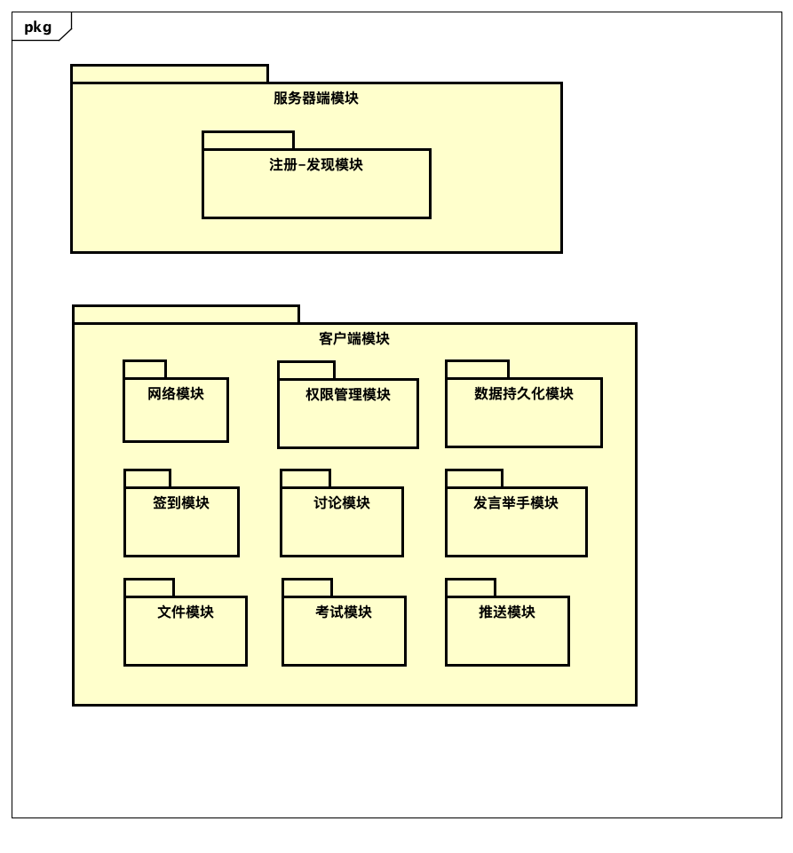
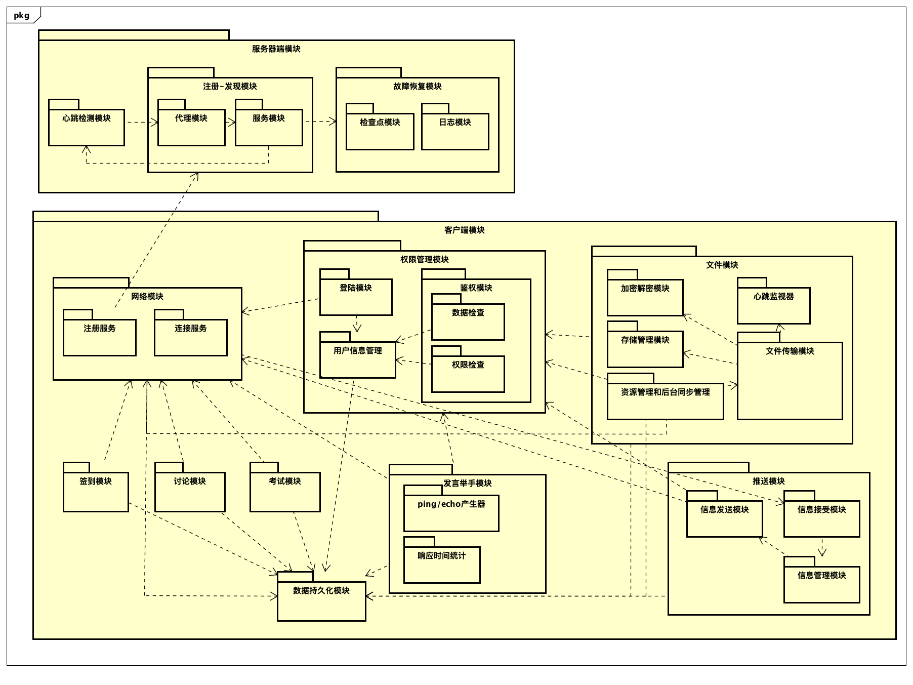
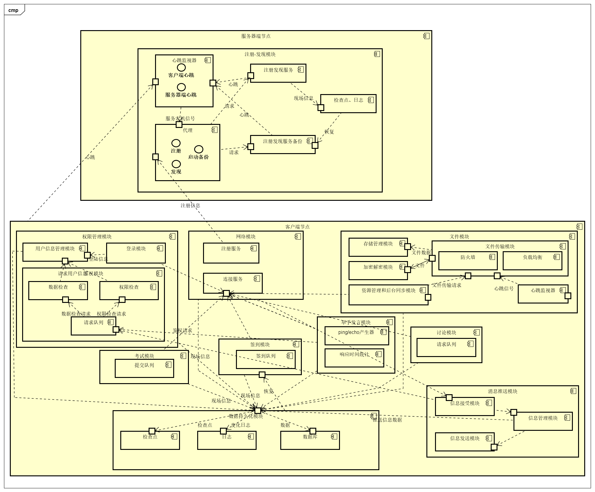

# 课程教学辅助系统 项目文档

By 五律协同观乙方

| 成员学号  | 成员姓名 |
| --------- | -------- |
| 161250010 | 陈俊达   |
| 161250011 | 陈俊宇   |
| 161250091 | 苗沐之   |
| 161250050 | 靳炳淑   |
| 161250103 | 钱宇辰   |
| 161250068 | 廖均达   |
| 161250056 | 李冰     |
| 161250067 | 梁楠     |

# 0. 目录

- [课程教学辅助系统 项目文档](#%E8%AF%BE%E7%A8%8B%E6%95%99%E5%AD%A6%E8%BE%85%E5%8A%A9%E7%B3%BB%E7%BB%9F-%E9%A1%B9%E7%9B%AE%E6%96%87%E6%A1%A3)
- [0. 目录](#0-%E7%9B%AE%E5%BD%95)
- [1. 系统主要功能点](#1-%E7%B3%BB%E7%BB%9F%E4%B8%BB%E8%A6%81%E5%8A%9F%E8%83%BD%E7%82%B9)
- [2. 系统定义](#2-%E7%B3%BB%E7%BB%9F%E5%AE%9A%E4%B9%89)
  - [2.1 功能需求](#21-%E5%8A%9F%E8%83%BD%E9%9C%80%E6%B1%82)
  - [2.2 设计约束](#22-%E8%AE%BE%E8%AE%A1%E7%BA%A6%E6%9D%9F)
  - [2.3 质量特性需求](#23-%E8%B4%A8%E9%87%8F%E7%89%B9%E6%80%A7%E9%9C%80%E6%B1%82)
- [3. P2P架构设计](#3-p2p%E6%9E%B6%E6%9E%84%E8%AE%BE%E8%AE%A1)
  - [3.1 第一次迭代](#31-%E7%AC%AC%E4%B8%80%E6%AC%A1%E8%BF%AD%E4%BB%A3)
    - [3.1.1 分解系统组件](#311-%E5%88%86%E8%A7%A3%E7%B3%BB%E7%BB%9F%E7%BB%84%E4%BB%B6)
  - [3.2 第二次迭代](#32-%E7%AC%AC%E4%BA%8C%E6%AC%A1%E8%BF%AD%E4%BB%A3)
    - [3.2.1 分解系统组件](#321-%E5%88%86%E8%A7%A3%E7%B3%BB%E7%BB%9F%E7%BB%84%E4%BB%B6)
  - [3.3 第三次迭代](#33-%E7%AC%AC%E4%B8%89%E6%AC%A1%E8%BF%AD%E4%BB%A3)
    - [3.3.1 分解系统组件](#331-%E5%88%86%E8%A7%A3%E7%B3%BB%E7%BB%9F%E7%BB%84%E4%BB%B6)
    - [3.3.2 确定架构驱动因素](#332-%E7%A1%AE%E5%AE%9A%E6%9E%B6%E6%9E%84%E9%A9%B1%E5%8A%A8%E5%9B%A0%E7%B4%A0)
    - [3.3.3 选择架构模式](#333-%E9%80%89%E6%8B%A9%E6%9E%B6%E6%9E%84%E6%A8%A1%E5%BC%8F)
      - [3.3.3.1 设计关注点](#3331-%E8%AE%BE%E8%AE%A1%E5%85%B3%E6%B3%A8%E7%82%B9)
      - [3.3.3.2 候选模式](#3332-%E5%80%99%E9%80%89%E6%A8%A1%E5%BC%8F)
    - [3.3.4 候选模式与对应ASR](#334-%E5%80%99%E9%80%89%E6%A8%A1%E5%BC%8F%E4%B8%8E%E5%AF%B9%E5%BA%94asr)
    - [3.3.5 架构视图](#335-%E6%9E%B6%E6%9E%84%E8%A7%86%E5%9B%BE)
  - [3.4 第四次迭代](#34-%E7%AC%AC%E5%9B%9B%E6%AC%A1%E8%BF%AD%E4%BB%A3)
    - [3.4.1 分解系统组件](#341-%E5%88%86%E8%A7%A3%E7%B3%BB%E7%BB%9F%E7%BB%84%E4%BB%B6)
    - [3.4.2 确定架构驱动因素](#342-%E7%A1%AE%E5%AE%9A%E6%9E%B6%E6%9E%84%E9%A9%B1%E5%8A%A8%E5%9B%A0%E7%B4%A0)
    - [3.4.3 选择架构模式](#343-%E9%80%89%E6%8B%A9%E6%9E%B6%E6%9E%84%E6%A8%A1%E5%BC%8F)
      - [3.4.3.1 设计关注点](#3431-%E8%AE%BE%E8%AE%A1%E5%85%B3%E6%B3%A8%E7%82%B9)
      - [3.4.3.2 候选模式](#3432-%E5%80%99%E9%80%89%E6%A8%A1%E5%BC%8F)
    - [3.4.4 候选模式与对应ASR](#344-%E5%80%99%E9%80%89%E6%A8%A1%E5%BC%8F%E4%B8%8E%E5%AF%B9%E5%BA%94asr)
    - [3.4.5 架构视图](#345-%E6%9E%B6%E6%9E%84%E8%A7%86%E5%9B%BE)
  - [3.5 第五次迭代](#35-%E7%AC%AC%E4%BA%94%E6%AC%A1%E8%BF%AD%E4%BB%A3)
    - [3.5.1 分解系统组件](#351-%E5%88%86%E8%A7%A3%E7%B3%BB%E7%BB%9F%E7%BB%84%E4%BB%B6)
    - [3.5.2 确定架构驱动因素](#352-%E7%A1%AE%E5%AE%9A%E6%9E%B6%E6%9E%84%E9%A9%B1%E5%8A%A8%E5%9B%A0%E7%B4%A0)
    - [3.5.3 选择架构模式](#353-%E9%80%89%E6%8B%A9%E6%9E%B6%E6%9E%84%E6%A8%A1%E5%BC%8F)
      - [3.2.3.1 设计关注点](#3231-%E8%AE%BE%E8%AE%A1%E5%85%B3%E6%B3%A8%E7%82%B9)
      - [3.5.3.2 候选模式](#3532-%E5%80%99%E9%80%89%E6%A8%A1%E5%BC%8F)
    - [3.5.4 候选模式与对应ASR](#354-%E5%80%99%E9%80%89%E6%A8%A1%E5%BC%8F%E4%B8%8E%E5%AF%B9%E5%BA%94asr)
    - [3.5.5 架构视图](#355-%E6%9E%B6%E6%9E%84%E8%A7%86%E5%9B%BE)
  - [3.6 第六次迭代](#36-%E7%AC%AC%E5%85%AD%E6%AC%A1%E8%BF%AD%E4%BB%A3)
    - [3.6.1 分解系统组件](#361-%E5%88%86%E8%A7%A3%E7%B3%BB%E7%BB%9F%E7%BB%84%E4%BB%B6)
    - [3.6.2 确定架构驱动因素](#362-%E7%A1%AE%E5%AE%9A%E6%9E%B6%E6%9E%84%E9%A9%B1%E5%8A%A8%E5%9B%A0%E7%B4%A0)
    - [3.6.3 选择架构模式](#363-%E9%80%89%E6%8B%A9%E6%9E%B6%E6%9E%84%E6%A8%A1%E5%BC%8F)
      - [3.6.3.1 设计关注点](#3631-%E8%AE%BE%E8%AE%A1%E5%85%B3%E6%B3%A8%E7%82%B9)
      - [3.6.3.2 候选模式](#3632-%E5%80%99%E9%80%89%E6%A8%A1%E5%BC%8F)
    - [3.6.4 候选模式与对应ASR](#364-%E5%80%99%E9%80%89%E6%A8%A1%E5%BC%8F%E4%B8%8E%E5%AF%B9%E5%BA%94asr)
    - [3.6.5 架构视图](#365-%E6%9E%B6%E6%9E%84%E8%A7%86%E5%9B%BE)
  - [3.7 第七次迭代](#37-%E7%AC%AC%E4%B8%83%E6%AC%A1%E8%BF%AD%E4%BB%A3)
    - [3.7.1 分解系统组件](#371-%E5%88%86%E8%A7%A3%E7%B3%BB%E7%BB%9F%E7%BB%84%E4%BB%B6)
    - [3.7.2 确定架构驱动因素](#372-%E7%A1%AE%E5%AE%9A%E6%9E%B6%E6%9E%84%E9%A9%B1%E5%8A%A8%E5%9B%A0%E7%B4%A0)
    - [3.7.3 选择架构模式](#373-%E9%80%89%E6%8B%A9%E6%9E%B6%E6%9E%84%E6%A8%A1%E5%BC%8F)
      - [3.7.3.1 设计关注点](#3731-%E8%AE%BE%E8%AE%A1%E5%85%B3%E6%B3%A8%E7%82%B9)
      - [3.7.3.2 候选模式](#3732-%E5%80%99%E9%80%89%E6%A8%A1%E5%BC%8F)
    - [3.7.4 候选模式与对应ASR](#374-%E5%80%99%E9%80%89%E6%A8%A1%E5%BC%8F%E4%B8%8E%E5%AF%B9%E5%BA%94asr)
    - [3.7.5 架构视图](#375-%E6%9E%B6%E6%9E%84%E8%A7%86%E5%9B%BE)
  - [3.8 第八次迭代](#38-%E7%AC%AC%E5%85%AB%E6%AC%A1%E8%BF%AD%E4%BB%A3)
    - [3.8.1 分解系统组件](#381-%E5%88%86%E8%A7%A3%E7%B3%BB%E7%BB%9F%E7%BB%84%E4%BB%B6)
    - [3.8.2 确定架构驱动因素](#382-%E7%A1%AE%E5%AE%9A%E6%9E%B6%E6%9E%84%E9%A9%B1%E5%8A%A8%E5%9B%A0%E7%B4%A0)
    - [3.8.3 选择架构模式](#383-%E9%80%89%E6%8B%A9%E6%9E%B6%E6%9E%84%E6%A8%A1%E5%BC%8F)
      - [3.8.3.1 设计关注点](#3831-%E8%AE%BE%E8%AE%A1%E5%85%B3%E6%B3%A8%E7%82%B9)
      - [3.8.3.2 候选模式](#3832-%E5%80%99%E9%80%89%E6%A8%A1%E5%BC%8F)
    - [3.8.4 候选模式与对应ASR](#384-%E5%80%99%E9%80%89%E6%A8%A1%E5%BC%8F%E4%B8%8E%E5%AF%B9%E5%BA%94asr)
    - [3.8.5 架构视图](#385-%E6%9E%B6%E6%9E%84%E8%A7%86%E5%9B%BE)
  - [3.9 第九次迭代](#39-%E7%AC%AC%E4%B9%9D%E6%AC%A1%E8%BF%AD%E4%BB%A3)
    - [3.9.1 分解系统组件](#391-%E5%88%86%E8%A7%A3%E7%B3%BB%E7%BB%9F%E7%BB%84%E4%BB%B6)
    - [3.9.2 确定架构驱动因素](#392-%E7%A1%AE%E5%AE%9A%E6%9E%B6%E6%9E%84%E9%A9%B1%E5%8A%A8%E5%9B%A0%E7%B4%A0)
    - [3.9.3 选择架构模式](#393-%E9%80%89%E6%8B%A9%E6%9E%B6%E6%9E%84%E6%A8%A1%E5%BC%8F)
      - [3.9.3.1 设计关注点](#3931-%E8%AE%BE%E8%AE%A1%E5%85%B3%E6%B3%A8%E7%82%B9)
      - [3.9.3.2 候选模式](#3932-%E5%80%99%E9%80%89%E6%A8%A1%E5%BC%8F)
    - [3.9.4 候选模式与对应ASR](#394-%E5%80%99%E9%80%89%E6%A8%A1%E5%BC%8F%E4%B8%8E%E5%AF%B9%E5%BA%94asr)
    - [3.9.5 架构视图](#395-%E6%9E%B6%E6%9E%84%E8%A7%86%E5%9B%BE)
  - [3.10 第十次迭代](#310-%E7%AC%AC%E5%8D%81%E6%AC%A1%E8%BF%AD%E4%BB%A3)
    - [3.10.1 分解系统组件](#3101-%E5%88%86%E8%A7%A3%E7%B3%BB%E7%BB%9F%E7%BB%84%E4%BB%B6)
    - [3.10.2 确定架构驱动因素](#3102-%E7%A1%AE%E5%AE%9A%E6%9E%B6%E6%9E%84%E9%A9%B1%E5%8A%A8%E5%9B%A0%E7%B4%A0)
    - [3.10.3 选择架构模式](#3103-%E9%80%89%E6%8B%A9%E6%9E%B6%E6%9E%84%E6%A8%A1%E5%BC%8F)
      - [3.10.3.1 设计关注点](#31031-%E8%AE%BE%E8%AE%A1%E5%85%B3%E6%B3%A8%E7%82%B9)
      - [3.10.3.2 候选模式](#31032-%E5%80%99%E9%80%89%E6%A8%A1%E5%BC%8F)
    - [3.10.4 候选模式与对应ASR](#3104-%E5%80%99%E9%80%89%E6%A8%A1%E5%BC%8F%E4%B8%8E%E5%AF%B9%E5%BA%94asr)
    - [3.10.5 架构视图](#3105-%E6%9E%B6%E6%9E%84%E8%A7%86%E5%9B%BE)
  - [3.11 第十一次迭代](#311-%E7%AC%AC%E5%8D%81%E4%B8%80%E6%AC%A1%E8%BF%AD%E4%BB%A3)
    - [3.11.1 分解系统组件](#3111-%E5%88%86%E8%A7%A3%E7%B3%BB%E7%BB%9F%E7%BB%84%E4%BB%B6)
    - [3.11.2 确定架构驱动因素](#3112-%E7%A1%AE%E5%AE%9A%E6%9E%B6%E6%9E%84%E9%A9%B1%E5%8A%A8%E5%9B%A0%E7%B4%A0)
    - [3.11.3 选择架构模式](#3113-%E9%80%89%E6%8B%A9%E6%9E%B6%E6%9E%84%E6%A8%A1%E5%BC%8F)
      - [3.11.3.1 设计关注点](#31131-%E8%AE%BE%E8%AE%A1%E5%85%B3%E6%B3%A8%E7%82%B9)
      - [3.11.3.2 候选模式](#31132-%E5%80%99%E9%80%89%E6%A8%A1%E5%BC%8F)
    - [3.11.4 候选模式与对应ASR](#3114-%E5%80%99%E9%80%89%E6%A8%A1%E5%BC%8F%E4%B8%8E%E5%AF%B9%E5%BA%94asr)
    - [3.11.5 架构视图](#3115-%E6%9E%B6%E6%9E%84%E8%A7%86%E5%9B%BE)
  - [3.12 第十二次迭代](#312-%E7%AC%AC%E5%8D%81%E4%BA%8C%E6%AC%A1%E8%BF%AD%E4%BB%A3)
    - [3.12.1 分解系统组件](#3121-%E5%88%86%E8%A7%A3%E7%B3%BB%E7%BB%9F%E7%BB%84%E4%BB%B6)
    - [3.12.2 确定架构驱动因素](#3122-%E7%A1%AE%E5%AE%9A%E6%9E%B6%E6%9E%84%E9%A9%B1%E5%8A%A8%E5%9B%A0%E7%B4%A0)
    - [3.12.3 选择架构模式](#3123-%E9%80%89%E6%8B%A9%E6%9E%B6%E6%9E%84%E6%A8%A1%E5%BC%8F)
      - [3.12.3.1 设计关注点](#31231-%E8%AE%BE%E8%AE%A1%E5%85%B3%E6%B3%A8%E7%82%B9)
      - [3.12.3.2 候选模式](#31232-%E5%80%99%E9%80%89%E6%A8%A1%E5%BC%8F)
    - [3.12.4 候选模式与对应ASR](#3124-%E5%80%99%E9%80%89%E6%A8%A1%E5%BC%8F%E4%B8%8E%E5%AF%B9%E5%BA%94asr)
    - [3.12.5 架构视图](#3125-%E6%9E%B6%E6%9E%84%E8%A7%86%E5%9B%BE)
  - [3.13 架构图](#313-%E6%9E%B6%E6%9E%84%E5%9B%BE)
    - [3.13.1 模块视图](#3131-%E6%A8%A1%E5%9D%97%E8%A7%86%E5%9B%BE)
    - [3.13.2 C&C视图](#3132-cc%E8%A7%86%E5%9B%BE)
  - [4.1 第一次迭代](#41-%E7%AC%AC%E4%B8%80%E6%AC%A1%E8%BF%AD%E4%BB%A3)
    - [4.1.1 分解系统组件](#411-%E5%88%86%E8%A7%A3%E7%B3%BB%E7%BB%9F%E7%BB%84%E4%BB%B6)
    - [4.1.2 架构图](#412-%E6%9E%B6%E6%9E%84%E5%9B%BE)
  - [4.2 第二次迭代](#42-%E7%AC%AC%E4%BA%8C%E6%AC%A1%E8%BF%AD%E4%BB%A3)
    - [4.2.1 分解系统组件](#421-%E5%88%86%E8%A7%A3%E7%B3%BB%E7%BB%9F%E7%BB%84%E4%BB%B6)
    - [4.2.2 确定架构驱动因素（重要性、难易度从高到低）](#422-%E7%A1%AE%E5%AE%9A%E6%9E%B6%E6%9E%84%E9%A9%B1%E5%8A%A8%E5%9B%A0%E7%B4%A0%E9%87%8D%E8%A6%81%E6%80%A7%E9%9A%BE%E6%98%93%E5%BA%A6%E4%BB%8E%E9%AB%98%E5%88%B0%E4%BD%8E)
    - [4.2.3 选择满足架构驱动因素的架构模式](#423-%E9%80%89%E6%8B%A9%E6%BB%A1%E8%B6%B3%E6%9E%B6%E6%9E%84%E9%A9%B1%E5%8A%A8%E5%9B%A0%E7%B4%A0%E7%9A%84%E6%9E%B6%E6%9E%84%E6%A8%A1%E5%BC%8F)
      - [4.2.3.1 设计关注点](#4231-%E8%AE%BE%E8%AE%A1%E5%85%B3%E6%B3%A8%E7%82%B9)
      - [4.2.3.2 候选模式](#4232-%E5%80%99%E9%80%89%E6%A8%A1%E5%BC%8F)
    - [4.2.4 候选模式与对应ASR](#424-%E5%80%99%E9%80%89%E6%A8%A1%E5%BC%8F%E4%B8%8E%E5%AF%B9%E5%BA%94asr)
    - [4.2.5 架构视图](#425-%E6%9E%B6%E6%9E%84%E8%A7%86%E5%9B%BE)
  - [4.3 第三次迭代](#43-%E7%AC%AC%E4%B8%89%E6%AC%A1%E8%BF%AD%E4%BB%A3)
    - [4.3.1 分解系统组件](#431-%E5%88%86%E8%A7%A3%E7%B3%BB%E7%BB%9F%E7%BB%84%E4%BB%B6)
    - [4.3.2 确定架构驱动因素（重要性、难易度从高到低）](#432-%E7%A1%AE%E5%AE%9A%E6%9E%B6%E6%9E%84%E9%A9%B1%E5%8A%A8%E5%9B%A0%E7%B4%A0%E9%87%8D%E8%A6%81%E6%80%A7%E9%9A%BE%E6%98%93%E5%BA%A6%E4%BB%8E%E9%AB%98%E5%88%B0%E4%BD%8E)
    - [4.3.3 选择满足架构驱动因素的架构模式](#433-%E9%80%89%E6%8B%A9%E6%BB%A1%E8%B6%B3%E6%9E%B6%E6%9E%84%E9%A9%B1%E5%8A%A8%E5%9B%A0%E7%B4%A0%E7%9A%84%E6%9E%B6%E6%9E%84%E6%A8%A1%E5%BC%8F)
      - [4.3.3.1 设计关注点](#4331-%E8%AE%BE%E8%AE%A1%E5%85%B3%E6%B3%A8%E7%82%B9)
      - [4.3.3.2 候选模式](#4332-%E5%80%99%E9%80%89%E6%A8%A1%E5%BC%8F)
    - [4.3.4 候选模式与对应ASR](#434-%E5%80%99%E9%80%89%E6%A8%A1%E5%BC%8F%E4%B8%8E%E5%AF%B9%E5%BA%94asr)
    - [4.3.5 架构视图](#435-%E6%9E%B6%E6%9E%84%E8%A7%86%E5%9B%BE)
  - [4.4 第四次迭代](#44-%E7%AC%AC%E5%9B%9B%E6%AC%A1%E8%BF%AD%E4%BB%A3)
    - [4.4.1 分解系统组件](#441-%E5%88%86%E8%A7%A3%E7%B3%BB%E7%BB%9F%E7%BB%84%E4%BB%B6)
    - [4.4.2 确定架构驱动因素](#442-%E7%A1%AE%E5%AE%9A%E6%9E%B6%E6%9E%84%E9%A9%B1%E5%8A%A8%E5%9B%A0%E7%B4%A0)
    - [4.4.3 选择满足架构驱动因素的架构模式](#443-%E9%80%89%E6%8B%A9%E6%BB%A1%E8%B6%B3%E6%9E%B6%E6%9E%84%E9%A9%B1%E5%8A%A8%E5%9B%A0%E7%B4%A0%E7%9A%84%E6%9E%B6%E6%9E%84%E6%A8%A1%E5%BC%8F)
      - [4.4.3.1 设计关注点](#4431-%E8%AE%BE%E8%AE%A1%E5%85%B3%E6%B3%A8%E7%82%B9)
      - [4.4.3.2 候选模式](#4432-%E5%80%99%E9%80%89%E6%A8%A1%E5%BC%8F)
    - [4.4.4 候选模式与对应ASR](#444-%E5%80%99%E9%80%89%E6%A8%A1%E5%BC%8F%E4%B8%8E%E5%AF%B9%E5%BA%94asr)
    - [4.4.5 架构图](#445-%E6%9E%B6%E6%9E%84%E5%9B%BE)
  - [4.5 第五次迭代](#45-%E7%AC%AC%E4%BA%94%E6%AC%A1%E8%BF%AD%E4%BB%A3)
    - [4.5.1 分解系统组件](#451-%E5%88%86%E8%A7%A3%E7%B3%BB%E7%BB%9F%E7%BB%84%E4%BB%B6)
    - [4.5.2 确定架构驱动因素](#452-%E7%A1%AE%E5%AE%9A%E6%9E%B6%E6%9E%84%E9%A9%B1%E5%8A%A8%E5%9B%A0%E7%B4%A0)
    - [4.5.3 选择满足架构驱动因素的架构模式](#453-%E9%80%89%E6%8B%A9%E6%BB%A1%E8%B6%B3%E6%9E%B6%E6%9E%84%E9%A9%B1%E5%8A%A8%E5%9B%A0%E7%B4%A0%E7%9A%84%E6%9E%B6%E6%9E%84%E6%A8%A1%E5%BC%8F)
      - [4.5.3.1 设计关注点](#4531-%E8%AE%BE%E8%AE%A1%E5%85%B3%E6%B3%A8%E7%82%B9)
      - [4.5.3.2 候选模式](#4532-%E5%80%99%E9%80%89%E6%A8%A1%E5%BC%8F)
    - [4.5.4 候选模式与对应ASR](#454-%E5%80%99%E9%80%89%E6%A8%A1%E5%BC%8F%E4%B8%8E%E5%AF%B9%E5%BA%94asr)
    - [4.5.5 架构视图](#455-%E6%9E%B6%E6%9E%84%E8%A7%86%E5%9B%BE)
  - [4.6 第六次迭代](#46-%E7%AC%AC%E5%85%AD%E6%AC%A1%E8%BF%AD%E4%BB%A3)
    - [4.6.1 分解系统组件](#461-%E5%88%86%E8%A7%A3%E7%B3%BB%E7%BB%9F%E7%BB%84%E4%BB%B6)
    - [4.6.2 确定架构驱动因素](#462-%E7%A1%AE%E5%AE%9A%E6%9E%B6%E6%9E%84%E9%A9%B1%E5%8A%A8%E5%9B%A0%E7%B4%A0)
    - [4.6.3 选择满足架构驱动因素的架构模式](#463-%E9%80%89%E6%8B%A9%E6%BB%A1%E8%B6%B3%E6%9E%B6%E6%9E%84%E9%A9%B1%E5%8A%A8%E5%9B%A0%E7%B4%A0%E7%9A%84%E6%9E%B6%E6%9E%84%E6%A8%A1%E5%BC%8F)
      - [4.6.3.1 设计关注点](#4631-%E8%AE%BE%E8%AE%A1%E5%85%B3%E6%B3%A8%E7%82%B9)
      - [4.6.3.2 候选模式](#4632-%E5%80%99%E9%80%89%E6%A8%A1%E5%BC%8F)
    - [4.6.4 候选模式与对应ASR](#464-%E5%80%99%E9%80%89%E6%A8%A1%E5%BC%8F%E4%B8%8E%E5%AF%B9%E5%BA%94asr)
    - [4.6.5 架构视图](#465-%E6%9E%B6%E6%9E%84%E8%A7%86%E5%9B%BE)
  - [4.7 第七次迭代](#47-%E7%AC%AC%E4%B8%83%E6%AC%A1%E8%BF%AD%E4%BB%A3)
    - [4.7.1 分解系统组件](#471-%E5%88%86%E8%A7%A3%E7%B3%BB%E7%BB%9F%E7%BB%84%E4%BB%B6)
    - [4.7.2 确定架构驱动因素（重要性、难易度从高到低）](#472-%E7%A1%AE%E5%AE%9A%E6%9E%B6%E6%9E%84%E9%A9%B1%E5%8A%A8%E5%9B%A0%E7%B4%A0%E9%87%8D%E8%A6%81%E6%80%A7%E9%9A%BE%E6%98%93%E5%BA%A6%E4%BB%8E%E9%AB%98%E5%88%B0%E4%BD%8E)
    - [4.7.3 选择满足架构驱动因素的架构模式](#473-%E9%80%89%E6%8B%A9%E6%BB%A1%E8%B6%B3%E6%9E%B6%E6%9E%84%E9%A9%B1%E5%8A%A8%E5%9B%A0%E7%B4%A0%E7%9A%84%E6%9E%B6%E6%9E%84%E6%A8%A1%E5%BC%8F)
      - [4.7.3.1 设计关注点](#4731-%E8%AE%BE%E8%AE%A1%E5%85%B3%E6%B3%A8%E7%82%B9)
      - [4.7.3.2 候选模式](#4732-%E5%80%99%E9%80%89%E6%A8%A1%E5%BC%8F)
    - [4.7.4 候选模式与对应ASR](#474-%E5%80%99%E9%80%89%E6%A8%A1%E5%BC%8F%E4%B8%8E%E5%AF%B9%E5%BA%94asr)
    - [4.7.5 架构视图](#475-%E6%9E%B6%E6%9E%84%E8%A7%86%E5%9B%BE)
  - [4.8 第八次迭代](#48-%E7%AC%AC%E5%85%AB%E6%AC%A1%E8%BF%AD%E4%BB%A3)
    - [4.8.1 分解系统组件](#481-%E5%88%86%E8%A7%A3%E7%B3%BB%E7%BB%9F%E7%BB%84%E4%BB%B6)
    - [4.8.2 确定架构驱动因素（重要性、难易度从高到低）](#482-%E7%A1%AE%E5%AE%9A%E6%9E%B6%E6%9E%84%E9%A9%B1%E5%8A%A8%E5%9B%A0%E7%B4%A0%E9%87%8D%E8%A6%81%E6%80%A7%E9%9A%BE%E6%98%93%E5%BA%A6%E4%BB%8E%E9%AB%98%E5%88%B0%E4%BD%8E)
    - [4.8.3 选择满足架构驱动因素的架构模式](#483-%E9%80%89%E6%8B%A9%E6%BB%A1%E8%B6%B3%E6%9E%B6%E6%9E%84%E9%A9%B1%E5%8A%A8%E5%9B%A0%E7%B4%A0%E7%9A%84%E6%9E%B6%E6%9E%84%E6%A8%A1%E5%BC%8F)
      - [4.8.3.1 设计关注点](#4831-%E8%AE%BE%E8%AE%A1%E5%85%B3%E6%B3%A8%E7%82%B9)
      - [4.8.3.2 候选模式](#4832-%E5%80%99%E9%80%89%E6%A8%A1%E5%BC%8F)
    - [4.8.4 候选模式与对应ASR](#484-%E5%80%99%E9%80%89%E6%A8%A1%E5%BC%8F%E4%B8%8E%E5%AF%B9%E5%BA%94asr)
    - [4.8.5架构视图](#485%E6%9E%B6%E6%9E%84%E8%A7%86%E5%9B%BE)
  - [4.9 第九次迭代](#49-%E7%AC%AC%E4%B9%9D%E6%AC%A1%E8%BF%AD%E4%BB%A3)
    - [4.9.1 分解系统组件](#491-%E5%88%86%E8%A7%A3%E7%B3%BB%E7%BB%9F%E7%BB%84%E4%BB%B6)
    - [4.9.2 确定架构驱动因素](#492-%E7%A1%AE%E5%AE%9A%E6%9E%B6%E6%9E%84%E9%A9%B1%E5%8A%A8%E5%9B%A0%E7%B4%A0)
    - [4.9.3 选择架构模式](#493-%E9%80%89%E6%8B%A9%E6%9E%B6%E6%9E%84%E6%A8%A1%E5%BC%8F)
      - [4.9.3.1 设计关注点](#4931-%E8%AE%BE%E8%AE%A1%E5%85%B3%E6%B3%A8%E7%82%B9)
      - [4.9.3.2 候选模式](#4932-%E5%80%99%E9%80%89%E6%A8%A1%E5%BC%8F)
    - [4.9.4 候选模式与对应ASR](#494-%E5%80%99%E9%80%89%E6%A8%A1%E5%BC%8F%E4%B8%8E%E5%AF%B9%E5%BA%94asr)
    - [4.9.5 架构视图](#495-%E6%9E%B6%E6%9E%84%E8%A7%86%E5%9B%BE)
  - [4.10 第十次迭代](#410-%E7%AC%AC%E5%8D%81%E6%AC%A1%E8%BF%AD%E4%BB%A3)
    - [4.10.1 分解系统组件](#4101-%E5%88%86%E8%A7%A3%E7%B3%BB%E7%BB%9F%E7%BB%84%E4%BB%B6)
    - [4.10.2 确定架构驱动因素](#4102-%E7%A1%AE%E5%AE%9A%E6%9E%B6%E6%9E%84%E9%A9%B1%E5%8A%A8%E5%9B%A0%E7%B4%A0)
    - [4.10.3 选择满足架构驱动因素的架构模式](#4103-%E9%80%89%E6%8B%A9%E6%BB%A1%E8%B6%B3%E6%9E%B6%E6%9E%84%E9%A9%B1%E5%8A%A8%E5%9B%A0%E7%B4%A0%E7%9A%84%E6%9E%B6%E6%9E%84%E6%A8%A1%E5%BC%8F)
      - [4.10.3.1 设计关注点](#41031-%E8%AE%BE%E8%AE%A1%E5%85%B3%E6%B3%A8%E7%82%B9)
      - [4.10.3.2 候选模式](#41032-%E5%80%99%E9%80%89%E6%A8%A1%E5%BC%8F)
    - [4.10.4 候选模式与对应 ASR](#4104-%E5%80%99%E9%80%89%E6%A8%A1%E5%BC%8F%E4%B8%8E%E5%AF%B9%E5%BA%94-asr)
    - [4.10.5 架构视图](#4105-%E6%9E%B6%E6%9E%84%E8%A7%86%E5%9B%BE)
  - [4.11 第十一次迭代](#411-%E7%AC%AC%E5%8D%81%E4%B8%80%E6%AC%A1%E8%BF%AD%E4%BB%A3)
    - [4.11.1 分解系统组件](#4111-%E5%88%86%E8%A7%A3%E7%B3%BB%E7%BB%9F%E7%BB%84%E4%BB%B6)
    - [4.11.2 确定架构驱动因素](#4112-%E7%A1%AE%E5%AE%9A%E6%9E%B6%E6%9E%84%E9%A9%B1%E5%8A%A8%E5%9B%A0%E7%B4%A0)
    - [4.11.3 选择满足架构驱动因素的架构模式](#4113-%E9%80%89%E6%8B%A9%E6%BB%A1%E8%B6%B3%E6%9E%B6%E6%9E%84%E9%A9%B1%E5%8A%A8%E5%9B%A0%E7%B4%A0%E7%9A%84%E6%9E%B6%E6%9E%84%E6%A8%A1%E5%BC%8F)
      - [4.11.3.1 设计关注点](#41131-%E8%AE%BE%E8%AE%A1%E5%85%B3%E6%B3%A8%E7%82%B9)
      - [4.11.3.2 候选模式](#41132-%E5%80%99%E9%80%89%E6%A8%A1%E5%BC%8F)
    - [4.11.4 候选模式与对应 ASR](#4114-%E5%80%99%E9%80%89%E6%A8%A1%E5%BC%8F%E4%B8%8E%E5%AF%B9%E5%BA%94-asr)
    - [4.11.5 架构视图](#4115-%E6%9E%B6%E6%9E%84%E8%A7%86%E5%9B%BE)
  - [4.12 架构图](#412-%E6%9E%B6%E6%9E%84%E5%9B%BE)
    - [4.12.1 模块视图](#4121-%E6%A8%A1%E5%9D%97%E8%A7%86%E5%9B%BE)
- [5. P2P与C/S架构对比](#5-p2p%E4%B8%8Ecs%E6%9E%B6%E6%9E%84%E5%AF%B9%E6%AF%94)
  - [5.1 性能对比](#51-%E6%80%A7%E8%83%BD%E5%AF%B9%E6%AF%94)
  - [5.2 安全性对比](#52-%E5%AE%89%E5%85%A8%E6%80%A7%E5%AF%B9%E6%AF%94)
  - [5.3 复杂度对比](#53-%E5%A4%8D%E6%9D%82%E5%BA%A6%E5%AF%B9%E6%AF%94)

# 1. 系统主要功能点

- 课程签到

学生到班后并连接上系统后，使用随身携带的设备进行签到。老师可以获得课程中每堂课的签到情况。

- 发言举手

在上课中，当老师口头提起一个问题时，可以使用系统开启举手功能。学生可以通过系统举手。老师可以看到举手的同学，并选择一个同学进行回答。老师也可以在过程中停止举手功能。举手信息将会显示在投影上，让所有同学都能看到。系统将会保存举手和选择信息。

- 参与讨论

当老师通过系统发起一个问题时，学生可以直接在系统中参与问题相关的讨论。参与的内容也将会显示在投影上，所有同学都能看到。系统将会保存这些讨论信息。

- 共享文件

老师可以将文件放到服务器上，供学生下载。学生可以搜索课程中共享的所有文件，并进行下载。

- 参加考试

老师可以输入题目、考试时间后发起一次考试，学生将会参加此次考试。考试结束后，学生可以立刻获得考试的分数；老师也可以获得本次考试中所有学生的分数情况。

- 信息推送

当老师分享新文件、设定了考试时，所有学生将会获得推送信息。老师也可以推送自定义信息。

# 2. 系统定义

## 2.1 功能需求

功能需求已经在[1. 系统主要功能点](#1-系统主要功能点)中覆盖。

## 2.2 设计约束

约束1：用户的数据不得被泄露和非法修改。

约束2：系统应该能在市面上绝大多数设备上运行。

## 2.3 质量特性需求

**性能**：场景1：大量用户短时间内进行数据量交换较小的操作（签到、举手、获取或者提交试卷）

| 场景组成部分 | 可能的值                                                                                                                                                                                                          |
| ------------ | ----------------------------------------------------------------------------------------------------------------------------------------------------------------------------------------------------------------- |
| 源           | 用户                                                                                                                                                                                                              |
| 刺激         | 大量用户在短时间内使用客户端进行进行数据量交换较小的操作                                                                                                                                                          |
| 制品         | 服务器、客户端中涉及到网络访问的模块                                                                                                                                                                              |
| 环境         | 系统运行时                                                                                                                                                                                                        |
| 响应         | 用户正常响应                                                                                                                                                                                                      |
| 响应度量     | 能使300人在5s之内完成对应操作 在300人5s进行相关操作的连续尝试中，每次最多有1%的人会发生由系统导致的网络请求错误 保证在有用户出现网络请求错误的情况下，数据仍然保持一致性（例如不能出现用户签到2次的情况） |

**性能**：场景2：用户正常操作

| 场景组成部分 | 可能的值                                                                                                                                                               |
| ------------ | ---------------------------------------------------------------------------------------------------------------------------------------------------------------------- |
| 源           | 用户                                                                                                                                                                   |
| 刺激         | 用户进行一项操作                                                                                                                                                       |
| 制品         | 系统的所有模块                                                                                                                                                         |
| 环境         | 系统运行时                                                                                                                                                             |
| 响应         | 系统能快速响应用户操作                                                                                                                                                 |
| 响应度量     | 对每次用户操作，系统应在1s内给出响应 对于需要长时间等待的操作，系统应给出进度条，或者使用通知系统，并具有超时提示，不能无限制等待 系统能同时响应1000用户的操作 |

**安全性和可用性**：场景3：由于各种原因导致的系统出错

| 场景组成部分 | 可能的值                                                                                                       |
| ------------ | -------------------------------------------------------------------------------------------------------------- |
| 源           | 系统                                                                                                           |
| 刺激         | 系统发生错误                                                                                                   |
| 制品         | 系统的所有模块                                                                                                 |
| 环境         | 系统运行时                                                                                                     |
| 响应         | 系统将会短时间恢复，并确保数据完整无损坏                                                                       |
| 响应度量     | 对于任何出错情况，系统保证在系统恢复运行时，99.999%数据均没有损坏 除了系统从发生错误到恢复运行的时间少于5s |

**性能**：场景4：推送信息需要快速有效到达用户

| 场景组成部分 | 可能的值                                                                                                    |
| ------------ | ----------------------------------------------------------------------------------------------------------- |
| 源           | 教室的设备                                                                                                  |
| 刺激         | 系统产生一条新的推送信息                                                                                    |
| 制品         | 系统的推送信息模块                                                                                          |
| 环境         | 系统运行时                                                                                                  |
| 响应         | 系统应该在快速把信息推送在用户的设备上                                                                      |
| 响应度量     | 系统应该在5s之内把信息推送到所有在线用户的设备上 当离线用户上线时，能在5s内获得自己没有接受到的推送信息 |

**安全性**：场景5：用户企图下载未选课的课程文件 

| 场景组成部分 | 可能的值                                                 |
| ------------ | -------------------------------------------------------- |
| 源           | 用户                                                     |
| 刺激         | 用户下载未授权的文件                                     |
| 制品         | 系统中的文件                                             |
| 环境         | 系统正常运行时                                           |
| 响应         | 系统鉴别用户权限阻止下载 系统记录违规操作            |
| 响应度量     | 对用户权限验证失败的概率低于0.05%； 鉴权时间小于0.5s |

**可用性**：场景6：断线重连

| 场景组成部分 | 可能的值                                                                                        |
| ------------ | ----------------------------------------------------------------------------------------------- |
| 源           | 用户设备、网络                                                                                  |
| 刺激         | 用户断线                                                                                        |
| 制品         | 整个系统                                                                                        |
| 环境         | 整体系统正常运行                                                                                |
| 响应         | 1. 系统发现用户断线时，记录断线信息 2. 当用户重连时恢复用户断线前的现场信息                  |
| 响应度量     | 1. 系统恢复现场信息的完成度要能够达到 90% 2. 系统从用户断线到被发现所经过的时间不能超过 5 秒 |

**安全性**：场景7：学生数据防止被攻击和篡改

| 场景组成部分 | 可能的值                                                                                                                  |
| ------------ | ------------------------------------------------------------------------------------------------------------------------- |
| 源           | 恶意攻击者                                                                                                                |
| 刺激         | 恶意攻击者发起攻击                                                                                                        |
| 制品         | 学生数据                                                                                                                  |
| 环境         | 整体系统正常运行                                                                                                          |
| 响应         | 1. 禁止未授权用户访问和操作数据或访问服务 2. 保存数据的访问记录                                                        |
| 响应度量     | 1. 从攻击发生到攻击被发现不能超过 1 个小时 2. 被阻止的非法访问的次数 3. 将被攻击的数据进行完全恢复不能超过 1 个小时 |

**安全性**：场景8：用户执行未授权的操作

| 场景组成部分 | 可能的值                          |
| ------------ | --------------------------------- |
|刺激|老师角色试图使用学生角色的功能，或者相反|
|源|用户|
|制品|鉴权模块|
|环境|运行时|
|响应|系统拒绝此次操作|
|响应度量|无|

**易用性**：场景9：学生使用过程中撤销错误操作

| 场景组成部分 | 可能的值                           |
| ------------ | ---------------------------------- |
| 源           | 学生                               |
| 刺激         | 学生想撤销举手操作                 |
| 制品         | 举手模块                           |
| 环境         | 整体系统正常运行                   |
| 响应         | 学生快速完成撤销，系统记录撤销操作 |
| 响应度量     | 在1s内完成撤销操作                 |

**可用性**：场景10：用户请求服务

| 场景组成部分 | 可能的值                                          |
| ------------ | ------------------------------------------------- |
| 刺激         | 用户进行操作                                      |
| 源           | 用户                                              |
| 制品         | 系统中涉及通信的模块                              |
| 环境         | 系统正在运行                                      |
| 响应         | 系统提供用户所需的服务                            |
| 响应度量     | 系统每7*24小时至多有10分钟不可用（99.9%可用时间） |

**可靠性**：场景11：用户请求其他用户的信息

|  场景组成部分  |  可能的值                                                    |
|  ------------ --------- |  --------------------------------- ------------------------------ |
|  刺激                  |  用户请求服务                                            |
|  源                      |  用户                                                            |
|  制品                  |  系统中涉及通信的模块                            |
|  环境                  |  系统正在运行                                            |
|  响应                  |  系统提供其他用户的信息                        |
|  响应度量          |  用户信息正确可用的概率至少达到99%  |

**性能**，**可用性**：场景12：文件上传和下载

| 场景组成部分 | 可能的值                                                                                                                                               |
| ------------ | ------------------------------------------------------------------------------------------------------------------------------------------------------ |
| 刺激         | 用户                                                                                                                                                   |
| 源           | 用户使用客户端进行文件上传和下载                                                                                                                       |
| 制品         | 涉及到网络访问的模块                                                                                                                                   |
| 环境         | 系统正在运行                                                                                                                                           |
| 响应         | 良好的上传、下载速度和体验                                                                                                                             |
| 响应度量     | 系统可以同时支持至少30个资源的上传和下载 当上传和下载过程因问题被迫中止后，能够恢复进度，不需要完全重新上传或者下载 尽可能避免不必要的网络流量 |

# 3. P2P架构设计

由于**系统定义**已经在[2. 系统定义](#2-系统定义)中完全覆盖，所以架构设计的每一迭代的第一个步骤（Confirm there is sufficient requirements information）均可以略去。

## 3.1 第一次迭代

### 3.1.1 分解系统组件

将系统分解为**服务器**和**客户端**两类节点。

## 3.2 第二次迭代
### 3.2.1 分解系统组件

将**服务器节点**和**客户端**节点分别进行分解。**服务器节点**分解为**注册-发现模块**，**客户端节点**分解为**网络模块**、**权限管理模块**、**签到模块**、**讨论模块**、**举手发言模块**、**文件模块**、**考试模块**、**推送模块**和**数据持久化模块**。

## 3.3 第三次迭代
### 3.3.1 分解系统组件

本迭代分解服务端节点的**注册-发现模块**。

### 3.3.2 确定架构驱动因素

| # |架构驱动因素|重要性|难易度|
|---|---|-|-|
|1|场景10：用户请求服务|高|高|
|2|场景11：用户请求其他用户的信息|高|中|
|3|场景3：系统故障|中|中|
|4|场景6：断线重连|低|中|

### 3.3.3 选择架构模式

#### 3.3.3.1 设计关注点

|质量属性|设计关注点|子关注点|
|---|---|-|
|可用性|预防故障|重启|
| | |数据完整性|
| |故障检测|监控服务端节点|
| |故障恢复|对客户端节点透明|
|可靠性|客户端节点信息正确可用|检测失效客户端节点|

#### 3.3.3.2 候选模式

**重启**

|#|模式|时间|服务不可用|
|---|---|-|-|
|1|冷启动|>1分钟|是|
|2|热备份|>0.3秒|可能|
|3|多主机备份|无|否|

选择模式：**热备份**

理由：冷启动需要超过1分钟的时间，这个期间系统处于服务不可用的状态，这是无法接受的。多主机备份复杂度太高，实现困难，故选择热备份。

**数据完整性**

|#|模式|存储负载|处理器负载|
|---|---|-|-|
|1|检查点|1秒每分钟|无|
|2|检查点+变化日志|1秒每分钟+每秒30条消息|无|
|3|检查点+捆绑日志|1秒每分钟+每x秒1条消息|无|
|4|检查点+同步备份|1秒每分钟+每x秒1条消息|每x秒同步一次主机和备份的状态|

选择模式：**检查点+捆绑日志**

理由：光靠检查点不能完全恢复系统状态；对服务端节点的访问是时间不均匀的，每产生一次变化就记录一条日志可能会导致很大的存储负载；同步主机的状态到备份则会消耗一定的处理器，因此选择检查点+捆绑日志。

**监控服务端节点**

|#|模式|信息负载|
|---|---|-|
|1|心跳机制|1|
|2|Ping&Echo|2|
|3|客户端节点检测故障|0|

选择模式：**心跳机制**

理由：心跳机制实现简单，通信量也没有Ping&Echo那么多。客户端节点检测到故障并不能告知服务端节点，因而选择心跳机制。

**对客户端节点透明**

|#|模式|通信方式|超时位置|
|---|---|-|-|
|1|客户端节点处理故障|单播|客户端节点|
|2|代理处理故障|单播|代理|
|3|基础设施处理故障|广播|基础设施内部|

选择模式：**代理处理故障**

理由：在客户端处理故障要求客户端节点了解故障的细节，可能会导致系统不够鲁棒；在基础设施内处理故障，广播会占用较大的带宽，因此选择用代理。

**检测失效客户端节点**

|#|模式|反应速度|通信负载|
|---|---|-|-|
|1|心跳机制|快|每秒1次|
|2|客户端检测+广播|慢|1+N次|

选择模式：**心跳机制**

理由：客户端检测失效节点并向其他人广播会占用大量的通信带宽，并且网络的更新有延时，其他客户端节点不一定能及时得知失效节点，因此选择心跳机制。

### 3.3.4 候选模式与对应ASR

| #   | 模式类型           | 选择的模式      | 架构驱动                                        |
| --- | ------------------ | --------------- | ----------------------------------------------- |
| 1   | 重启               | 热备份          | 场景10：用户请求服务、场景3：系统故障           |
| 2   | 数据完整性         | 检查点+捆绑日志 | 场景10：用户请求服务、场景3：系统故障           |
| 3   | 监控服务端节点     | 心跳机制        | 场景10：用户请求服务、场景3：系统故障           |
| 4   | 对客户端节点透明   | 代理处理故障    | 场景10：用户请求服务、场景3：系统故障           |
| 5   | 检测失效客户端节点 | 心跳机制        | 场景11：用户请求其他用户的信息、场景6：断线重连 |

### 3.3.5 架构视图

**C&C视图**

**模块视图**

## 3.4 第四次迭代
### 3.4.1 分解系统组件

本迭代分解客户端节点的**网络模块**。

### 3.4.2 确定架构驱动因素

|#|架构驱动因素|重要性|难易度|
|---|---|-|-|
|1|场景10：用户请求服务|高|中|
|2|场景6：断线重连|高|中|
|3|场景11：用户请求其他用户的信息|高|中|
|4|功能需求：参加考试|中|中|

### 3.4.3 选择架构模式

#### 3.4.3.1 设计关注点

| 质量属性 | 设计关注点   | 子关注点     |
| -------- | ------------ | ------------ |
| 可用性   | 预防故障     | 监测相邻节点 |
|          | 从故障中恢复 | 重启         |
|          |              | 数据完整性   |
| 可靠性   | 减少无效数据 | 数据交换     |

#### 3.4.3.2 候选模式

**监测相邻节点**

|#|模式|通信开销|连接信息的时效性|
|-|-|-|-|
|1|心跳机制|随着网络增大而增大|高|
|2|超时重试机制|小|低|

选择模式：**超时重试机制**

理由：采用心跳机制检测相邻节点的连接是否有效，虽然可以保证客户端节点的连接信息的时效性，但是随着P2P网络增大，心跳机制带来的通信开销也会增大，最终增大到不可接受的地步。相比之下，超时重试机制实现简单，开销较低，因此选择超时重试机制。

**重启**

|#|模式|时间|服务不可用|
|---|---|-|-|
|1|冷启动|>5秒|是|
|2|热备份|>0.3秒|可能|
|3|多主机备份|无|否|

选择模式：**冷启动**

理由：对于客户端节点而言，多主机备份运行程序是不现实的；热备份虽然启动时间快，但是实现起来较为复杂。相比之下，遇到问题就重启更符合一般用户的操作习惯，5秒以上的等待时间也并非不能接受，故选择冷启动。

**数据完整性**

这一部分放在客户端节点的数据持久化模块实现。

**数据交换**

|#|模式|频率|通信负载|
|-|-|-|-|
|1|快泛洪|每分钟一次|高|
|2|慢泛洪|每五分钟一次|低|

选择模式：**慢泛洪**

理由：若客户端频繁向相邻节点交换数据，会占用较大带宽，影响网络的正常通信，因此选择频率较低的慢泛洪。

### 3.4.4 候选模式与对应ASR

| # | 模式类型 | 选择的模式 | 架构驱动 |
| -- | -- | -- | -- |
|1|监测相邻节点|超时重试机制|场景10：用户请求服务、场景6：断线重连|
|2|重启|冷启动|场景10：用户请求服务|
|3|数据完整性|无|场景6：断线重连、功能需求5：参加考试|
|4|数据交换|慢泛洪|场景11：用户请求其他用户的信息|

### 3.4.5 架构视图
**C&C视图**

**模块视图**

## 3.5 第五次迭代
### 3.5.1 分解系统组件

本迭代分解客户端节点的数据持久化模块。

### 3.5.2 确定架构驱动因素

|#|架构驱动因素|重要性|难易度|
|---|---|-|-|
|1|约束1：用户的数据不得被泄露和非法修改|高|高|
|2|场景7：学生数据防止被攻击和篡改|高|高|
|3|场景3：系统故障|高|中|
|4|场景6：断线重连|高|中|
|5|功能需求：参加考试|高|高|
|6|功能需求：课程签到|中|低|
|7|功能需求：发言举手|中|低|
|8|功能需求：参与讨论|中|低|
|9|功能需求：信息推送|中|低|

### 3.5.3 选择架构模式
#### 3.2.3.1 设计关注点

| 质量属性 | 设计关注点 | 子关注点  |
| -------- | ---------- | --------- |
|安全性|用户数据安全|防止泄露|
| | |防止非法修改|
|可用性|故障预防|数据完整性|

#### 3.5.3.2 候选模式

**防止泄露**

|#|模式|实现难度|
|-|-|-|
|1|数据加密|低|
|2|限制数据库远程访问|低|
|3|限制数据库远程访问+数据加密|中|

选择模式：**限制数据库远程访问+数据加密**

理由：单单给数据加密并不能防止数据被泄露，只是增加了解读数据的难度；限制远程访问数据库可以有效防御外部的恶意访问，但却不能很好的应对本地攻击，因此综合采取两种方式来防止数据泄露。

**防止非法修改**

|#|模式|实现难度|安全性|性能开销|
|-|-|-|-|-|
|1|校验位|高|高|高|
|2|限制数据库访问权限|低|中|无|

选择模式：**限制数据库访问权限**

理由：虽然使用数据校验位安全性很高，但其实现难度也高，并且会带来额外的性能开销；限制数据库访问权限提供的安全性已经可以满足要求了，因此选择它。

**数据完整性**

|#|模式|存储负载|处理器负载|
|---|---|-|-|
|1|检查点|1秒每半分钟|无|
|2|检查点+变化日志|1秒每半分钟+每秒2条消息|无|
|3|检查点+捆绑日志|1秒每半分钟+每x秒1条消息|无|
|4|检查点+同步备份|1秒每半分钟+每x秒1条消息|每x秒同步一次主机和备份的状态|

选择模式：**检查点+变化日志**

理由：单单使用检查点不能完全恢复出错前的现场信息，捆绑日志实现起来较为复杂，同步备份则由于客户端节点并未采取备份而不可行。考虑到实际使用中，用户的操作频率有一定的上限，使用变化日志带来的存储负担还可接受，故选择检查点+变化日志。

### 3.5.4 候选模式与对应ASR

| #   | 模式类型     | 选择的模式                  | 架构驱动                                                                                                                                  |
| --- | ------------ | --------------------------- | ----------------------------------------------------------------------------------------------------------------------------------------- |
| 1   | 防止泄露     | 限制数据库远程访问+数据加密 | 约束1：用户的数据不得被泄露和非法修改                                                                                                     |
| 2   | 防止非法修改 | 限制数据库访问权限          | 约束1：用户的数据不得被泄露和非法修改、场景7：学生数据防止被攻击和篡改                                                                    |
| 3   | 数据完整性   | 检查点+变化日志             | 场景3：系统故障、场景6：断线重连、功能需求1：课程签到、功能需求2：发言举手、功能需求3：参与讨论、功能需求5：参加考试、功能需求6：信息推送 |

### 3.5.5 架构视图

**C&C视图**

**模块视图**

## 3.6 第六次迭代

### 3.6.1 分解系统组件

本迭代分解客户端节点的**签到模块**。

### 3.6.2 确定架构驱动因素

|#|架构驱动因素|重要性|难易度|
|---|---|-|-|
|1|场景1：大量用户短时间内进行数据量交换较小的操作|高|高|
|2|约束1：用户的数据不得被泄露和非法修改|高|中|
|3|功能需求：课程签到|高|低|

### 3.6.3 选择架构模式

#### 3.6.3.1 设计关注点

| 质量属性 | 设计关注点 | 子关注点     |
| -------- | ---------- | ------------ |
| 性能     | 高并发     | 密集网络请求 |
| 安全性   | 数据安全   | 禁止非法修改 |
|          |            | 数据完整性   |

#### 3.6.3.2 候选模式

**密集网络请求**

|#|模式|实现难度|并发性能|
|-|-|-|-|
|1|同步请求|低|<60（取决于硬件和容器）|
|2|集群+负载均衡|高|>10000（取决于硬件和容器）|
|3|消息队列|中|>150（取决于硬件和容器）|

选择模式：**消息队列**

理由：使用同步的方式处理请求将不能满足场景1要求的5s内处理300人的请求；集群+负载均衡的并发性能最好，但是实现难度较大，不经济；使用消息队列缓存用户请求，实现难度中等，并发能力也足以满足要求。

**禁止非法修改**

|#|模式|实现难度|安全性|性能开销|
|-|-|-|-|-|
|1|校验位|高|高|高|
|2|限制数据库访问权限|低|中|无|

选择模式：**限制数据库访问权限**

理由：虽然使用数据校验位安全性很高，但其实现难度也高，并且会带来额外的性能开销；限制数据库访问权限提供的安全性已经可以满足要求了，因此选择它。

**数据完整性**

|#|模式|存储负载|处理器负载|
|---|---|-|-|
|1|检查点|1秒每半分钟|无|
|2|检查点+变化日志|1秒每半分钟+每秒2条消息|无|
|3|检查点+捆绑日志|1秒每半分钟+每x秒1条消息|无|
|4|检查点+同步备份|1秒每半分钟+每x秒1条消息|每x秒同步一次主机和备份的状态|

选择模式：**检查点+捆绑日志**

理由：检查点不能完全保证数据完整性，使用变化日志在高并发的场景下会产生大量的日志，对磁盘的IO能力是一个较大的挑战；同步备份在客户端节点稍显小题大做，故而选择检查点+捆绑日志。

### 3.6.4 候选模式与对应ASR

| #   | 模式类型 | 选择的模式 | 架构驱动 |
| --- | -------- | ---------- | -------- |
|1|密集网络请求|消息队列|场景1：大量用户短时间内进行数据量交换较小的操作 功能需求1：课程签到|
|2|禁止非法修改|限制数据库访问权限|功能需求1：课程签到 约束1：用户的数据不得被泄露和非法修改|
|3|数据完整性|检查点+捆绑日志|功能需求1：课程签到 约束1：用户的数据不得被泄露和非法修改|

### 3.6.5 架构视图
**C&C视图**

**模块视图**

## 3.7 第七次迭代
### 3.7.1 分解系统组件

本迭代分解客户端节点的**考试模块**。

### 3.7.2 确定架构驱动因素

|#|架构驱动因素|重要性|难易度|
|---|---|-|-|
|1|场景6：断线重连|高|高|
|2|场景7：学生数据防止被攻击和篡改|高|高|
|3|约束1：用户的数据不得被泄露和非法修改|高|高|
|4|场景1：大量用户短时间内进行数据量交换较小的操作|中|中|
|5|功能需求: 参与考试|高|高|

### 3.7.3 选择架构模式
#### 3.7.3.1 设计关注点

| 质量属性 | 设计关注点 | 子关注点     |
| -------- | ---------- | ------------ |
| 可用性   | 故障检测   | 快速反应     |
|          | 故障恢复   | 数据完整性   |
| 安全性   | 数据安全   | 防止泄露数据 |
|          |            | 禁止非法修改 |
| 性能     | 高并发     | 密集网络请求 |

#### 3.7.3.2 候选模式

**快速反应**

| #   | 模式     | 反应时间 | 准确率         |
| --- | -------- | -------- | -------------- |
| 1   | 异常处理 | <0.1秒   | 可能会误判     |
| 2   | 出错重试 | <2秒     | 误判可能性较低 |

选择模式：**出错重试**

理由：在通过网络传输数据时，一出现异常就启动断线重连机制，这样做虽然反应快，但可能会把瞬时的网络波动误判成断线；出错重试机制虽然会花费更多时间，但并没有超出要求规定的5秒，且准确率更高，故选择之。

**数据完整性**

|#|模式|存储负载|实现难度|
|---|---|-|-|
|1|检查点|1秒每15秒|低|
|2|检查点+变化日志|1秒每半分钟+每秒2条消息|中|
|3|检查点+捆绑日志|1秒每半分钟+每x秒1条消息|中|
|4|检查点+同步备份|1秒每半分钟+每x秒1条消息|高|

选择模式：**检查点**

理由：虽然检查点不能完全恢复现场数据，但是场景7并没有要求要完全恢复现场信息，因此实现最简单的检查点完全够用。除此之外，进一步缩短检查点的周期，可以有效提高数据恢复程度。

**防止泄露数据**

这部分在数据持久化模块实现。

**禁止非法修改**

这部分在数据持久化模块实现。

**密集网络请求**

|#|模式|实现难度|并发性能|
|-|-|-|-|
|1|同步请求|低|<60（取决于硬件和容器）|
|2|集群+负载均衡|高|>10000（取决于硬件和容器）|
|3|消息队列|中|>150（取决于硬件和容器）|

选择模式：**消息队列**

理由：使用同步的方式处理请求将不能满足场景1要求的5s内处理300人的请求；集群+负载均衡的并发性能最好，但是实现难度较大，不经济；使用消息队列缓存用户请求，实现难度中等，并发能力也足以满足要求。

### 3.7.4 候选模式与对应ASR

| #   | 模式类型 | 选择的模式 | 架构驱动 |
| --- | -------- | ---------- | -------- |
|1|快速反应|出错重试|场景6：断线重连|
|2|数据完整性|检查点|场景6：断线重连|
|3|防止泄露数据|无|场景7：学生数据防止被攻击和篡改 约束1：用户的数据不得被泄露和非法修改|
|4|禁止非法修改|无|场景7：学生数据防止被攻击和篡改 约束1：用户的数据不得被泄露和非法修改|
|5|密集网络请求|消息队列|场景1：大量用户短时间内进行数据量交换较小的操作|

### 3.7.5 架构视图
**C&C视图**

**模块视图**

## 3.8 第八次迭代
### 3.8.1 分解系统组件

本迭代分解客户端节点的**发言举手模块**。

### 3.8.2 确定架构驱动因素

| # |架构驱动因素|重要性|难易度|
|----|----|----|----|
|1|功能需求：发言举手|中|低|
|2|场景1：大量用户短时间内进行数据量交换较小的操作|高|高|
|3|场景3：系统故障|中|中|
|4|场景6：断线重连|低|中|
|5|场景9：学生使用过程中撤销错误操作|高|中|
|6|场景10：用户请求服务|高|高|
|7|场景11：用户请求其他用户的信息|高|中|

### 3.8.3 选择架构模式

#### 3.8.3.1 设计关注点

| 质量属性 | 设计关注点             | 子关注点           |
| -------- | ---------------------- | ------------------ |
| 性能     | 资源管理               | 数据交换速度度量   |
| 可用性   | 客户端节点可用性监测   | 对客户端节点透明   |
|          | 客户端节点故障恢复     | 对客户端节点透明   |
|          |                        | 保持数据一致性     |
| 易用性   | 支持用户动机           | 撤销操作           |
| 可靠性   | 客户端节点信息正确可用 | 检测失效客户端节点 |

#### 3.8.3.2 候选模式

**数据交换速度度量**

|#|模式|精确度|性能|
|---|---|---|---|
|1|度量每次请求的时间|高|中|
|2|度量样本请求的时间|中|高|
|3|度量模拟请求的时间|中|高|

选择模式：**度量样本请求的时间**

理由：每次请求都度量时间会导致系统延迟增大,所以不可取;模拟请求的开支虽然较小,但仅仅为了度量数据交换速度而发送请求也会消耗一定网络资源;因此选择抽取一定量样本进行度量

**保持数据一致性**

数据一致性由客户端节点的持久化模块实现.

**对客户端节点透明**

|#|模式|通信方式|超时位置|
|---|---|---|---|
|1|客户端节点处理故障|单播|客户端节点|
|2|代理处理故障|单播|代理|
|3|基础设施处理故障|广播|基础设施内部|

选择模式：**代理处理故障**

理由：在客户端处理故障要求客户端节点了解故障的细节，可能会导致系统不够鲁棒；在基础设施内处理故障，广播会占用较大的带宽，因此选择用代理。

**撤销操作**

|#|模式|易用性|性能代价|
|---|---|---|---|
|1|命令模式|高|中|
|2|客户端节点提供撤销接口|高|中|

选择模式: **客户端节点提供撤销接口**

理由: 使用命令模式保存举手信息会造成较大的内存消耗,因此选择专门提供举手信息的撤销接口.

**检测失效客户端节点**

|#|模式|反应速度|通信负载|
|---|---|---|---|
|1|心跳机制|快|每秒1次|
|2|ping/echo机制|快|每秒1次|
|3|客户端检测+广播|慢|1+N次|

选择模式：**ping/echo机制**

理由：心跳机制要求教师所持节点保存所有的学生持有节点,且需要定期发送心跳信息,容易造成通信瓶颈;客户端检测失效节点并向其他人广播会占用大量的通信带宽，并且网络的更新有延时，其他客户端节点不一定能及时得知失效节点;因此选择ping/echo机制。

### 3.8.4 候选模式与对应ASR

| # | 模式类型 | 选择的模式 | 架构驱动 |
|---|---|---|---|
|1|数据交换速度度量|度量样本请求的时间|场景1：大量用户短时间内进行数据量交换较小的操作|
|2|数据完整性|无|场景3：系统故障|
|3|对客户端节点透明|代理处理故障|场景3：系统故障 场景10：用户请求服务|
|4|撤销操作|客户端节点提供撤销接口|场景9:学生使用过程中撤销错误操作|
|5|检测失效客户端节点|ping/echo机制|场景6：断线重连 场景11：用户请求其他用户的信息|

### 3.8.5 架构视图

**c&c视图**

**模块视图**

## 3.9 第九次迭代

### 3.9.1 分解系统组件

本迭代分解客户端节点的**讨论模块**。

### 3.9.2 确定架构驱动因素

| #   | 架构驱动因素                   | 重要性 | 难易度 |
| --- | ------------------------------ | ------ | ------ |
| 1   | 功能需求：参与讨论             | 中     | 低     |
| 2   | 场景2：用户正常操作            | 中     | 高     |
| 3   | 场景3：系统故障                | 中     | 中     |
| 4   | 场景6：断线重连                | 高     | 中     |
| 5   | 场景10：用户请求服务           | 高     | 中     |
| 6   | 场景11：用户请求其他用户的信息 | 高     | 中     |

### 3.9.3 选择架构模式

#### 3.9.3.1 设计关注点

| 质量属性 | 设计关注点             | 子关注点           |
| -------- | ---------------------- | ------------------ |
| 性能     | 控制资源需求           | 限制执行时间       |
|          |                        | 限制资源响应       |
|          | 管理资源               | 维护数据备份       |
| 可用性   | 客户端节点可用性监测   | 对客户端节点透明   |
|          | 客户端节点故障恢复     | 对客户端节点透明   |
| 可靠性   | 客户端节点信息正确可用 | 检测失效客户端节点 |

#### 3.9.3.2 候选模式

**限制执行时间**

|#|模式|性能|实现难度|
|----|----|----|----|
|1|异步定时终止|高|中|

选择模式：**异步定时终止**

理由：在接受请求后即异步定时终止执行,实现简单且性能较好

**限制资源响应**

|#|模式|性能|实现难度|
|----|----|----|----|
|1|定长请求队列|高|中|
|2|不限长请求队列|中|中|

选择模式：**定长请求队列**

理由：不限长请求队列可能会导致请求处理缓慢,无法满足质量需求;虽然定长请求队列会导致部分用户无法发表言论,但可以及时作出反馈,因此选择模式1

**维护数据备份**

|#|模式|通信性能|存储性能|
|----|----|----|----|
|1|实时备份|中|中|
|2|定期备份|中|高|

选择模式: **定期备份**

理由: 采用实时备份显然会造成IO资源的大量消耗,同时频繁备份本身也会消耗网络资源,因此选择定期备份。

**对客户端节点透明**

|#|模式|通信方式|超时位置|
|---|---|---|---|
|1|客户端节点处理故障|单播|客户端节点|
|2|代理处理故障|单播|代理|
|3|基础设施处理故障|广播|基础设施内部|

选择模式：**代理处理故障**

理由：在客户端处理故障要求客户端节点了解故障的细节，可能会导致系统不够鲁棒；在基础设施内处理故障，广播会占用较大的带宽，因此选择用代理。

**检测失效客户端节点**

|#|模式|反应速度|通信负载|
|---|---|---|---|
|1|心跳机制|快|每秒1次|
|2|ping/echo机制|快|每秒1次|
|3|客户端检测+广播|慢|1+N次|

选择模式：**心跳机制**

理由：ping/echo机制要求各客户端节点向参与讨论的节点发送信息,会造成较大的资源消耗;客户端检测失效节点并向其他人广播会占用大量的通信带宽，并且网络的更新有延时，其他客户端节点不一定能及时得知失效节点;因此选择心跳机制。

### 3.9.4 候选模式与对应ASR

| # | 模式类型 | 选择的模式 | 架构驱动 |
| --- | --- | --- | --- |
|1|限制执行时间|异步定时终止|场景2：用户正常操作|
|2|限制资源响应|定长请求队列|场景2：用户正常操作|
|3|维护数据备份|维护数据备份|场景2：用户正常操作|
|4|对客户端节点透明|对客户端节点透明|场景3：系统故障 场景6：断线重连 场景10：用户请求服务|
|5|检测失效客户端节点|检测失效客户端节点|场景11：用户请求其他用户的信息|

### 3.9.5 架构视图
**c&c视图**

**模块视图**

## 3.10 第十次迭代
### 3.10.1 分解系统组件
选择**文件模块**继续分解。

### 3.10.2 确定架构驱动因素

| #   | 架构驱动因素                                    | 重要性 | 难易度 |
| --- | ----------------------------------------------- | ------ | ------ |
| 1   | 功能需求：共享文件                              | 高     | 高     |
| 2   | 场景12：文件上传和下载                          | 高     | 高     |
| 3   | 场景6：断线重连                                 | 高     | 中     |
| 4   | 设计约束1：用户的数据不得被泄露和非法修改       | 高     | 中     |
| 5   | 场景5：用户企图下载未选课的课程文件             | 高     | 低     |
| 6   | 场景8：用户执行未授权的操作                    | 中     | 低     |
| 7   | 场景2：用户正常操作                             | 中     | 低     |
| 8   | 场景3：由于各种原因导致的系统出错               | 中     | 低     |
| 9   | 场景10：用户请求服务                            | 低     | 中     |
| 10  | 设计约束2：系统应该能在市面上绝大多数设备上运行 | 中     | 低     |

### 3.10.3 选择架构模式
#### 3.10.3.1 设计关注点

| 质量属性 | 设计关注点             | 子关注点                     |
| -------- | ---------------------- | ---------------------------- |
| 性能     | 良好的上传下载体验     | 良好的上传下载速度           |
|          |                        | 快速的响应速度               |
|          |                        | 可支持多个资源同时上传和下载 |
| 可用性   | 断线重连               | 检测网络中断                 |
|          |                        | 上传下载中断可以恢复进度     |
|          | 高可用时间             | 系统应达到99.9%可用时间      |
| 安全性   | 数据不得泄露和非法修改 | 防止数据非法访问和修改       |
|          | 用户权限设定           | 不得下载没有权限的文件       |
|          |                        | 学生用户不得上传文件         |

#### 3.10.3.2 候选模式

**良好的上传下载速度**

| #   | 模式名称                                                 | 开发难度 | 速度提升效果 | 数据安全性 | 硬件需求 | 成本 |
| --- | -------------------------------------------------------- | -------- | ------------ | ---------- | -------- | ---- |
| 1   | 多线程上传和下载                                         | 中       | 中           | 高         | 低       | 低   |
| 2   | 使用UDP协议传输数据                                      | 中       | 中           | 中         | 低       | 低   |
| 3   | 后台同步                                                 | 高       | 高           | 中         | 中       | 低   |
| 4   | 使用高带宽连接方式（例如Wi-Fi Direct协议而不是蓝牙协议） | 低       | 高           | 高         | 高       | 高   |
| 5   | 引入外部内容分发网络（CDN）                              | 低       | 高           | 中         | 中       | 高   |
| 6   | 提高硬件性能                                             | 低       | 中           | 高         | 高       | 高   |

选择模式：**后台同步**、**多线程上传和下载**、**使用UDP协议**

选择理由：系统对数据安全性要求很高，所以不能冒险将数据保存到网络上。使用类似OneDrive的同步云，将文件实时同步到本地设备，能够实现即用即取，不需要手动上传和下载。同时，存储到CDN需要付出巨大的网络成本。由于系统需要在尽可能多的设备上运行，且一些设备可能并不支持Wi-Fi Direct协议，所以不能将系统的性能依赖于连接方式和硬件的速度。UDP和多线程是目前常用的网络加速方法，开发资料丰富，效果良好，且无数据泄露风险，故选择。

**快速的响应速度**

| #   | 模式名称             | 开发难度 | 速度提升效果 | 数据及时性 |
| --- | -------------------- | -------- | ------------ | ---------- |
| 1   | 单独处理资源列表请求 | 中       | 高           | 高         |
| 2   | 本地缓存资源列表     | 中       | 高           | 中         |

选择模式：**单独处理资源列表请求**、**本地缓存资源列表**

选择理由：两种方法均能有效提高获得响应速度，故均选用。本地缓存的资源过期问题可以通过用户手动刷新解决。

**可支持多个资源同时上传和下载**

| #   | 模式名称                    | 成本 | 效果 | 开发难度 |
| --- | --------------------------- | ---- | ---- | -------- |
| 1   | 引入外部内容分发网络（CDN） | 高   | 高   | 低       |
| 2   | 多线程                      | 低   | 中   | 高       |

选择模式：**多线程**

选择理由：和之前一样，引入CDN会增加巨大的网络成本。多线程能充分利用系统资源，在不付出额外成本的情况下提高能同时上传和下载的资源数。

**检测网络中断**

| #   | 模式名称                     | 性能影响 | 响应速度       |
| --- | ---------------------------- | -------- | -------------- |
| 1   | 心跳                         | 低       | 中             |
| 2   | Ping-echo                    | 中       | 中             |
| 3   | 一段时间内没有速度即认为中断 | 低       | 依赖于时间间隔 |

选择模式：**心跳**

选择理由：一段时间内没有速度认为中断容易在网络负载大的时候造成假阳性的问题。心跳比ping-echo不需要额外硬件资源和设置，并能达到可以接受的响应速度。注意，虽然网络模块有心跳机制，但是为了保存文件传输的效率，文件传输需要建立单独的信道进行传输，所以不能复用网络模块的心跳机制。

**上传下载中断可以恢复进度**

| #   | 模式名称                   | 成本 | 效果 | 开发难度 | 系统硬件和网络资源消耗 |
| --- | -------------------------- | ---- | ---- | -------- | ---------------------- |
| 1   | 首先将文件保存到外部服务器 | 高   | 高   | 低       | 低                     |
| 2   | 使用临时文件保存进度       | 低   | 高   | 中       | 中                     |
| 3   | 减少每个包的大小           | 低   | 高   | 高       | 中                     |

选择模式：**使用临时文件保存进度**、**减少每个包的大小**

选择理由：将文件都首先保存到外部服务器会增加成本，故不选用。减少包的大小和使用临时文件能够让网络中断时损失的进度降低。

**系统应达到99.9%可用时间**

| #   | 模式名称                             | 成本 | 可用时间 | 文件大小限制 |
| --- | ------------------------------------ | ---- | -------- | ------------ |
| 1   | 将部分常用文件存储于外部服务器       | 高   | 高       | 低           |
| 2   | 在网络可用时在后台将文件保存到设备上 | 低   | 中       | 高           |

选择模式：**在网络可用时在后台将文件保存到设备上**

选择理由：将文件保存到外部服务器可能会造成数据安全性和网络流量问题。可以让用户自己选择是否在网络可用时将所有文件都缓存到本地。

**防止数据非法访问和修改**

| #   | 模式名称               | 成本 | 对性能的影响 | 数据泄露影响 | 用户体验影响 | 开发难度 |
| --- | ---------------------- | ---- | ------------ | ------------ | ------------ | -------- |
| 1   | 加密文件               | 低   | 高           | 低           | 中           | 低       |
| 2   | 定时更改文件接口的地址 | 中   | 高           | 高           | 低           | 高       |
| 3   | 禁止可疑网络请求       | 低   | 低           | 高           | 中           | 低       |
| 4   | 使用中心化数据服务器   | 高   | 低           | 高           | 中           | 低       |
| 5   | 保存多份文件副本       | 高   | 高           | 高           | 中           | 中       |

选择模式：**加密文件**、**禁止可疑网络请求**

选择理由：对每个文件都进行加密会造成性能灾难，但是可以采取加密部分非常重要的文件的策略。禁止可疑网络请求能够过滤一些非法请求，提高系统安全性。使用中心化数据服务器会提高成本。定时更改接口地址很可能会带来地址的同步问题。保存多份文件副本会增加资源消耗。

**不得下载没有权限的文件**

| #   | 模式名称           | 成本 | 性能开销 | 开发难度 | 安全性 |
| --- | ------------------ | ---- | -------- | -------- | ------ |
| 1   | 对每个请求进行鉴权 | 低   | 中       | 低       | 高     |
| 2   | 维护可访问文件列表 | 中   | 低       | 高       | 中     |

选择模式：**对每个请求进行鉴权**

选择理由：维护可访问文件列表需要保证文件列表实时更新，开发难度极大，且一旦同步出现问题会极大降低用户体验和数据安全问题，故不选用。

**学生用户不得上传文件**

| #   | 模式名称           | 成本 | 性能开销 | 开发难度 | 安全性 |
| --- | ------------------ | ---- | -------- | -------- | ------ |
| 1   | 对每个请求进行鉴权 | 低   | 中       | 低       | 高     |
| 2   | 维护教师用户列表   | 中   | 低       | 中       | 中     |

选择模式：**对每个请求进行鉴权**

选择理由：通过对每个请求可以保证安全性和降低开发难度。

### 3.10.4 候选模式与对应ASR

| #   | 模式类型                     | 选择的模式                              | 架构驱动                                     |
| --- | ---------------------------- | --------------------------------------- | -------------------------------------------- |
| 1   | 良好的上传下载速度           | 后台同步、多线程上传和下载、使用UDP协议 | 场景12、设计约束1、设计约束2                 |
| 2   | 快速的响应速度               | 单独处理资源列表请求、本地缓存资源列表  | 场景2、设计约束1、设计约束2                  |
| 3   | 可支持多个资源同时上传和下载 | 使用软件实现负载均衡                    | 场景12、场景2、设计约束1、设计约束2          |
| 4   | 检测网络中断                 | 心跳                                    | 场景6、场景2、设计约束2                      |
| 5   | 上传下载中断可以恢复进度     | 使用临时文件保存进度、减少每个包的大小  | 场景12、场景6、场景3、设计约束1              |
| 6   | 系统应达到99.9%可用时间      | 在网络可用时在后台将文件保存到设备上    | 设计约束1、场景2、场景10                     |
| 7   | 防止数据非法访问和修改       | 加密文件、禁止可疑网络请求              | 设计约束1、场景8                            |
| 8   | 不得下载没有权限的文件       | 对每个请求进行鉴权                      | 场景5、设计约束1、功能需求：共享文件、场景8 |
| 9   | 学生用户不得上传文件         | 对每个请求进行鉴权                      | 功能需求：共享文件、场景8                   |

### 3.10.5 架构视图

**模块视图**

**C&C视图**

## 3.11 第十一次迭代

### 3.11.1 分解系统组件

选择**权限管理模块**继续分解。

### 3.11.2 确定架构驱动因素

| #   | 架构驱动因素                                    | 重要性 | 难易度 |
| --- | ----------------------------------------------- | ------ | ------ |
| 1   | 设计约束1：用户的数据不得被泄露和非法修改       | 高     | 高     |
| 2   | 场景8：用户执行未授权的操作                    | 高     | 高     |
| 3   | 场景7：学生数据防止被攻击和篡改                 | 高     | 高     |
| 4   | 场景10：用户请求服务                            | 中     | 高     |
| 5   | 场景2：用户正常操作                             | 中     | 中     |
| 6   | 设计约束2：系统应该能在市面上绝大多数设备上运行 | 中     | 中     |

### 3.11.3 选择架构模式

#### 3.11.3.1 设计关注点

| 质量属性 | 设计关注点   | 子关注点         |
| -------- | ------------ | ---------------- |
| 安全性   | 数据安全     | 防止非法访问     |
|          |              | 防止非法数据     |
| 可用性   | 高可用时间   | 从攻击中恢复     |
| 性能     | 权限检查速度 | 提高权限检查速度 |

#### 3.11.3.2 候选模式

**防止非法访问**

| #   | 模式名称                     | 开发难度 | 性能影响 | 安全性 |
| --- | ---------------------------- | -------- | -------- | ------ |
| 1   | 对每个请求单独鉴权           | 中       | 中       | 高     |
| 2   | 对每个请求维护可访问资源列表 | 高       | 低       | 高     |
| 3   | 维持可信地址列表             | 低       | 低       | 低     |
| 4   | 维持黑名单                   | 低       | 低       | 低     |

选择模式：**对每个请求单独鉴权**

选择理由：对每个请求都进行鉴权操作能够保证安全性。

**防止非法数据**

| #   | 模式名称     | 开发难度 | 性能影响 | 安全性 |
| --- | ------------ | -------- | -------- | ------ |
| 1   | 输入数据检验 | 中       | 中       | 高     |

选择模式：**输入数据检验**

选择理由：在提交给后续服务之前检验数据能够确保数据的合法性。

**从攻击中恢复**

| #   | 模式名称     | 开发难度 | 恢复速度 | 用户体验     |
| --- | ------------ | -------- | -------- | ------------ |
| 1   | 黑名单       | 低       | 高       | 对用户透明   |
| 2   | 重新建立网络 | 低       | 中       | 需要用户操作 |
| 3   | 冗余         | 高       | 高       | 对用户透明   |

选择模式：**黑名单**、**重新建立网络**

选择理由：由于节点硬件规模限制，无法采用冗余配置鉴权模块的方式加快恢复速度。采用黑名单可以快速屏蔽小闺蜜的攻击源，恢复系统运行；若攻击规模大，可采用重新建立网络（自动或者手动）的方式恢复系统功能。

**提高权限检查速度**

| #   | 模式名称     | 开发难度 | 性能         |
| --- | ------------ | -------- | ------------ |
| 1   | 请求队列     | 中       | 中           |
| 2   | 多线程并行   | 中       | 高           |
| 3   | 提高硬件性能 | 低       | 依赖硬件性能 |

选择模式：**请求队列**、**多线程并行**

选择理由：由于需要在尽可能多的硬件上运行，所以不能把系统性能的提高依赖于硬件性能的提高。多线程能够提高权限检查的速度；使用请求队列能够平滑系统性能，提高效率。

### 3.11.4 候选模式与对应ASR

| #   | 模式类型         | 选择的模式           | 架构驱动                 |
| --- | ---------------- | -------------------- | ------------------------ |
| 1   | 防止非法访问     | 对每个请求单独鉴权   | 设计约束1，场景7，场景8 |
| 2   | 防止非法数据     | 输入数据检验         | 设计约束1，场景7，场景8 |
| 3   | 从攻击中恢复     | 黑名单、重新建立网络 | 场景2，场景10，设计约束2 |
| 4   | 提高权限检查速度 | 请求队列、多线程并行 | 场景2，场景10，设计约束2 |

### 3.11.5 架构视图

**模块视图**

**C&C视图**

## 3.12 第十二次迭代

### 3.12.1 分解系统组件

选择**推送模块**继续分解。

### 3.12.2 确定架构驱动因素

| #   | 架构驱动因素                              | 重要性 | 难易度 |
| --- | ----------------------------------------- | ------ | ------ |
| 1   | 场景4：推送信息需要快速有效到达用户       | 高     | 高     |
| 2   | 功能需求：信息推送                        | 高     | 高     |
| 3   | 设计约束1：用户的数据不得被泄露和非法修改 | 中     | 中     |
| 4   | 场景3：由于各种原因导致的系统出错         | 中     | 中     |

### 3.12.3 选择架构模式

#### 3.12.3.1 设计关注点

| 质量属性 | 设计关注点           | 子关注点                   |
| -------- | -------------------- | -------------------------- |
| 性能     | 推送信息快速到达用户 | 快速到达在线用户           |
|          |                      | 离线用户上线时快速获得推送 |
| 可靠性   | 确保信息到达         | 确保信息到达用户           |
| 安全性   | 用户数据私密性       | 不能获得其他用户的推送     |

#### 3.12.3.2 候选模式

**快速到达在线用户**

| #   | 模式名称             | 开发难度 | 加速效果 | 安全性 |
| --- | -------------------- | -------- | -------- | ------ |
| 1   | 优先处理推送信息请求 | 中       | 好       | 高     |
| 2   | 将信息发往所有设备   | 中       | 中       | 中     |

选择模式：**优先处理推送信息请求**

选择原因：通过优先处理推送信息请求可以保证推送信息能够快速到达机器，而不被处理其他请求而延迟。

**离线用户上线时快速获得推送**

| #   | 模式名称                                                   | 开发难度 | 加速效果 | 安全性 | 未送达概率 |
| --- | ---------------------------------------------------------- | -------- | -------- | ------ | ---------- |
| 1   | 本机等待离线用户上线后再发送                               | 中       | 中       | 高     | 高         |
| 2   | 先发送给所有设备，当离线用户上线后，所有设备发送给离线用户 | 中       | 中       | 中     | 中         |
| 3   | 将信息存储到外部网络上                                     | 低       | 高       | 低     | 低         |

选择模式：**本机等待离线用户上线后再发送**

选择原因：发给其他设备是不必要的，徒增开发难度和安全隐患。引入外部网络增大了信息泄露概率，也增加了网络流量成本。

**确保信息到达用户**

| #   | 模式名称       | 开发难度 | 性能影响 | 能否保证到达 |
| --- | -------------- | -------- | -------- | ------------ |
| 1   | 回执+重发      | 中       | 中       | 能           |
| 2   | 多次发送       | 低       | 中       | 不能         |
| 3   | 首先检测可达性 | 低       | 低       | 不能         |

选择模式：**回执+重发**

选择原因：设备收到信息发送回执，若原设备一段时间未收到回执就重发。这样可以在保证信息到达的情况下减少网络压力。

**不能获得其他用户的推送**

| #   | 模式名称                               | 开发难度 | 性能影响 | 安全性 |
| --- | -------------------------------------- | -------- | -------- | ------ |
| 1   | 发送所有推送给所有用户，由用户设备筛选 | 低       | 低       | 低     |
| 2   | 定点发送信息                           | 中       | 低       | 高     |

选择模式：**定点发送信息**

选择原因：把所有信息发送给所在用户，由用户设备筛选浪费网络流量，并增加了信息泄露的风险。

### 3.12.4 候选模式与对应ASR

| #   | 模式类型                   | 选择的模式                   | 架构驱动                             |
| --- | -------------------------- | ---------------------------- | ------------------------------------ |
| 1   | 快速到达在线用户           | 优先处理推送信息请求         | 场景4，功能需求：信息推送            |
| 2   | 离线用户上线时快速获得推送 | 本机等待离线用户上线后再发送 | 场景4，功能需求：信息推送，设计约束1 |
| 3   | 确保信息到达用户           | 回执+重发                    | 场景4，功能需求：信息推送，场景3     |
| 4   | 不能获得其他用户的推送     | 定点发送信息                 | 设计约束1                            |

### 3.12.5 架构视图

**模块视图**

**C&C视图**

## 3.13 架构图

### 3.13.1 模块视图

### 3.13.2 C&C视图

## 4.1 第一次迭代

### 4.1.1 分解系统组件

将**服务器**分解为**考试模块、讨论模块、举手模块、签到模块、文件模块、消息推送模块、网络模块、权限模块、数据库模块、登录模块** 

将**客户端**分解为**考试模块、讨论模块、举手模块、签到模块、文件模块、消息推送模块、网络模块、登录模块**

在后续分解中将同时分解客户端以及服务器相同的模块。

### 4.1.2 架构图

## 4.2 第二次迭代

### 4.2.1 分解系统组件

选择**考试模块**继续分解。

### 4.2.2 确定架构驱动因素（重要性、难易度从高到低）

| #    | 架构驱动因素 | 重要性 | 难易度 |
| ---- | :----------- | ------ | ------ |
|1|场景1：大量用户短时间内进行数据量交换较小的操作|中|中|
|2     |场景6：断线重连|高|高|
|3|场景7：学生数据防止被攻击和篡改|高|高|

### 4.2.3 选择满足架构驱动因素的架构模式

#### 4.2.3.1 设计关注点

| 质量属性 | 设计关注点 | 子关注点     |
| -------- | ---------- | ------------ |
| 可用性   | 故障检测   | 快速反应     |
| 可用性   | 故障恢复   | 数据完整性   |
| 安全性   | 高并发     | 密集网络请求 |

#### 4.2.3.2 候选模式

**快速反应**

| #    | 模式名称 | 反应时间 | 准确率 |
| ---- | -------- | -------- | ------ |
|1|异常处理|<0.1秒|可能会误判|
|2|出错重试|<2秒|误判可能性较低|

选择模式：**出错重试**

理由：在通过网络传输数据时，一出现异常就启动断线重连机制，这样做虽然反应快，但可能会把瞬时的网络波动误判成断线；出错重试机制虽然会花费更多时间，但并没有超出要求规定的5秒，且准确率更高，故选择之。

**数据完整性**

|#|模式|存储负载|实现难度|
|---|---|-|-|
|1|检查点|1秒每15秒|低|
|2|检查点+变化日志|1秒每半分钟+每秒2条消息|中|
|3|检查点+捆绑日志|1秒每半分钟+每x秒1条消息|中|
|4|检查点+同步备份|1秒每半分钟+每x秒1条消息|高|

选择模式：**检查点**

理由：虽然检查点不能完全恢复现场数据，但是场景7并没有要求要完全恢复现场信息，因此实现最简单的检查点完全够用。除此之外，进一步缩短检查点的周期，可以有效提高数据恢复程度。

**密集网络请求**

|#|模式|实现难度|并发性能|
|-|-|-|-|
|1|同步请求|低|<60（取决于硬件和容器）|
|2|集群+负载均衡|高|>10000（取决于硬件和容器）|
|3|消息队列|中|>150（取决于硬件和容器）|

选择模式：**模式3**

理由：使用同步的方式处理请求将不能满足场景1要求的5s内处理300人的请求；集群+负载均衡的并发性能最好，但是实现难度较大，不经济；使用消息队列缓存用户请求，实现难度中等，并发能力也足以满足要求。
### 4.2.4 候选模式与对应ASR

| #    | 模式类型 | 选择的模式 | 架构驱动 |
| ---- | -------- | ---------- | -------- |
|1|快速反应|出错重试|场景6：断线重连|
|2|数据完整性|检查点|场景6：断线重连|
|3|密集网络请求|消息队列|场景1：大量用户短时间内进行数据量交换较小的操作|

### 4.2.5 架构视图

**C&C视图**

**模块视图**

## 4.3 第三次迭代

### 4.3.1 分解系统组件

本迭代分解客户端节点的**文件模块**。

### 4.3.2 确定架构驱动因素（重要性、难易度从高到低）

| #    | 架构驱动因素                                     | 重要性 | 难易度 |
| ---- | ------------------------------------------------ | ------ | ------ |
| 1    | 场景5：用户企图下载未选课的课程文件             | 高       |  中      |
| 2    | 场景6：断线重连                                 | 高     | 低       |
| 3	| 场景10：用户请求服务 | 中 | 中 |
| 4 | 场景11：用户请求其他用户的信息 | 中 | 中 |
| 5    | 场景12：文件上传和下载                           | 高     | 高     |

### 4.3.3 选择满足架构驱动因素的架构模式

#### 4.3.3.1 设计关注点

| 质量属性 | 设计关注点       | 子关注点         |
| -------- | ---------------- | ---------------- |
| 安全性   | 资源采集         |  资源压缩编码                |
| | 数据不能泄露				|防止数据被非法访问|
| 性能     | 资源数据传输     | 资源数据传输协议 资源传输效率  |
| 可靠性   | 资源下载中断恢复 | 中断处理和恢复   |
|   	  | 上传数据处理 | 上传数据处理方式、上传数据处理效率 |
| 可用性   | 上传进度     | 上传断点记录、上传数据拆分方式     |

#### 4.3.3.2 候选模式

**资源压缩编码**

| #    | 模式名称 | 压缩率 | 容错能力 | CPU能力要求 | 压缩时间 |
| ---- | -------- | ------ | -------- | ----------- | -------- |
| 1    | RAR压缩  | 高     | 高       | 高          | 中       |
| 2    | ZIP压缩  | 中     | 低       | 高          | 高       |

选择模式：**RAR压缩** 

选择理由：ZIP占存过大，并且只有英文版，RAR具有官方简体中文且安装包较小，同时RAR压缩率高容错能力高，相比ZIP能支持更多的流行压缩格式。最为关键的是在传输超大型文件过程中RAR支持分卷压缩，降低了上传压力。

**防止数据非法访问**

| #    | 模式名称               | 成本 | 对性能的影响 | 数据泄露影响 | 用户体验影响 | 开发难度 |
| ---- | ---------------------- | ---- | ------------ | ------------ | ------------ | -------- |
| 1    | 加密文件               | 低   | 高           | 高           | 中           | 低       |
| 2    | 定时更改文件接口的地址 | 中   | 高           | 中           | 低           | 高       |

选择模式：**加密文件**

选择理由：定时更改接口地址很可能会带来地址的同步问题，增加开发难度。加密文件后，即使文件泄露，文件中的内容也不会泄露，安全性较高，所以选择加密文件

**资源数据传输协议**

| #    | 模式名称 | 性能 | 安全性 | 可伸缩性 | 可用性 |
| ---- | -------- | ---- | ------ | -------- | ------ |
| 1    | TCP协议  | 弱   | 强     | 弱       | 强     |
| 2    | UDP协议  | 强   | 弱     | 强       | 弱     |

选择模式：**TCP协议** 

选择理由：UDP协议是无连接的，它本身没有数据校验机制，不会进行数据的校准和分组确认。而TCP是面向连接的可靠协议，如果发现分组有丢失现象，会请求进行重传。对于资源下载，数据的安全性和可用性非常重要，传送的文件出现问题需要重新下载，反而增加下载时间。所以选择TCP协议进行下载。

**资源传输效率**

| #    | 模式名称       | 性能 | 可伸缩性 | 可用性 |
| ---- | -------------- | ---- | -------- | ------ |
| 1    | 使用镜像服务器 | 高   | 高       | 高     |
| 2    | 离线下载       | 中   | 高       | 高     |
| 3    | 提升服务器带宽 | 高   | 中       | 中     |
| 4    | 限制客户端码率 | 中   | 中       | 中     |

选择模式：**镜像服务器加速、离线下载**

选择理由： 数据传输效率主要考虑传输速率和传输可用性。传输效率主要由服务器总带宽决定，单一提升某一服务器的带宽的确可以提高传输效事，但使用镜像服务器不仅可以提升总带宽，而且有更高的可用性和容错性。单一服务器的连接并发数是固定的，可容纳用户也有数量上的限制，而使用镜像服务器可以容纳更多的用户，并且可以通过镜像服务器的缓存提高性能。如果某台服务器发生故障，单一服务器就再也不能提供服务，而分布式服务器仍可对用户提供资源而限制客户端的码率并不是长久的方案，首先不满足易用性。所以首选方案是使用镜像服务器,当然也可以根据需求提升镜像服务器的带宽。而离线下载则可以帮助冷门资源的下载，提高性能和可用性，且提高安全性，又不与镜像服务器冲突，所以也会同时使用。

**中断处理和恢复**

| #    | 模式名称                             | 性能 | 易用性 | 安全性 |
| ---- | ------------------------------------ | ---- | ------ | ------ |
| 1    | 保存本地备份，可在重新下载时导入恢复 | 高   | 中     | 中     |
| 2    | 删除本地备份，完全重新下载           | 低   | 中     | 高     |

选择模式：**保存本地备份、重新下载时导入恢复**

选择理由： 保存备份虽然会降低安全性但是有前面的加密保护，而重新导人并不困难但对用户下载大文件中断有着极大帮助，重新导人解析或许会消耗时间，但是实际上用户可以通过选择是否维续之前的下载来决定是否导人解析。导人解析本身也可以通过进度的配置文件解决。

**上传数据处理方式**

| #    | 模式名称                                 | 性能要求 | 成本 | 安全性 | 处理效率 |
| ---- | ---------------------------------------- | -------- | ---- | ------ | -------- |
| 1    | 直接存储                                 | 低       | 低   | 低     | 高       |
| 2    | 把文件解压扫描，检查是否有病毒后存储     | 高       | 高   | 高     | 低       |
| 3    | 只解压一小部分文件，检查是否有病毒后存储 | 中       | 中   | 中     | 中       |

选择模式：**只解压一小部分文件，检查是否有病毒后存储**

选择理由：直接存储安全性太低，全部解压扫描效率太低，所以选择解压部分扫描抽查。

**上传数据处理效率**

| #    | 模式名称               | 处理速率 | 可伸缩性 | 可用性 |
| ---- | ---------------------- | -------- | -------- | ------ |
| 1    | 使用RAD5存储上传的数据 | 中       | 中       | 高     |
| 2    | 边解压边分析数据       | 高       | 高       | 低     |
| 3    | 解压完成再分析数据     | 中       | 中       | 低     |

选择模式：**使用RAD5存储上传的数据、边解压边分析数据**
选择理由：系统突然崩溃时可使用另外一个校验信息，恢复之前上传的数据，提高了可用性，使用边解压边分析有效提高了数据的处理效率。

**上传断点记录**

| #    | 模式名称             | 上传速率 | 可用性 | 可同时上传数量 |
| ---- | -------------------- | -------- | ------ | -------------- |
| 1    | 自定义断点交互协议   | 中       | 高     | 高             |
| 2    | 使用http断点下载协议 | 高       | 高     | 中             |

选择模式：**自定义断点交互协议**
选择理由：自定义断点交互协议可以让游览器记住最近一次成功传输的位置，也可以把上传的断点放在服务器端。

**上传数据拆分方式**

| #    | 模式名称          | 处理速率 | 可伸缩性 | 可用性 |
| ---- | ----------------- | -------- | -------- | ------ |
| 1    | 定义拆分单元为1M  | 中       | 高       | 高     |
| 2    | 定义拆分单元为10M | 高       | 中       | 中     |

选择模式：**定义拆分单元为1M**

选择理由：传输单元为1M，没有占用太多的传输通道，可以增加更多的并发，使得统一用户在同一时间，上传更多的文件。

### 4.3.4 候选模式与对应ASR

| #    | 模式类型         | 选择的模式                       | 架构驱动                               |
| ---- | ---------------- | -------------------------------- | -------------------------------------- |
| 1    | 资源压缩编码     | RAR压缩                          | 文件上传和下载                         |
| 2    | 资源数据传输协议 | TCP协议                          | 文件上传和下载、用户请求服务           |
| 3    | 资源传输效率     | 镜像服务器加速和离线下载         | 文件上传和下载、用户请求服务           |
| 4    | 中断处理和恢复   | 保存本地备份，重新下载时导入恢复 | 文件上传和下载、断线重连、用户请求服务 |
| 5    | 上传数据处理方式 | 只解压一小部分文件，检查是否有病毒后存储     | 文件上传和下载、用户请求服务                                 |
| 6    | 上传数据处理效率 | 使用RAD5存储上传的数据、边解压边分析数据     | 文件上传和下载                                               |
| 7    | 上传断点记录     | 自定义断点交互协议                           | 文件上传和下载、断线重连                                     |
| 8    | 上传数据拆分方式 | 定义拆分单元为1M                             | 文件上传和下载 |

### 4.3.5 架构视图

**C&C视图**

**模块视图**

## 4.4 第四次迭代

### 4.4.1 分解系统组件

选择**登录模块**继续分解。

### 4.4.2 确定架构驱动因素

| #    | 架构驱动因素                        | 重要性 | 难易度 |
| ---- | ----------------------------------- | ------ | ------ |
|1|场景3：系统故障|中|中|
|2|场景6：断线重连|低|中|
|3     |场景10：用户请求服务|高|高|
|4|设计约束2：系统应该能在市面上绝大多数设备上运行|高|中|

### 4.4.3 选择满足架构驱动因素的架构模式

#### 4.4.3.1 设计关注点

| 质量属性 | 设计关注点       | 子关注点                             |
| -------- | ---------------- | ------------------------------------ |
| 性能     | 良好的登录体验 | 登录校验快速   |

#### 4.4.3.2 候选模式

**登录校验快速**

| #   | 模式名称 | 开发难度 |性能提高 | 成本| 安全性 |
| --- | -------- | ----- | ------ | ---| -- | 
|1|服务器使用缓存|低|高| 中 |
| 2 | 不进行特殊处理 | 低 | 无 | 低 | 高 |
| 3 | 使用请求队列 | 中 | 中 | 中 | 高 |

选择模式：**使用缓存**

选择理由：用户登录具有局部性，即一个班的同学可能会在短时间内一起登录。使用缓存能够有效提高一个班即将上课的时候大量用户一起登录的性能。

### 4.4.4 候选模式与对应ASR

| #    | 模式类型         | 选择的模式                       | 架构驱动                               |
| ---- | ---------------- | -------------------------------- | -------------------------------------- |
| 1    | 良好的登录体验     | 服务器使用缓存                          | 场景10，设计约束2|

### 4.4.5 架构图

**C&C 视图**

**模块视图**

## 4.5 第五次迭代

### 4.5.1 分解系统组件

选择**推送模块**继续分解。

### 4.5.2 确定架构驱动因素 

| #    | 架构驱动因素                        | 重要性 | 难易度 |
| ---- | ----------------------------------- | ------ | ------ |
| 1    | 场景4：推送信息需要快速有效到达用户 | 高     | 高     |
| 2    | 场景3：由于各种原因导致的系统出错   | 中     | 中     |

### 4.5.3 选择满足架构驱动因素的架构模式

#### 4.5.3.1 设计关注点

| 质量属性 | 设计关注点       | 子关注点                             |
| -------- | ---------------- | ------------------------------------ |
| 性能     | 推送信息到达用户 | 用户推送效率、离线用户获得推送方式   |
| 可靠性   | 确保信息有效到达 | 确保信息到达用户                     |
| 安全性   | 用户数据私密性   | 用户推送信息不错位，对其他用户不可见 |

#### 4.5.3.2 候选模式

**用户推送效率**

| #    | 模式名称               | 开发难度 | 加速效果 | 安全性 |
| ---- | ---------------------- | -------- | -------- | ------ |
| 1    | 优先处理推送信息请求   | 中       | 好       | 高     |
| 2    | 按顺序处理信息发送请求 | 中       | 中       | 中     |

选择模式：**优先处理推送信息请求**

选择原因：通过优先处理推送信息请求可以保证推送模块的优先级，因为推送优先级较高能保证推送消息快速到达用户，提高效率

**离线用户获得推送方式**

| #    | 模式名称                                               | 开发难度 | 加速效果 | 安全性 | 未送达概率 |
| ---- | ------------------------------------------------------ | -------- | -------- | ------ | ---------- |
| 1    | 离线用户上传后再由服务器发送推送                       | 中       | 中       | 高     | 高         |
| 2    | 服务器发送推送数据到本机，离线用户上线后从本地读取推送 | 中       | 中       | 中     | 中         |

选择模式：**离线用户上传后再由服务器发送推送**

选择原因：提前发送至本机，安全性无法保障且容易被盗取。

**确保信息到达用户**

| #    | 模式名称  | 开发难度 | 性能影响 | 能否保证到达 |
| ---- | --------- | -------- | -------- | ------------ |
| 1    | 回执+重发 | 中       | 中       | 能           |
| 2    | 多次发送  | 低       | 中       | 不能         |

选择模式：**回执+重发**

选择原因：设备收到信息发送回执，若原设备一段时间未收到回执就重发。这样可以在保证信息到达的情况下减少网络压力。

**用户推送信息不错位，对其他用户不可见**

| #    | 模式名称             | 开发难度 | 性能影响 | 安全性 |
| ---- | -------------------- | -------- | -------- | ------ |
| 1    | 广播式发送           | 低       | 低       | 低     |
| 2    | 定点指定用户发送信息 | 中       | 低       | 高     |

选择模式：**定点指定用户发送信息**

选择原因：广播式发送缺乏安全性，容易泄露推送内容

### 4.5.4 候选模式与对应ASR

| #    | 模式类型                             | 选择的模式                       | 架构驱动                                                 |
| ---- | ------------------------------------ | -------------------------------- | -------------------------------------------------------- |
| 1    | 用户推送效率                         | 优先处理推送信息请求             | 推送信息需要快速有效到达用户                             |
| 2    | 离线用户获得推送方式                 | 离线用户上传后再由服务器发送推送 | 推送信息需要快速有效到达用户                             |
| 3    | 确保信息到达用户                     | 回执+重发                        | 推送信息需要快速有效到达用户、由于各种原因导致的系统出错 |
| 4    | 用户推送信息不错位，对其他用户不可见 | 定点指定用户发送信息             | 推送信息需要快速有效到达用户                             |

### 4.5.5 架构视图

**C&C 视图**

**模块视图**

## 4.6 第六次迭代

### 4.6.1 分解系统组件

选择**权限管理模块**继续分解。

### 4.6.2 确定架构驱动因素

| #    | 架构驱动因素                              | 重要性 | 难易度 |
| ---- | ----------------------------------------- | ------ | ------ |
| 1    | 设计约束1：用户的数据不得被泄露和非法修改 | 高     | 高     |
| 2    | 场景13：用户执行未授权的操作              | 高     | 高     |
| 3    | 场景7：学生数据防止被攻击和篡改           | 高     | 高     |
| 4    | 场景10：用户请求服务                      | 中     | 高     |
| 5    | 场景2：用户正常操作                       | 中     | 中     |

### 4.6.3 选择满足架构驱动因素的架构模式

#### 4.6.3.1 设计关注点

| 质量属性 | 设计关注点   | 子关注点         |
| -------- | ------------ | ---------------- |
| 安全性   | 权限设置安全 | 防止非法访问     |
| 性能     | 权限检查效率 | 提高权限检查效率 |

#### 4.6.3.2 候选模式

**防止非法访问**

| #    | 模式名称                     | 开发难度 | 性能影响 | 安全性 |
| ---- | ---------------------------- | -------- | -------- | ------ |
| 1    | 对每个请求单独鉴权           | 中       | 中       | 高     |
| 2    | 维持白名单地址列表             | 低       | 低       | 低     |
| 3    | 维持黑名单                   | 低       | 低       | 低     |

选择模式：**对每个请求单独鉴权**

选择理由：对每个请求都进行鉴权操作能够保证安全性。

**提高权限检查速度**

| #    | 模式名称     | 开发难度 | 性能         |
| ---- | ------------ | -------- | ------------ |
| 1    | 请求队列     | 中       | 中           |
| 2    | 多线程并行   | 中       | 高           |
| 3    | 提高硬件性能 | 低       | 依赖硬件性能 |

选择模式：**请求队列、多线程并行**

选择理由：系统性能的提高依赖于硬件性能的提高会造成成本过高。所以采用多线程和请求队列提高效率。

### 4.6.4 候选模式与对应ASR

| #    | 模式类型         | 选择的模式                 | 架构驱动                                                     |
| ---- | ---------------- | -------------------------- | ------------------------------------------------------------ |
| 1    | 防止非法访问     | 对每个请求单独鉴权         | 用户的数据不得被泄露和非法修改，学生数据防止被攻击和篡改，用户执行未授权的操作 |
| 2    | 提高权限检查速度 | 请求队列、多线程并行       | 用户正常操作、用户请求服务                                   |

### 4.6.5 架构视图

**C&C 视图**

**模块视图**

## 4.7 第七次迭代

### 4.7.1 分解系统组件

选择**举手模块**继续分解。

### 4.7.2 确定架构驱动因素（重要性、难易度从高到低）

| #    | 架构驱动因素       | 重要性 | 难易度 |
| ---- | ------------------ | ------ | ------ |
| 1    | 功能需求：发言举手 | 高     | 中     |
|2 |场景1：大量用户短时间内进行举手 |高 |高 |
|3 |场景2:老师正常发起举手或同学正常举手 |高 |中 |
|4|场景3：由于各种原因导致的系统出错|中|低|
|5|场景9：学生想撤销举手操作|中|中|
|6|设计约束2：系统应该能在市面上绝大多数设备上运行|中|低|

### 4.7.3 选择满足架构驱动因素的架构模式

#### 4.7.3.1 设计关注点

| 质量属性 | 设计关注点     | 子关注点               |
| -------- | -------------- | ---------------------- |
| 性能     | 良好的举手体验 | 快速响应               |
|          |                | 可短时间内支持多个用户 |
|  易用性|良好的举手体验 |用户可快速撤销举手|

#### 4.7.3.2 候选模式

**快速响应**

| #   | 模式名称 | 开发难度 |性能影响 | 成本|
| --- | -------- | ----- | ------ | ---|
| 1   | 提高服务器性能    | 低    | 高     | 高 |
|2|服务器使用缓存|中|中| 低 |

选择模式 ：**服务器使用缓存**
选择理由： 提升服务器性能虽然可以显著提升响应速度但成本也大幅提高，服务器使用缓存将减少与数据库的交互进而提升响应速度，提升程度足够且成本低

**短时间内支持多个用户**

| #   | 模式名称 | 开发难度 | 性能影响 | 成本|
| --- | -------- | ----- | ------ | --|
| 1   | DNS负载均衡    | 中  | 高     | 高 |
|2|提升服务器性能 |低|中| 中 |

选择模式：**提升服务器性能**
选择理由：提升服务器性能和DNS负载均衡都可以显著提升系统处理高并发的能力，但DNS负载均衡开发难度较大，适用于大型互联网产品，在本教学支持系统中不实用，故不选取。

**用户可快速撤销举手**
|#| 模式名称| 开发难度 | 性能影响|
| -- | --| --| --|
| | 使用缓存|中 | 中|
| | 优先处理撤销请求|低|中|

选择模式：选择 **使用缓存、优先处理撤销请求**模式。服务器通过使用缓存进而每次用户举手操作都不会直接写入数据库中，在撤销举手时也就减少了与数据库的交互模块，增加了性能，而优先处理撤销请求也可以提高撤销请求被处理的速度。这两者都可以提高性能且不互相冲突，开发难度也都适中，所以都选择。

### 4.7.4 候选模式与对应ASR

| # | 模式类型 | 选择的模式 | 架构驱动 |
| -- | -- | -- | -- |
| 1 |  快速响应| 服务器使用缓存 | 场景2，场景7，设计约束2 |
| 2| 短时间内支持多个用户 | DNS负载均衡 | 场景1，场景2，设计约束2 |
|3|用户可快速撤销举手|使用缓存、优先处理撤销请求|场景9|

### 4.7.5 架构视图

**C&C视图**

 

**模块视图**

 

## 4.8 第八次迭代

### 4.8.1 分解系统组件

选择**讨论模块**继续分解。

### 4.8.2 确定架构驱动因素（重要性、难易度从高到低）

| #    | 架构驱动因素                                    | 重要性 | 难易度 |
| ---- | ----------------------------------------------- | ------ | ------ |
| 1    | 功能需求：参与讨论                              | 高     | 中     |
| 2    | 场景1：大量同学同时参与老师的讨论       | 高     | 中     |
|3 |场景2:老师正常发起讨论或同学正常参与讨论 |高 |中 |
|4 | 场景10：用户请求服务|高|中|
| 5    | 设计约束2：系统应该能在市面上绝大多数设备上运行 | 中     | 低     |

### 4.8.3 选择满足架构驱动因素的架构模式

#### 4.8.3.1 设计关注点

| 质量属性 | 设计关注点 | 子关注点  |
| -------- | ---------- | --------- |
|性能|良好的讨论体验|快速响应 |
| | | 支持高并发|

#### 4.8.3.2 候选模式

**快速响应**

| #   | 模式名称 | 开发难度 |性能影响 | 成本|
| --- | -------- | ----- | ------ | ---|
| 1   | 提高服务器性能    | 低    | 高     | 高 |
|2|服务器使用缓存|中|中| 低 |

选择模式 ：**服务器使用缓存**
选择理由： 提升服务器性能虽然可以显著提升响应速度但成本也大幅提高，服务器使用缓存将减少与数据库的交互进而提升响应速度，提升程度足够且成本低

**支持高并发**

| #   | 模式名称 | 开发难度 | 性能影响 | 成本|
| --- | -------- | ----- | ------ | --|
| 1   | DNS负载均衡    | 中  | 高     | 高 |
|2|提升服务器性能 |低|中| 中 |

选择模式：**提升服务器性能**
选择理由：提升服务器性能和DNS负载均衡都可以显著提升系统处理高并发的能力，但DNS负载均衡开发难度较大，适用于大型互联网产品，在本教学支持系统中不实用，故不选取。

### 4.8.4 候选模式与对应ASR

| #    | 模式类型     | 选择的模式     | 架构驱动                |
| ---- | ------------ | -------------- | ----------------------- |
|1 |快速响应|使用缓存|场景2，场景10，设计约束2|
| 2    | 支持高并发   | DNS负载均衡    | 场景1，场景2，场景10，设计约束2 |

### 4.8.5架构视图

**C&C视图**

 

**模块视图**

 

## 4.9 第九次迭代
### 4.9.1 分解系统组件

本迭代分解客户端节点的**网络模块**。

### 4.9.2 确定架构驱动因素

|#|架构驱动因素|重要性|难易度|
|---|---|-|-|
|1| 场景2:用户正常操作|高|低|
|2|场景3：各种原因导致系统出错|高|中|
|3|场景6：断线重连|高|中||
|4| 场景9：学生撤销错误操作|高|中|
|5|场景10：用户请求服务|高|中|

### 4.9.3 选择架构模式

#### 4.9.3.1 设计关注点

|质量属性|设计关注点|子关注点|
|---|---|-|
|可用性|故障恢复 |重启 |
| | | 对客户端透明|
| | 故障检测|健康监测|

#### 4.9.3.2 候选模式
**重启**

| #   | 模式名称 | 停机时间 | 是否丢失服务 |
| --- | -------- | ----- | ------ |
| 1   | 冷重启    | >2分钟    | 是     |
| 2| 热备份| >0.3秒|可能|

选择模式：**热备份**

选择理由：根据场景3中的需求，重启时间应该小于5s，所以冷重启并不适合，而且热备份更易于实现

**对客户端透明**

|# |模式名称 | 通信方式 |超时位置|
| --- | -------- | ----- | ------ |
| 1| 客户端处理故障| 单播|客户端|
|2| 代理故障|单播 | 代理|
|3|基础设施处理故障|广播|基础设施内部|

选择模式：**代理处理故障**
选择理由：如果使用客户端处理故障的方式，则客户端的开发人员需要了解处理故障的原理，进而很容易被曲解而导致系统不够鲁棒。而基础设施并不自带广播的功能，添加广播能力需要增加很高的成本，所以选择代理处理故障。

**健康监测**

|# |模式名称 | 成本 |监测效果| 支持HTTP |
| --- | -------- | ----- | ------|--- |
| 1| Ping/Echo | 中|高|是|
|2| 心跳 |中 | 高|否|

选择模式：**Ping/Echo**
选择理由：ping/echo 与心跳有相似的成本与检测效果，但 ping echo不需要服务器主动往客户端发消息，可适用于更多网络连接类型，例如HTTP连接、RMI等

### 4.9.4 候选模式与对应ASR

| #    | 模式类型     | 选择的模式     | 架构驱动                |
| ---- | ------------ | -------------- | ----------------------- |
| 1    | 重启   | 热备份    | 场景2，场景3，场景6，场景9，场景10，设计约束2 |
|2|对客户端透明|代理处理故障|场景2，场景3，场景6，场景9，场景10，设计约束2|

### 4.9.5 架构视图

**C&C视图**

 

**模块视图**

 

## 4.10 第十次迭代

### 4.10.1 分解系统组件

本次迭代选择**签到模块**进行分解。

### 4.10.2 确定架构驱动因素

| #    | 架构驱动因素                                    | 重要性 | 难易度 |
| ---- | ----------------------------------------------- | ------ | ------ |
| 1    | 功能需求：课程签到                              | 高     | 高     |
| 2    | 场景1：大量用户短时间内进行数据量交换较小的操作 | 高     | 高     |
| 3    | 场景2：用户正常操作                             | 中     | 高     |
| 4    | 场景3：由于各种原因导致的系统出错               | 中     | 中     |
| 5    | 设计约束1：用户的数据不得被泄露和非法修改       | 中     | 中     |
| 6    | 场景10：用户请求服务                            | 中     | 中     |
| 7    | 场景7：学生数据防止被攻击和篡改                 | 中     | 高     |

### 4.10.3 选择满足架构驱动因素的架构模式

#### 4.10.3.1 设计关注点

| 质量属性 | 设计关注点 | 子关注点             |
| -------- | ---------- | -------------------- |
| 性能     | 资源管理   | 快速的处理时间       |
| 可用性   | 预防故障   | 恢复错误发生前的数据 |
| 安全性   | 攻击检测   | 检测非法签到         |

#### 4.10.3.2 候选模式

**快速的处理时间**

| #    | 模式名称                       | 速度提升效果 | 硬件需求 | 成本 |
| ---- | ------------------------------ | ------------ | -------- | ---- |
| 1    | 引入并发                       | 高           | 中       | 中   |
| 2    | 增加服务器数量                 | 高           | 高       | 高   |
| 3    | 对数据进行缓存                 | 高           | 中       | 中   |
| 4    | 提高硬件性能（如 CPU、内存等） | 高           | 高       | 高   |

选择模式：**引入并发、对数据进行缓存**

选择理由：引入并发访问实现成本始终，对硬件需求不大，同时签到这一服务的特点是写操作偏多而读操作较少，并发可能会引起的数据不一致等问题能够教容易的得到解决；对数据进行缓存能够提高对这部分数据的读写速度，提高单次处理的速度同时也令处理时间更快，当缓存到达一定的容量时，在将缓存中的数据同步到数据库中。

**恢复错误发生前的数据**

与数据库模块恢复数据策略相同

**防止非法签到**

| #    | 模式名称           | 实现难度 |
| ---- | ------------------ | -------- |
| 1    | 记录访问者身份信息 | 低       |
| 2    | 拒绝异常 ip 访问   | 低       |
| 3    | 身份信息验证       | 低       |
| 4    | 非法访问行为识别   | 高       |

选择模式：**身份信息验证、拒绝异常 ip 访问**

选择理由：身份信息验证能够满足本系统对安全性的要求，拒绝异常 ip 访问能够防止代替签到等违规操作，且该两种方式较容易实现，成本较低，故选择。

### 4.10.4 候选模式与对应 ASR

| #    | 模式类型           | 选择的模式               | 架构驱动                                       |
| ---- | ------------------ | ------------------------ | ---------------------------------------------- |
| 1    | 快速的处理时间     | 引入并发，对数据进行缓存 | 场景1、场景2、场景10                           |
| 2    | 数据完整性         | 检查点+捆绑日志          | 场景3、约束1           |
| 3    | 检测非法签到     | 身份信息验证、拒绝异常 ip 访问                 | 约束1、场景7       |

### 4.10.5 架构视图

**C&C 视图**

 

**模块视图**

 

## 4.11 第十一次迭代

### 4.11.1 分解系统组件

本次迭代选择**数据访问模块**进行分解

### 4.11.2 确定架构驱动因素

| #    | 架构驱动因素                                                 | 重要性 | 难易度 |
| ---- | ------------------------------------------------------------ | ------ | ------ |
| 1    | 约束1：用户的数据不得被泄露和非法修改                        | 高     | 高     |
| 2    | 场景1：大量用户在短时间内使用客户端进行进行数据量交换较小的操作 | 高     | 中     |
| 3    | 场景3：由于各种原因导致的系统出错                            | 高     | 中     |
| 4    | 场景6：断线重连                                              | 高     | 高     |
| 5    | 场景7：学生数据防止被攻击和篡改                              | 高     | 高     |
| 6    | 场景10：用户请求服务                                         | 中     | 中·    |
| 7    | 场景2：用户正常操作                                          | 高     | 高     |

### 4.11.3 选择满足架构驱动因素的架构模式

#### 4.11.3.1 设计关注点

| 质量属性 | 设计关注点 | 子关注点           |
| -------- | ---------- | ------------------ |
| 性能     | 资源管理   | 快速的响应时间     |
|          |            | 足够的吞吐量       |
| 可用性   | 故障预防   | 数据备份     |
|          |  故障恢复          | 恢复数据          |
| 安全性   | 抵抗攻击   | 防止数据泄露       |
|          |            | 防止数据被非法修改 |
|          | 检测攻击   | 检测数据泄露       |
|          |            | 检测数据非法修改   |

#### 4.11.3.2 候选模式

**快速响应**

| #    | 模式名称     | 速度提升效果 | 硬件需求 | 成本 |
| ---- | ------------ | ------------ | -------- | ---- |
| 1    | 缓存         | 高           | 中       | 中   |
| 2    | 增加硬件数量 | 高           | 高       | 高   |
| 3    | 提高硬件性能 | 高           | 高       | 高   |
| 4    | 建立高效索引 | 高           | 低       | 中   |

选择模式：**缓存、建立高效索引**

选择理由：结合用户对数据库访问的模式对索引进行优化可以能够显著提升查询速度；将经常被读取的数据放入缓存中能够缩短处理时间；分布式数据库能够提高

**足够的吞吐量**

| #    | 模式名称         | 吞吐量提升效果 | 成本 | 难度 |
| ---- | ---------------- | -------------- | ---- | ---- |
| 1    | 分布式数据库     | 高             | 中   | 中   |
| 2    | 读写分离         | 高             | 中   | 中   |
| 3    | 增加计算设备数量 | 中             | 高   | 低   |
| 4    | 提高计算设备性能 | 中             | 高   | 低   |

选择模式：**分布式数据库**

选择理由：在系统平时的使用场景中，业务请求不是每时每刻都是大量的，通过提升硬件的方式来提升吞吐量在业务请求较少时，对资源存在严重的浪费；在此系统的业务场景中，写操作较多，不低于读操作的需求，所以读写分离不适合用来解决此问题；分布式数据库本身成本较为适中，拥有较好的伸缩性，通过实现数据访问节点的动态平滑扩缩容，应对峰值流量。可以更好的支撑未来业务量的快速发展以及各种异常变化，提升业务满意度。

**数据备份**

| #    | 模式名称   | 成本 | 实现难度 |
| ---- | ---------- | ---- | -------- |
| 1    | 定期磁带   | 高   | 低       |
| 2    | 数据库备份 | 中   | 低       |
| 3    | 网络数据   | 中   | 中       |
| 4    | 远程镜像   | 高   | 中       |

选择模式：**网络数据**

选择理由：对生产系统的数据库数据和所需跟踪的重要目标文件的更新进行监控与跟踪，并将更新日志实时通过网络传送到备份系统，备份系统则根据日志对磁盘进行更新。通过该方式可以借助云端对数据库进行备份，降低成本。

**恢复数据**

| #    | 模式            | 存储负载                 | 处理器负载                    |
| ---- | --------------- | ------------------------ | ----------------------------- |
| 1    | 检查点          | 1秒每半分钟              | 无                            |
| 2    | 检查点+变化日志 | 1秒每半分钟+每秒2条消息  | 无                            |
| 3    | 检查点+捆绑日志 | 1秒每半分钟+每x秒1条消息 | 无                            |
| 4    | 检查点+同步备份 | 1秒每半分钟+每x秒1条消息 | 每x秒同步一次主机和备份的状态 |

选择模式：**检查点+变化日志**

理由：单单使用检查点不能完全恢复出错前的现场信息，捆绑日志实现起来较为复杂，同步备份则由于客户端节点并未采取备份而不可行。考虑到实际使用中，用户的操作频率有一定的上限，使用变化日志带来的存储负担还可接受，故选择检查点+变化日志。

**检测数据泄露**

| #    | 模式名称           | 实现难度 |
| ---- | ------------------ | -------- |
| 1    | 监控访问者身份信息 | 低    |
| 2    | 创建访问模式库以检测异常的访问 | 高 |

选择模式：**监控访问者身份信息**

选择理由：通过创建访问模式库来发现异常的访问行为是一项十分复杂的工程，需要投入较高的人力物力；监控访问方信息实现相对简单，其对攻击的保障已经足够满足本系统的需求。

**检测数据被非法修改**

| #    | 模式名称                           | 安全系数 | 实现难度 |
| ---- | ---------------------------------- | -------- | -------- |
| 1    | 监控修改请求者信息                 | 中       | 低       |
| 2    | 建立访问模式库以检测异常的修改请求 | 高       | 高       |
| 3    | 对数据添加校验码                   | 中       | 低       |

选择模式：**监控修改请求者信息**

选择理由：通过创建访问模式库来发现异常的访问行为是一项十分复杂的工程，需要投入较高的人力物力；对数据添加校验码除了需要额外的存储空间之外，还需要消耗大量的计算资源对校验码进行检查，成本较高；监控修改请求者信息实现相对简单，其对攻击的保障已经足够满足本系统的需求。

**防止数据泄露**

| #    | 模式名称               | 安全等级 | 实现难度 |
| ---- | ---------------------- | -------- | -------- |
| 1    | 数据加密               | 高       | 低       |
| 2    | 异常访问行为识别       | 高       | 高       |
| 3    | 限制对数据库远程的访问 | 中       | 低       |
| 4    | 对所有访问进行身份验证 | 中       | 低       |

选择模式：**数据加密、限制远程访问、对所有访问进行身份验证**

选择理由：异常访问行为识别需要的技术要求较高，成本较高；限制远程访问并对访问进行验证能够有效抵御非法的远程及本地访问，数据加密作为最后一道防线是的数据难以被攻击者破解

**防止数据被非法修改**

同 **防止数据泄露**

### 4.11.4 候选模式与对应 ASR

| #    | 模式类型           | 选择的模式                                     | 架构驱动             |
| ---- | ------------------ | ---------------------------------------------- | -------------------- |
| 1    | 快速响应           | 缓存、建立高效索引                             | 场景2                |
| 2    | 足够的吞吐量       | 分布式数据库                                   | 场景1、场景10        |
| 3    | 数据备份           | 网络数据                                       | 场景6、场景3、场景10 |
| 4    | 恢复数据           | 检查点+捆绑日志                                | 场景6、场景3         |
| 5    | 检测数据泄露       | 监控访问者身份信息                             | 约束1、场景7         |
| 6    | 检测数据被非法修改 | 监控修改请求者信息                             | 约束1、场景7         |
| 7    | 防止数据泄露       | 数据加密、限制远程访问、对所有访问进行身份验证 | 约束1、场景7         |
| 8    | 防止数据被非法修改 | 数据加密、限制远程访问、对所有访问进行身份验证 | 约束1、场景7         |

### 4.11.5 架构视图

**C&C 视图**

 

**模块视图**

 

## 4.12 架构图

### 4.12.1 模块视图

###4.12.2 C&C视图

# 5. P2P与C/S架构对比

## 5.1 性能对比

|优缺点 |P2P|C/S|
|-|-|-|
|优点|P2P网络规模越大，网络性能越高。|大多数服务器都能轻松应对三百多人同时在线。|
|缺点|节点的处理能力参差不齐（比如手机），当大多数节点的性能较弱时，P2P系统的性能也会不理想|服务器是系统性能瓶颈所在，当达到服务器性能上限时，客户端越多，系统性能越差。|

## 5.2 安全性对比

|优缺点 |P2P|C/S|
|-|-|-|
|优点|少数节点被攻破，不会对系统整体的功能和安全性造成太大影响。|只需要在服务器端使用防护措施，实施难度较低。 目前服务器安防措施较为成熟。|
|缺点|每个节点都需要应用安全策略，实施难度较大。|服务器会成为攻击的主要目标，一旦服务器被攻破，会造成巨大损失。|

## 5.3 复杂度对比

|优缺点 |P2P|C/S|
|-|-|-|
|优点|系统易于延展（横向、纵向）。|架构简单，易于开发，也易于维护。 系统易于纵向扩展。|
|缺点|架构复杂，开发和维护成本较高。 系统冷启动极为麻烦。|横向扩展难度较高，且会增加系统的复杂度，增加维护的复杂度。|

