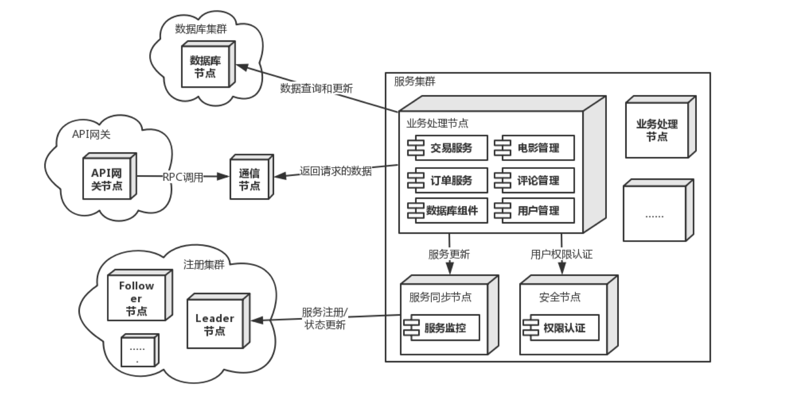

### 业务驱动
//即业务需求
(ln)

### 质量属性效用树
|质量属性|具体属性|场景|
|----|----|----|
|安全性|数据安全|A1：|(mmz)
|安全性|权限控制|A2：|(mmz)
|可用性|服务可用性|A3:|(lb)
|可用性|错误检测|A4:|(ljd)
|鲁棒性|错误操作处理|A5:|(ljd)
|性能|并发性|A6:|(qyc)
|性能|响应速度|A7:|(qyc)
|可靠性|数据完整性|A8:|(jbs)
|可扩展性|服务更新|A9:|(jbs)

整合:(ln)

# 表格模板

<table>
	<tr>
		<th>场景A4</th>
		<th colspan='4'>系统在5s内发现用户断线</th>
	</tr>
	<tr>
		<td>质量属性</td>
		<td colspan='4'>可用性</td>
	</tr>
	<tr>
		<td>环境</td>
		<td colspan='4'>整体系统正常运行</td>
	</tr>
	<tr>
		<td>刺激</td>
		<td colspan='4'>用户断线</td>
	</tr>
	<tr>
		<td>响应</td>
		<td colspan='4'>1. 系统发现用户断线时，记录断线信息 2. 当用户重连时恢复用户断线前的现场信息</td>
	</tr>
	<tr>
			<th>架构决策</th>
			<th>敏感点</th>
			<th>权衡点</th>
			<th>风险</th>
			<th>非风险</th>
	</tr>
	<tr>
		<td>ping/echo机制</td>
		<td>S4</td>
		<td></td>
		<td></td>
		<td>N4</td>
	</tr>
	<tr>
		<td>出错重试</td>
		<td></td>
		<td>T4</td>
		<td>R2</td>
		<td></td>
	</tr>
	<tr>
		<td>理由说明</td>
		<td colspan='4'>通过ping/echo的检测机制,系统能够尽早发现连接异常,并采取出错重试的恢复措施</td>
	</tr>
	<tr>
		<td>相关架构图</td>
		<td colspan='4'></img></td>
	</tr>
</table>

### ATAM过程

1. 根据对方组的架构，产生效用树（Utility Tree）（已完成，本文档第一部分）
2. 针对每个树的叶节点（即是每个具体属性），根据对方文档中的设定场景，设定一个这个属性对应的场景（已经确定属性，需要每个人确定场景）
3. 对于每个场景，完成分析表格

### 注意事项

- 场景根据对方组的对应质量属性的场景写
- 表格的前四行可以来源于对方的文档,也即是参考的对方的场景里的信息
- **架构决策**是对方**选中**的tactics,后续的点（敏感点、权衡点、风险和非风险）都是各自独立的,直接写在表格里,整合的同学需要把这些点提取成单独的表格并标号
- **理由**是选取**这些**tactics的原因
- 架构图是module view相关部分的截图
- 目录分支规范：以目前最新的atam分支的提交为基础分支（把atam合并到自己分支也行），然后在`project/atam`下建议以自己名字缩写（例如`cjd`）为名的目录，把自己的文件放在此目录中。自己的工作做完后**直接推送到自己的分支**。合并的同学首先将分支合并到atam，然后合并到`project/atam/atam.md`中，各个人的图片复制到`project/atam/img`目录下。

### DDL

3月25日中午12点