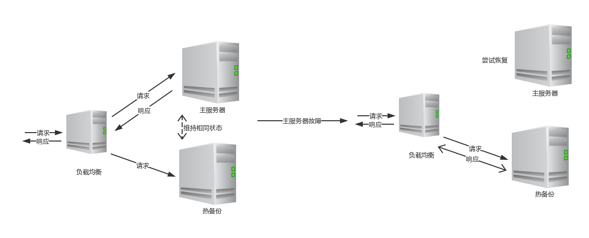
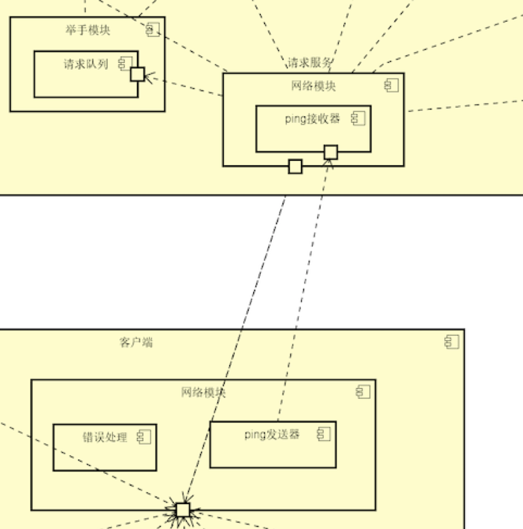

# 课程教学辅助系统 评估文档

By 五律协同观乙方

| 成员学号  | 成员姓名 |
| --------- | -------- |
| 161250010 | 陈俊达   |
| 161250011 | 陈俊宇   |
| 161250091 | 苗沐之   |
| 161250050 | 靳炳淑   |
| 161250103 | 钱宇辰   |
| 161250068 | 廖均达   |
| 161250056 | 李冰     |
| 161250067 | 梁楠     |

# 0. 目录

# 0.1业务驱动

| 业务驱动 | 1                                                            |
| -------- | ------------------------------------------------------------ |
| 用户购票 | 用户可以在平台上选择影院或电影查看上映，然后对电影进行选票的操作 |
| 发表评论 | 用户可以在观影完成后对电影进行评分和评论操作                 |
| 回复评论 | 用户可以看到其他用户的评分和评论，并可以对其他用户的评论进行评论、或者“顶/踩”操作 |
| 账户管理 | 用户可以设置个人信息，包括昵称、手机号、密码、感兴趣电影类型等信息 |
| 订单管理 | 用户可以对已经购买的电影订单进行查看、退票、改签等操作       |
| 报表查看 | 管理员可以查看每部电影的销售情况或者每个影院每次放映的的上座率，用户画像等资料 |
| 电影管理 | 管理员可以对电影进行上架和下架等操作                         |
| 拍片管理 | 电影院的管理员可以基于系统的已有电影进行其电影院的排片操作，同时本系统和其他电影院的系统进行同步座位、价格和场次情况 |

# 1. 质量属性效用树

| 质量属性 | 具体属性 | 场景 |
| -------- | -------- | ---- |
|安全性|数据安全|A1：禁止未授权用户修改本地数据[高，中]|
|安全性|权限控制|A2：用户执行操作前验证权限[高，中]|
|可用性|服务可用性|A3: 每周系统服务下线总持续时间不超过10分钟，时间段不出现在服务繁忙期(8:00AM~12:00PM)，系统可用时间达99.9%[高, 中]|
|可用性|错误检测|A4: 系统在5s内发现用户断线[高, 高]|
|鲁棒性|错误操作处理|A5:|
|性能|并发性|A6:|
|性能|响应速度|A7:|
|可靠性|数据完整性|A8:|
|可扩展性|服务更新|A9:|

# 2. ATAM分析

<table>
	<tr><td colspan="5">场景A1：禁止未授权用户修改本地数据</td></tr>
	<tr>
		<td>质量属性</td>
		<td>安全性</td>
	</tr>
	<tr>
		<td>环境</td>
		<td>系统运行时</td>
	</tr>
	<tr>
		<td>刺激</td>
		<td>未授权用户试图访问本地数据库</td>
	</tr>
	<tr>
		<td>响应</td>
		<td>系统拒绝此次操作，并记录操作源、操作行为到日志中</td>
	</tr>
	<tr>
		<td>架构决策</td>
		<td>敏感点</td>
		<td>权衡点</td>
		<td>风险</td>
		<td>非风险</td>
	</tr>
	<tr>
		<td>限制数据库访问权限</td>
		<td>S1</td>
		<td>T1</td>
		<td>R1</td>
		<td>N1</td>
	</tr>
	<tr>
		<td>原因</td>
		<td>本系统事关学生敏感数据（成绩、回答记录等），因此数据安全性是很重要的。一些恶意用户可能会视图修改老师节点上的敏感数据，限制数据库访问权限可以有效防止恶意修改。</td>
	</tr>
	<tr>
		<td>相关的架构图</td>
		<td>略</td>
	</tr>
</table>

<table>
	<tr><td colspan="5">场景A2：用户执行操作前验证权限</td></tr>
	<tr>
		<td>质量属性</td>
		<td>安全性</td>
	</tr>
	<tr>
		<td>环境</td>
		<td>系统运行时</td>
	</tr>
	<tr>
		<td>刺激</td>
		<td>用户执行操作</td>
	</tr>
	<tr>
		<td>响应</td>
		<td>系统验证用户权限，判断是否可以执行</td>
	</tr>
	<tr>
		<td>架构决策</td>
		<td>敏感点</td>
		<td>权衡点</td>
		<td>风险</td>
		<td>非风险</td>
	</tr>
	<tr>
		<td>用户执行操作前验证权限</td>
		<td>S2</td>
		<td>T2</td>
		<td>无</td>
		<td>N2</td>
	</tr>
	<tr>
		<td>原因</td>
		<td>本系统的用户分为学生和教师等多种身份，为防止无权限的操作发生，应该在用户执行操作前验证权限</td>
	</tr>
	<tr>
		<td>相关的架构图</td>
		<td>略</td>
	</tr>
</table>

| 场景A3                                     | 系统运行过程中随着服务，服务器总会产生少量异常影响服务器持续服务性能，于是需要周期性停机维护。 |        |      |        |
| ------------------------------------------ | ------------------------------------------------------------ | ------ | ---- | ------ |
| 质量属性                                   | 可用性（服务可用率）                                         |        |      |        |
| 环境                                       | 整体系统正常运行                                             |        |      |        |
| 刺激                                       | 服务器因为持续服务而出现不稳定情况                           |        |      |        |
| 响应                                       | 服务器周期性进行停机维护                                     |        |      |        |
| 架构决策                                   | 敏感点                                                       | 权衡点 | 风险 | 非风险 |
| 使用热备份与实时负载均衡服务器提供备用服务 | S3                                                           | T3     |      | N3     |
| 理由说明                                   | 通过热备份与实时负载均衡服务器提供备用服务，可以保证运行时主服务器突发不可运行时快速恢复的异常时能启用热备份维持服务，保障系统服务时间覆盖率。 |        |      |        |
| 相关架构图                                 |                                       |        |      |        |

<table>
	<tr>
		<th>场景A4</th>
		<th colspan='4'>系统在5s内发现用户断线</th>
	</tr>
	<tr>
		<td>质量属性</td>
		<td colspan='4'>可用性</td>
	</tr>
	<tr>
		<td>环境</td>
		<td colspan='4'>整体系统正常运行</td>
	</tr>
	<tr>
		<td>刺激</td>
		<td colspan='4'>用户断线</td>
	</tr>
	<tr>
		<td>响应</td>
		<td colspan='4'>1. 系统发现用户断线时，记录断线信息 2. 当用户重连时恢复用户断线前的现场信息</td>
	</tr>
	<tr>
			<th>架构决策</th>
			<th>敏感点</th>
			<th>权衡点</th>
			<th>风险</th>
			<th>非风险</th>
	</tr>
	<tr>
		<td>ping/echo机制</td>
		<td>S4</td>
		<td></td>
		<td></td>
		<td>N4</td>
	</tr>
	<tr>
		<td>出错重试</td>
		<td></td>
		<td>T4</td>
		<td>R2</td>
		<td></td>
	</tr>
	<tr>
		<td>理由说明</td>
		<td colspan='4'>通过ping/echo的检测机制,系统能够尽早发现连接异常,并采取出错重试的恢复措施</td>
	</tr>
	<tr>
		<td>相关架构图</td>
		<td colspan='4'></img></td>
	</tr>
</table>

# 3. 敏感点

|#|架构决策|原因|
|-|-|-|
|S1|限制数据库访问权限|安全性和性能的敏感点。保证数据未被纂改，可能会带来性能上的开销。|
|S2|用户执行操作前验证权限|安全性和性能的敏感点。每次操作前需要进行验证，会带来性能上的开销。|
| S3   | 使用热备份与实时负载均衡服务器提供备用服务 | 热备份与实时负载均衡服务器可以避免服务器意外宕机引起服务不可用，是系统服务可用性的敏感点，用户访问服务额外经过负载均衡服务器会影响总体响应时间，可能提升服务速度，但也会多一次访问请求，也是性能的敏感点。 |
|S4|ping/echo机制|可用性的敏感点 用来检测服务的状态|

# 4. 权衡点
|#|架构决策|原因|
|-|-|-|
|T1|限制数据库访问权限|安全性和性能的权衡点。牺牲部分安全性，保证性能。|
|T2|用户执行操作前验证权限|安全性和性能的权衡点。牺牲部分安全性，保证性能。|
| T3   | 使用热备份与实时负载均衡服务器提供备用服务 | 增加实时负载均衡服务器改善服务提供但增加访问次数，是可用性与性能的权衡点。 |
|T4|出错重试|可用性与效率的权衡点 出错后立刻尝试重连可以避免偶然错误,但增加系统负载|

# 5. 风险

|#|架构决策|原因|
|-|-|-|
|R1|限制数据库访问权限|数据库可能被暴力破解。|
|R2|出错重试|出错重试会增加系统负载,降低效率|

# 6. 非风险

|#|架构决策|原因|
|-|-|-|
|N1|限制数据库访问权限|大部分数据库均提供权限验证的功能。|
|N2|用户执行操作前验证权限|将操作分为不同等级，验证高等级操作|
| N3  | 使用热备份与实时负载均衡服务器提供备用服务 | 增加这些模块会改善可用性，而少量增加系统运行金钱成本。采用决策可以自建服务器或购买相关服务。 |
|N4|ping/echo机制|ping/echo机制实现简单,且已有成熟的解决方案|

