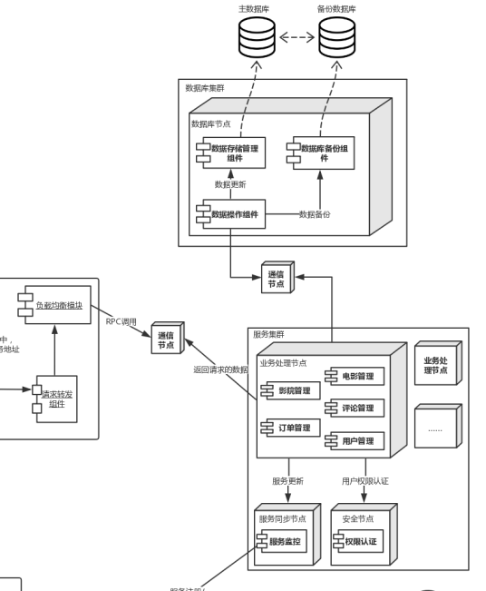

# 课程教学辅助系统 评估文档

By 五律协同观乙方

| 成员学号  | 成员姓名 |
| --------- | -------- |
| 161250010 | 陈俊达   |
| 161250011 | 陈俊宇   |
| 161250091 | 苗沐之   |
| 161250050 | 靳炳淑   |
| 161250103 | 钱宇辰   |
| 161250068 | 廖均达   |
| 161250056 | 李冰     |
| 161250067 | 梁楠     |

# 0. 目录

# 0.1. 业务驱动

| 业务驱动 | 内容                                                         |
| -------- | ------------------------------------------------------------ |
| 用户购票 | 用户可以在平台上选择影院或电影查看上映，然后对电影进行选票的操作 |
| 发表评论 | 用户可以在观影完成后对电影进行评分和评论操作                 |
| 回复评论 | 用户可以看到其他用户的评分和评论，并可以对其他用户的评论进行评论、或者“顶/踩”操作 |
| 账户管理 | 用户可以设置个人信息，包括昵称、手机号、密码、感兴趣电影类型等信息 |
| 订单管理 | 用户可以对已经购买的电影订单进行查看、退票、改签等操作       |
| 报表查看 | 管理员可以查看每部电影的销售情况或者每个影院每次放映的的上座率，用户画像等资料 |
| 电影管理 | 管理员可以对电影进行上架和下架等操作                         |
| 拍片管理 | 电影院的管理员可以基于系统的已有电影进行其电影院的排片操作，同时本系统和其他电影院的系统进行同步座位、价格和场次情况 |

# 1. 质量属性效用树

| 质量属性 | 具体属性 | 场景 |
| -------- | -------- | ---- |
|安全性|数据安全|A1：攻击者获得数据库数据后,无法解析加密后的数据[中, 中]|
|安全性|权限控制|A2：系统在2秒内拒绝未验证用户的购票操作[高, 中]|
|可用性|服务可用性|A3：每周系统服务下线总持续时间不超过10分钟，时间段不出现在服务繁忙期(8:00AM~12:00PM)，系统可用时间达99.9%(高,中)|
|可用性|错误检测|A4：系统及时发现服务器出现故障，无法正常运行的情况 (高，中)|
|可用性|错误操作处理|A5：系统在 1s 内发现用户断线 (中，高)|
|性能|并发性|A6: 超过100个用户同时购买同一场的电影票 (高，高)|
|性能|响应速度|A7:|
|可靠性|数据完整性|A8:|
|可扩展性|服务更新|A9:|

# 2. ATAM分析
<table>
	<tr>
		<th>场景A1</th>
		<th colspan='4'>攻击者获得数据库数据后,无法解析加密后的数据</th>
	</tr>
	<tr>
		<td>质量属性</td>
		<td colspan='4'>安全性</td>
	</tr>
	<tr>
		<td>环境</td>
		<td colspan='4'>系统运⾏环境，系统正常运行;或者系统整体测试时</td>
	</tr>
	<tr>
		<td>刺激</td>
		<td colspan='4'>外部攻击</td>
	</tr>
	<tr>
		<td>响应</td>
		<td colspan='4'>攻击者只能获得无法破译的加密信息</td>
	</tr>
	<tr>
			<th>架构决策</th>
			<th>敏感点</th>
			<th>权衡点</th>
			<th>风险</th>
			<th>非风险</th>
	</tr>
	<tr>
		<td>库内扩展加密</td>
		<td>S1</td>
		<td>T1</td>
		<td></td>
		<td>N1</td>
	</tr>
		<tr>
		<td>理由说明</td>
		<td colspan='4'>库内扩展加密利⽤视图触发器等数据库本身的机制，可以加密数据库中不同粒度的数据.同时对于不同⽤户，控制其对敏感数据的访问权限. 库内扩展加密已有成熟的解决方案.</td>
	</tr>
	<tr>
		<td>相关架构图</td>
		<td colspan='4'></img></td>
	</tr>
</table>

<table>
	<tr>
		<th>场景A2</th>
		<th colspan='4'>系统在2秒内拒绝未验证用户的购票操作</th>
	</tr>
	<tr>
		<td>质量属性</td>
		<td colspan='4'>安全性</td>
	</tr>
	<tr>
		<td>环境</td>
		<td colspan='4'>整体系统正常运行</td>
	</tr>
	<tr>
		<td>刺激</td>
		<td colspan='4'>未验证用户尝试进行购票或支付等操作</td>
	</tr>
	<tr>
		<td>响应</td>
		<td colspan='4'>1. 系统在2秒内拒绝⽤户进行相应操作，并提示用户进⾏登录 2.系统记录用户违规操作</td>
	</tr>
	<tr>
			<th>架构决策</th>
			<th>敏感点</th>
			<th>权衡点</th>
			<th>风险</th>
			<th>非风险</th>
	</tr>
	<tr>
		<td>基于token的认证</td>
		<td></td>
		<td>T2</td>
		<td></td>
		<td>N2</td>
	</tr>
	<tr>
		<td>限制接口每秒的请求数</td>
		<td>S2</td>
		<td></td>
		<td></td>
		<td>N3</td>
	</tr>
	<tr>
		<td>使⽤访问能⼒表</td>
		<td>S3</td>
		<td></td>
		<td>R1</td>
		<td></td>
	</tr>
	<tr>
		<td>使⽤SSL/TSL进行加密</td>
		<td>S4</td>
		<td></td>
		<td></td>
		<td>N4</td>
	</tr>
	<tr>
		<td>理由说明</td>
		<td colspan='4'>基于token的认证可以减少服务器资源消耗,且实现难度低. 限制接口每秒的请求数可以灵活限制恶意访问. 访问能⼒表可以高效提供访问权限控制,但实现难度高. SSL/TSL加密简单高效.</td>
	</tr>
	<tr>
		<td>相关架构图</td>
		<td colspan='4'></img></td>
	</tr>
</table>

<table>
	<tr>
		<th>场景A3</th>
		<th colspan='4'>系统服务器无法正常运行</th>
	</tr>
	<tr>
		<td>质量属性</td>
		<td colspan='4'>可用性（服务可用率）</td>
	</tr>
	<tr>
		<td>环境</td>
		<td colspan='4'>整体系统正常运行</td>
	</tr>
	<tr>
		<td>刺激</td>
		<td colspan='4'>系统服务器崩溃，无法提供服务</td>
	</tr>
	<tr>
		<td>响应</td>
		<td colspan='4'>1.查明服务器障原因，修复系统故障  2.记录并保存故障日志  3.通知访问的用户相应的功能暂时无法使用  4.解决问题并重启服务器</td>
	</tr>
	<tr>
			<th>架构决策</th>
			<th>敏感点</th>
			<th>权衡点</th>
			<th>风险</th>
			<th>非风险</th>
	</tr>
	<tr>
		<td>使用双机双工模式进行服务器备份</td>
		<td>S5</td>
		<td>T3</td>
		<td></td>
		<td>N5</td>
	</tr>
	<tr>
		<td>使用Ngnix等软件处理理请求分发，在客户端存储和维护服务端清单来实现服务分发的负载均衡</td>
		<td>S6</td>
		<td>T4</td>
		<td>R2</td>
		<td>N6</td>
	</tr>
	<tr>
		<td>理由说明</td>
		<td colspan='4'>双机双⼯模式中，两台服务器均为活动，同时运行相同的应用，实现了负载均衡，且不易产生服务丢失,效果较好。 使用Ngnix等软件处理理请求分发，在客户端存储和维护服务端清单来实现服务分发的负载均衡，有利于快速迭代和部署，避免数据量集中访问时出现的性能问题，提高系统的可利用率。</td>
	</tr>
	<tr>
		<td>相关架构图</td>
		<td colspan='4'></img></td>
	</tr>
</table>

<table>
	<tr>
		<th>场景A4</th>
		<th colspan='4'>系统及时发现服务器出现故障，无法正常运行的情况</th>
	</tr>
	<tr>
		<td>质量属性</td>
		<td colspan='4'>可用性</td>
	</tr>
	<tr>
		<td>环境</td>
		<td colspan='4'>系统服务器出现故障，⽆法正常运⾏</td>
	</tr>
	<tr>
		<td>刺激</td>
		<td colspan='4'>系统服务器崩溃，⽆法提供服务</td>
	</tr>
	<tr>
		<td>响应</td>
		<td colspan='4'>1. 查明服务器故障原因，修复系统故障 2. 记录并保存故障⽇志 3. 通知访问的⽤户相应的功能暂时⽆法使⽤ 4. 解决问题并重启服务器</td>
	</tr>
	<tr>
			<th>架构决策</th>
			<th>敏感点</th>
			<th>权衡点</th>
			<th>风险</th>
			<th>非风险</th>
	</tr>
	<tr>
		<td>Ping/Echo</td>
		<td>S7</td>
		<td>T5</td>
		<td></td>
		<td>N7</td>
	</tr>
	<tr>
		<td>理由说明</td>
		<td colspan='4'>1. 在分布式环境下，服务节点⼀般会很多，所以根据概率⽽⾔，宕机少部分服务器对⽤户和整个系统的服务⽽⾔⼀般影响不⼤ 2. 监控中⼼需要对⼤量的服务器进⾏监控，所以资源消耗对监控模块⽽⾔⾄关重要，Ping/Echo 消耗较小</td>
	</tr>
	<tr>
		<td>相关架构图</td>
		<td colspan='4'></img></td>
	</tr>
</table>

<table>
	<tr>
		<th>场景A5</th>
		<th colspan='4'>系统在 1s 内发现用户断线</th>
	</tr>
	<tr>
		<td>质量属性</td>
		<td colspan='4'>可用性</td>
	</tr>
	<tr>
		<td>环境</td>
		<td colspan='4'>客户端软件在⽆⽹络或⽹络不稳定的环境下运⾏</td>
	</tr>
	<tr>
		<td>刺激</td>
		<td colspan='4'>⽹络不稳定或失去连接</td>
	</tr>
	<tr>
		<td>响应</td>
		<td colspan='4'>1. 在 0.5s 内保存⽤户的操作和相应的信息 2. 在断线发生后 1s 内告知⽤户⽹络存在问题 3. 检测到⽹络连接状况良好时，在1s内重新进⾏操作</td>
	</tr>
	<tr>
			<th>架构决策</th>
			<th>敏感点</th>
			<th>权衡点</th>
			<th>风险</th>
			<th>非风险</th>
	</tr>
	<tr>
		<td>Heartbeat</td>
		<td>S8</td>
		<td>T6</td>
		<td></td>
		<td></td>
	</tr>
	<tr>
		<td>理由说明</td>
		<td colspan='4'>心跳检测可以快速发现错误节点,且其通信负担较小</td>
	</tr>
	<tr>
		<td>相关架构图</td>
		<td colspan='4'></img></td>
	</tr>
</table>

<table>
	<tr>
		<th>场景A6</th>
		<th colspan='4'>超过100个用户同时购买同一场的电影票</th>
	</tr>
	<tr>
		<td>质量属性</td>
		<td colspan='4'>性能</td>
	</tr>
	<tr>
		<td>环境</td>
		<td colspan='4'>整体系统正常运行</td>
	</tr>
	<tr>
		<td>刺激</td>
		<td colspan='4'>超过100个用户同时购买同一场的电影票</td>
	</tr>
	<tr>
		<td>响应</td>
		<td colspan='4'>1. 系统帮助用户正常完成购买操作 2. 服务器端的数据库中的数据正常修改 3. 客户端用户界面及时刷新</td>
	</tr>
	<tr>
			<th>架构决策</th>
			<th>敏感点</th>
			<th>权衡点</th>
			<th>风险</th>
			<th>非风险</th>
	</tr>
	<tr>
		<td>增加数据检索服务节点</td>
		<td>S1</td>
		<td></td>
		<td>R1</td>
		<td>N1</td>
	</tr>
	<tr>
		<td>增加数据计算服务节点</td>
		<td>S1</td>
		<td></td>
		<td>R1</td>
		<td>N1、N2</td>
	</tr>
	<tr>
		<td>使用Ngnix等软件处理请求分发+在客户端存储和维护服务端清单</td>
		<td></td>
		<td>T1</td>
		<td>R2</td>
		<td>N3</td>
	</tr>
	<tr>
		<td>使用优先队列处理请求</td>
		<td>S2</td>
		<td>T2</td>
		<td></td>
		<td></td>
	</tr>
	<tr>
		<td>最小连接数算法</td>
		<td></td>
		<td>T3</td>
		<td></td>
		<td></td>
	</tr>
	<tr>
		<td>文件系统存储</td>
		<td></td>
		<td></td>
		<td></td>
		<td>N4</td>
	</tr>
	<tr>
		<td>理由说明</td>
		<td colspan='4'>增加节点的成本低，灵活(N1、N2)，但是其实现难度受系统架构的可伸缩性影响(R1)。 软负载均衡+客户端维护信息可以取长补短。 文件系统处理大容量数据较为方便。</td>
	</tr>
	<tr>
		<td>相关架构图</td>
		<td colspan='4'></img></td>
	</tr>
</table>

# 3. 敏感点

|#|架构决策|原因|
|---|---|---|
|S1|库内扩展加密|安全性的敏感点库内扩展加密由数据库管理系统实现，可以防⽌控制了操作系统的攻击者|
|S2|限制接口每秒的请求数|安全性的敏感点限制接入可以保障系统的安全|
|S3|使⽤访问能⼒表|安全性与效率的敏感点访问能力表提供访问权限控制,同时访问能力表是一种高效的控制权限方式|
|S4|使⽤SSL/TSL进行加密|安全性的敏感点SSL/TSL信息加密可以保证通信安全|
|S5| 使用双机双工模式进行服务器备份 | 使用双机双工模式进行服务器备份可以避免服务器意外宕机引起服务不可用，是系统服务可用性的敏感点。 |
|S6| 使用Ngnix等软件处理理请求分发，在客户端存储和维护服务端清单来实现服务分发的负载均衡 |使用Ngnix等软件处理理请求分发，在客户端存储和维护服务端清单来实现服务分发的负载均衡可以进行快速迭代和修改，减少客户端对负载均衡节点的访问，提升效率，是系统服务可用性的敏感点。 |
|S7|Ping/Echo|ping/echo 只能测试客户端和服务器之间的网络连接是否正常，而不能检测服务器的某些功能是否正常运行，有可能出现 ping/echo 正常但是服务器的某些特定服务不正常|
|S8|Heartbeat|发送心跳的频率会影响发现用户断线时间|

# 4. 权衡点
|#|架构决策|原因|
|---|---|---|
|T1|库内扩展加密|安全性与性能的权衡点库内扩展加密会因为加密与解密过程而消耗时间,但效率损耗在15%以内。|
|T2|基于token的认证|安全性与效率的权衡点基于cookie的认证会消耗服务器资源,而基于token的认证相对更加高效|
|T3| 使用双机双工模式进行服务器备份 | 使用双机双工模式进行服务器备份改善服务提供但增加访问次数，是可用性与性能的权衡点 |
|T4|使用Ngnix等软件处理理请求分发，在客户端存储和维护服务端清单来实现服务分发的负载均衡|  在数据量集中访问的情况下可能会出现单点的性能瓶颈问题，是可用性与性能的权衡点 |
|T5|Ping/Echo|ping 的频率决定了发现服务器故障的时间，高频率能够更快发现服务器宕机，但同样也增加了客户端和服务器的处理负担，需要对频率进行权衡|
|T6|Heartbeat|发送心跳的频率决定了发现用户断线的时间。高频率能够更快发现断线但同时也增加了服务器的负担，这是需要进行权衡的地方|

# 5. 风险

|#|架构决策|原因|
|---|---|---|
|R1|使⽤访问能⼒表|访问能力表实现相对复杂|
|R2| 使用Ngnix等软件处理理请求分发，在客户端存储和维护服务端清单来实现服务分发的负载均衡 | 流量较大时负载均衡节点会成为性能瓶颈 |

# 6. 非风险

|#|架构决策|原因|
|---|---|---|
|N1|库内扩展加密|库内扩展加密是现在主流的数据库加密方式。|
|N2|基于token的认证|基于token的认证实现难度低且效率高|
|N3|限制接口每秒的请求数|限制接口每秒的请求数可以平滑应对访问量波动|
|N4|使⽤SSL/TSL进行加密|SSL/TSL被大多数设备支持,且实现成本低|
|N5| 使用双机双工模式进行服务器备份 | 增加这些模块会改善可用性，而少量增加系统运行金钱成本 |
|N6| 使用Ngnix等软件处理理请求分发，在客户端存储和维护服务端清单来实现服务分发的负载均衡 | 客户端维护数据可以减轻负载均衡节点负担 |
|N7|Ping/Echo|ping/echo 实现简单，有成熟的解决方案|

