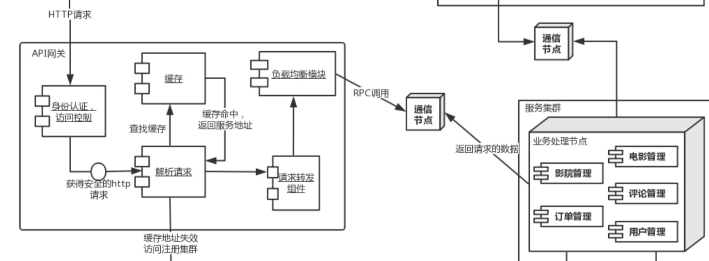
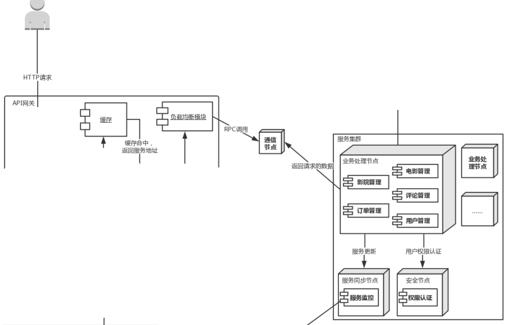

# 质量属性效用树
| 质量属性 | 具体属性   | 场景                                   |
| -------- | ---------- | -------------------------------------- |
| 可靠性   | 数据完整性 | A8: >100的⽤用户同时购买同⼀一场电影的票 |
| 可扩展性 | 服务更新   | A9: 为系统加⼊入新的功能和服务          |

# ATAM分析
<table>
	<tr>
		<th>场景A8</th>
		<th colspan='4'>>100的⽤用户同时购买同⼀一场电影的票</th>
	</tr>
	<tr>
		<td>质量属性</td>
		<td colspan='4'>可靠性</td>
	</tr>
	<tr>
		<td>环境</td>
		<td colspan='4'>整体系统正常运行</td>
	</tr>
	<tr>
		<td>刺激</td>
		<td colspan='4'>>100的⽤用户同时购买同⼀一场电影的票</td>
	</tr>
	<tr>
		<td>响应</td>
		<td colspan='4'>1. 系统帮助⽤用户正常完成购买操作 2. 服务器器端的数据库中的数据正常修改 3. 客户端⽤用户界⾯面及时刷新</td>
	</tr>
	<tr>
			<th>架构决策</th>
			<th>敏感点</th>
			<th>权衡点</th>
			<th>风险</th>
			<th>非风险</th>
	</tr>
	<tr>
		<td>选择增加数据检索服务节点</td>
		<td></td>
		<td></td>
		<td></td>
		<td></td>
	</tr>
  	<tr>
		<td>使⽤用Ngnix等软件处理理请求分发\在客户端存储和维护服务端清单</td>
		<td></td>
		<td></td>
		<td></td>
		<td></td>
	</tr>
  <tr>
		<td>使用优先队列处理请求</td>
		<td></td>
		<td></td>
		<td></td>
		<td></td>
	</tr>
  <tr>
		<td>最⼩连接数算法</td>
		<td></td>
		<td></td>
		<td></td>
		<td></td>
	</tr>
	<tr>
		<td>理由说明</td>
		<td colspan='4'>1.使⽤用增加
数据计算服务节点的方式，可伸缩性强，不需要重新部署和启动整个系统，在提⾼性能
的过程中服务依然是可用的，且相对成本较低，所以由于提高单机计算性能 2.使用 Ngnix等软件处理请求分发，可以进行快速的迭代和修改，同时可以很方便地修改配置，同时在正常流量下可以保证与硬件分发相差不⼤的性能提升。 3.选择使用优先队列来处理信息，这样可以在保证数据不会丢失的情况下仍然可以先处理高优级的请求。 4.最小连接数算法是以后端服务器的视角来观察系统的负载，⽐较灵活和智能，算法效果较好，极⼤的提高后端服务器的利用率，将负载合理地分流到机器</td>
	</tr>
	<tr>
		<td>相关架构图</td>
		<td colspan='4'></img></td>
	</tr>
</table>

<table>
	<tr>
		<th>场景A9</th>
		<th colspan='4'>为系统加⼊入新的功能和服务</th>
	</tr>
	<tr>
		<td>质量属性</td>
		<td colspan='4'>可扩展性</td>
	</tr>
	<tr>
		<td>环境</td>
		<td colspan='4'>整体系统正常运行</td>
	</tr>
	<tr>
		<td>刺激</td>
		<td colspan='4'>为系统加⼊入新的功能和服务</td>
	</tr>
	<tr>
		<td>响应</td>
		<td colspan='4'>1. 系统帮助⽤用户正常完成购买操作 2. 服务器器端的数据库中的数据正常修改 3. 客户端⽤用户界⾯面及时刷新</td>
	</tr>
	<tr>
			<th>架构决策</th>
			<th>敏感点</th>
			<th>权衡点</th>
			<th>风险</th>
			<th>非风险</th>
	</tr>
	<tr>
		<td>Zab协议栈模式</td>
		<td></td>
		<td></td>
		<td></td>
		<td></td>
	</tr>
  	<tr>
		<td>业务服务器定时更新注册表</td>
		<td></td>
		<td></td>
		<td></td>
		<td></td>
	</tr>
  <tr>
		<td>Restful API</td>
		<td></td>
		<td></td>
		<td></td>
		<td></td>
	</tr>
	<tr>
		<td>理由说明</td>
		<td colspan='4'>1.Zab协议栈基于Paxos算法，它使用了单一的Leader来接受和处理客户端的所有事务请求，并将服务器数据的状态变更以事务Proposal的形式广播到所有的Server中。Zab协议利用崩溃恢复和消息广播两种基本模式提供了相当水平的可用性，新出册的节点在加入后等待，带到下一轮Leader选举时⾃动进入Follower群组。 2.定时更新注册表，同时由于注册中心不必发出多个网络请求，降低了负载，减少注册中⼼宕机的可能性。 3.用HTTP协议可以保证数据传送完成后关闭协议，网络资源的释放和管理更加灵活⽅便</td>
	</tr>
	<tr>
		<td>相关架构图</td>
		<td colspan='4'></img></td>
	</tr>
</table>
