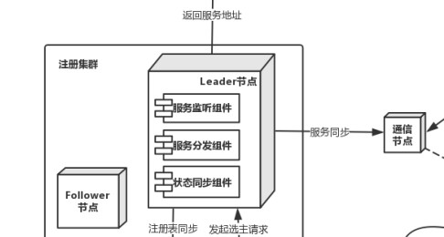
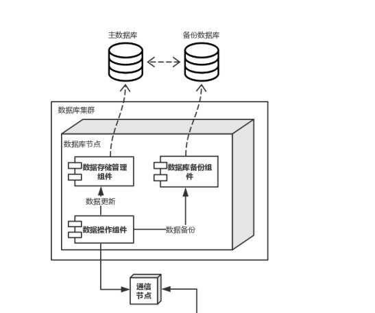
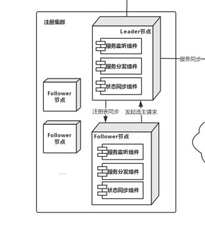
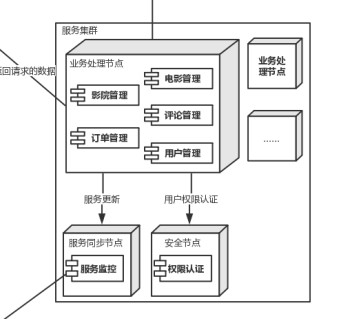

# 质量属性效用树
| 质量属性 | 具体属性   | 场景                                   |
| -------- | ---------- | -------------------------------------- |
| 可靠性   | 数据完整性 | A8: >100的⽤用户同时购买同⼀一场电影的票 |
| 可扩展性 | 服务更新   | A9: 为系统加入新的功能和服务          |

# ATAM分析
<table>
	<tr>
		<th>场景A6</th>
		<th colspan='4'>超过100个用户同时购买同一场的电影票</th>
	</tr>
	<tr>
		<td>质量属性</td>
		<td colspan='4'>性能</td>
	</tr>
	<tr>
		<td>环境</td>
		<td colspan='4'>整体系统正常运行</td>
	</tr>
	<tr>
		<td>刺激</td>
		<td colspan='4'>超过100个用户同时购买同一场的电影票</td>
	</tr>
	<tr>
		<td>响应</td>
		<td colspan='4'>1. 系统帮助用户正常完成购买操作 2. 服务器端的数据库中的数据正常修改 3. 客户端用户界面及时刷新</td>
	</tr>
	<tr>
			<th>架构决策</th>
			<th>敏感点</th>
			<th>权衡点</th>
			<th>风险</th>
			<th>非风险</th>
	</tr>
	<tr>
		<td>Zab协议栈模式</td>
		<td></td>
		<td>T1</td>
		<td>R1</td>
		<td>N1</td>
	</tr>
  	<tr>
		<td>奇偶校验</td>
		<td></td>
		<td>T2</td>
		<td></td>
		<td></td>
	</tr>
  <tr>
		<td>实时备份</td>
		<td>S1</td>
		<td></td>
		<td></td>
		<td>N4</td>
	</tr>
  <tr>
		<td>固定时间间隔备份</td>
		<td></td>
		<td>T3</td>
		<td></td>
		<td>N3</td>
	</tr>
	<tr>
		<td>理由说明</td>
		<td colspan='4'>系统对可用性要求不高，Zab协议栈提供了高容错的可接受的方案。 数据校验要考虑正确率和计算的成本，因此选择奇偶校验。 业务数据较为重要，采用实时备份；静态数据体量巨大，间隔备份较为可取。</td>
	</tr>
	<tr>
		<td>相关架构图</td>
		<td colspan='4'></img></img></td>
	</tr>
</table>

<table>
	<tr>
		<th>场景A9</th>
		<th colspan='4'>为系统加入新的功能和服务</th>
	</tr>
	<tr>
		<td>质量属性</td>
		<td colspan='4'>可扩展性</td>
	</tr>
	<tr>
		<td>环境</td>
		<td colspan='4'>整体系统正常运行</td>
	</tr>
	<tr>
		<td>刺激</td>
		<td colspan='4'>为系统加入新的功能和服务</td>
	</tr>
	<tr>
		<td>响应</td>
		<td colspan='4'>1. 系统帮助用户正常完成购买操作 2. 服务器端的数据库中的数据正常修改 3. 客户端用户界面及时刷新</td>
	</tr>
	<tr>
			<th>架构决策</th>
			<th>敏感点</th>
			<th>权衡点</th>
			<th>风险</th>
			<th>非风险</th>
	</tr>
	<tr>
		<td>业务服务器定时更新注册表</td>
		<td></td>
		<td>T4</td>
		<td></td>
		<td>N2</td>
	</tr>
  	<tr>
		<td>Zab协议栈模式</td>
		<td></td>
		<td></td>
		<td></td>
		<td>N1</td>
	</tr>
	<tr>
		<td>理由说明</td>
		<td colspan='4'>1.定时更新注册表，同时由于注册中心不必发出多个网络请求，降低负载，减少注册中心宕机的可能性。 2.使用Zab协议栈的系统维护时间较短。</td>
	</tr>
	<tr>
		<td>相关架构图</td>
		<td colspan='4'></img></img></td>
	</tr>
</table>

### 敏感点

|#|架构决策|原因|
|-|-|-|
|S1|实时备份|资源的敏感点。数据量越大，备份的开销越高。|

### 权衡点

|#|架构决策|原因|
|-|-|-|
|T1|Zab协议栈模式|权衡CAP原则。Server/Client牺牲了一致性，Gossip模式则牺牲了可用性，Zab协议栈的一致性和可用性均在可接受范围。|
|T2|奇偶校验|正确率和成本的权衡点。校验位越多，正确率越高，但是计算成本越高。|
|T3|固定时间间隔备份|成功率和成本的权衡点。备份时间间隔越短，恢复数据的成功率越高，但是存储开销也越高。|
|T4|业务服务器定时更新注册表|速度、成本以及可靠性的权衡点。注册表更新速度越高，成本越高。主动更新注册表更可靠，成本也更高。|

### 风险

|#|架构决策|原因|
|-|-|-|
|R1|Zab协议栈模式|可用性一般。|

### 非风险

|#|架构决策|原因|
|-|-|-|
|N1|Zab协议栈模式|有利于快速迭代，系统维护时间短。 系统对可用性要求不高。|
|N2|业务服务器定时更新注册表|便于扩展新业务。|
|N3|固定时间间隔备份|文件系统崩溃可以通过磁盘修复恢复数据。|
|N4|实时备份|数据安全性高。|