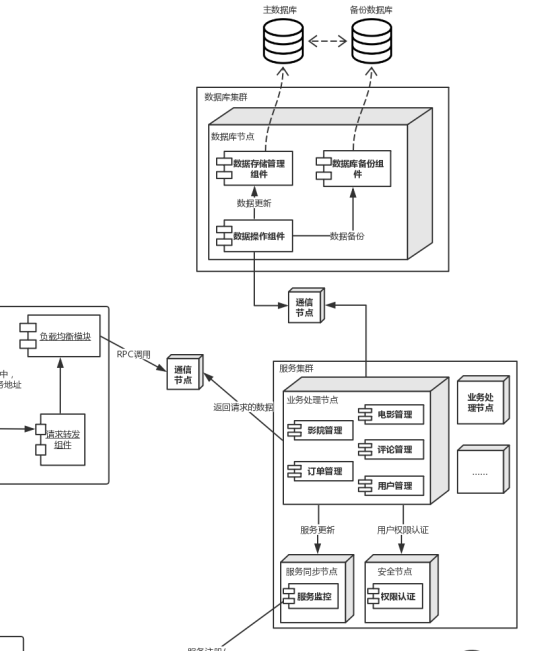

# ATAM分析
<table>
	<tr>
		<th>场景A3</th>
		<th colspan='4'>系统服务器无法正常运行</th>
	</tr>
	<tr>
		<td>质量属性</td>
		<td colspan='4'>可用性（服务可用率）</td>
	</tr>
	<tr>
		<td>环境</td>
		<td colspan='4'>整体系统正常运行</td>
	</tr>
	<tr>
		<td>刺激</td>
		<td colspan='4'>系统服务器崩溃，无法提供服务</td>
	</tr>
	<tr>
		<td>响应</td>
		<td colspan='4'>1.查明服务器障原因，修复系统故障  2.记录并保存故障日志  3.通知访问的用户相应的功能暂时无法使用  4.解决问题并重启服务器</td>
	</tr>
	<tr>
			<th>架构决策</th>
			<th>敏感点</th>
			<th>权衡点</th>
			<th>风险</th>
			<th>非风险</th>
	</tr>
	<tr>
		<td>使用双机双工模式进行服务器备份</td>
		<td>S1</td>
		<td>T1</td>
		<td></td>
		<td>N1</td>
	</tr>
	<tr>
		<td>使用Ngnix等软件处理理请求分发，在客户端存储和维护服务端清单来实现服务分发的负载均衡</td>
		<td>S2</td>
		<td>T2</td>
		<td>R1</td>
		<td>N2</td>
	</tr>
	<tr>
		<td>理由说明</td>
		<td colspan='4'>双机双⼯模式中，两台服务器均为活动，同时运行相同的应用，实现了负载均衡，且不易产生服务丢失,效果较好。 使用Ngnix等软件处理理请求分发，在客户端存储和维护服务端清单来实现服务分发的负载均衡，有利于快速迭代和部署，避免数据量集中访问时出现的性能问题，提高系统的可利用率。</td>
	</tr>
	<tr>
		<td>相关架构图</td>
		<td colspan='4'></img></td>
	</tr>
</table>

## 敏感点

| #    | 架构决策                                   | 理由                                                         |
| ---- | ------------------------------------------ | ------------------------------------------------------------ |
| S1   | 使用双机双工模式进行服务器备份 | 使用双机双工模式进行服务器备份可以避免服务器意外宕机引起服务不可用，是系统服务可用性的敏感点。 |
| S2   | 使用Ngnix等软件处理理请求分发，在客户端存储和维护服务端清单来实现服务分发的负载均衡 |使用Ngnix等软件处理理请求分发，在客户端存储和维护服务端清单来实现服务分发的负载均衡可以进行快速迭代和修改，减少客户端对负载均衡节点的访问，提升效率，是系统服务可用性的敏感点。 |

## 权衡点

| #    | 架构决策                                   | 理由                                                         |
| ---- | ------------------------------------------ | ------------------------------------------------------------ |
| T1   | 使用双机双工模式进行服务器备份 | 使用双机双工模式进行服务器备份改善服务提供但增加访问次数，是可用性与性能的权衡点 |
| T2   |使用Ngnix等软件处理理请求分发，在客户端存储和维护服务端清单来实现服务分发的负载均衡|  在数据量集中访问的情况下可能会出现单点的性能瓶颈问题，是可用性与性能的权衡点 |

## 风险

| #    | 架构决策                                   | 理由                                                         |
| ---- | ------------------------------------------ | ------------------------------------------------------------ |
| R1   | 使用Ngnix等软件处理理请求分发，在客户端存储和维护服务端清单来实现服务分发的负载均衡 | 流量较大时负载均衡节点会成为性能瓶颈 |

## 非风险

| #    | 架构决策                                   | 理由                                                         |
| ---- | ------------------------------------------ | ------------------------------------------------------------ |
| N1   | 使用双机双工模式进行服务器备份 | 增加这些模块会改善可用性，而少量增加系统运行金钱成本 |
| N2   | 使用Ngnix等软件处理理请求分发，在客户端存储和维护服务端清单来实现服务分发的负载均衡 | 客户端维护数据可以减轻负载均衡节点负担 |
