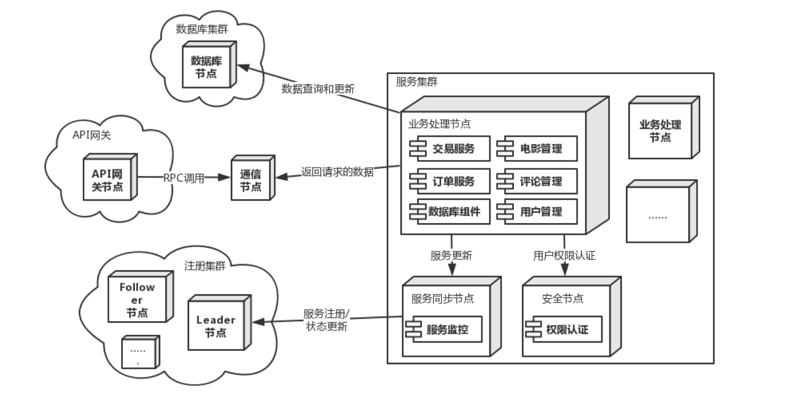

# ATAM 分析

## 场景

A4: 系统及时发现服务器出现故障，无法正常运行的情况 (高，中)

A5: 系统在 1s 内发现用户断线 (中，高)

## 分析

<table>
	<tr>
		<th>场景A4</th>
		<th colspan='4'>系统及时发现服务器出现故障，无法正常运行的情况</th>
	</tr>
	<tr>
		<td>质量属性</td>
		<td colspan='4'>可用性</td>
	</tr>
	<tr>
		<td>环境</td>
		<td colspan='4'>系统服务器出现故障，⽆法正常运⾏</td>
	</tr>
	<tr>
		<td>刺激</td>
		<td colspan='4'>系统服务器崩溃，⽆法提供服务</td>
	</tr>
	<tr>
		<td>响应</td>
		<td colspan='4'>1. 查明服务器故障原因，修复系统故障 2. 记录并保存故障⽇志 3. 通知访问的⽤户相应的功能暂时⽆法使⽤ 4. 解决问题并重启服务器</td>
	</tr>
	<tr>
			<th>架构决策</th>
			<th>敏感点</th>
			<th>权衡点</th>
			<th>风险</th>
			<th>非风险</th>
	</tr>
	<tr>
		<td>Ping/Echo</td>
		<td>ping/echo 只能测试客户端和服务器之间的网络连接是否正常，而不能检测服务器的某些功能是否正常运行，有可能出现 ping/echo 正常但是服务器的某些特定服务不正常</td>
		<td>ping 的频率决定了发现服务器故障的时间，高频率能够更快发现服务器宕机，但同样也增加了客户端和服务器的处理负担，需要对频率进行权衡</td>
		<td></td>
		<td>ping/echo 实现简单，有成熟的解决方案</td>
	</tr>
	<tr>
		<td>理由说明</td>
		<td colspan='4'>1. 在分布式环境下，服务节点⼀般会很多，所以根据概率⽽⾔，宕机少部分服务器对⽤户和整个系统的服务⽽⾔⼀般影响不⼤ 2. 监控中⼼需要对⼤量的服务器进⾏监控，所以资源消耗对监控模块⽽⾔⾄关重要，Ping/Echo 消耗较小</td>
	</tr>
	<tr>
		<td>相关架构图</td>
		<td colspan='4'></img></td>
	</tr>
</table>

<table>
	<tr>
		<th>场景A5</th>
		<th colspan='4'>系统在 1s 内发现用户断线</th>
	</tr>
	<tr>
		<td>质量属性</td>
		<td colspan='4'>可用性</td>
	</tr>
	<tr>
		<td>环境</td>
		<td colspan='4'>客户端软件在⽆⽹络或⽹络不稳定的环境下运⾏</td>
	</tr>
	<tr>
		<td>刺激</td>
		<td colspan='4'>⽹络不稳定或失去连接</td>
	</tr>
	<tr>
		<td>响应</td>
		<td colspan='4'>1. 在 0.5s 内保存⽤户的操作和相应的信息 2. 在断线发生后 1s 内告知⽤户⽹络存在问题 3. 检测到⽹络连接状况良好时，在1s内重新进⾏操作</td>
	</tr>
	<tr>
			<th>架构决策</th>
			<th>敏感点</th>
			<th>权衡点</th>
			<th>风险</th>
			<th>非风险</th>
	</tr>
	<tr>
		<td>Heartbeat</td>
		<td>发送心跳的频率会影响发现用户断线时间</td>
		<td>发送心跳的频率决定了发现用户断线的时间。高频率能够更快发现断线但同时也增加了服务器的负担，这是需要进行权衡的地方</td>
		<td></td>
		<td></td>
	</tr>
	<tr>
		<td>理由说明</td>
		<td colspan='4'>心跳检测的通信负担比 ping/echo 的通信负担更小</td>
	</tr>
	<tr>
		<td>相关架构图</td>
		<td colspan='4'></img></td>
	</tr>
</table>

