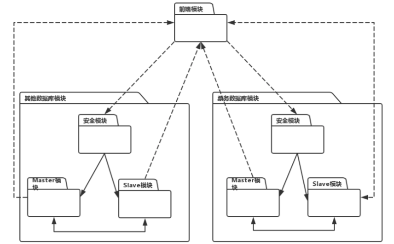
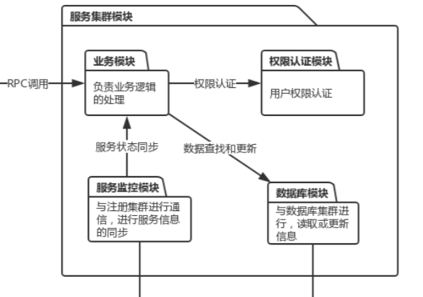

# 质量属性效用树
|质量属性|具体属性|场景|
|----|----|----|
|安全性|数据安全|A1：攻击者获得数据库数据后,无法解析加密后的数据[中, 中]|
|安全性|权限控制|A2：系统在2秒内拒绝未验证用户的购票操作[高, 中]|

# ATAM分析
<table>
	<tr>
		<th>场景A1</th>
		<th colspan='4'>攻击者获得数据库数据后,无法解析加密后的数据</th>
	</tr>
	<tr>
		<td>质量属性</td>
		<td colspan='4'>安全性</td>
	</tr>
	<tr>
		<td>环境</td>
		<td colspan='4'>系统运⾏环境，系统正常运行;或者系统整体测试时</td>
	</tr>
	<tr>
		<td>刺激</td>
		<td colspan='4'>外部攻击</td>
	</tr>
	<tr>
		<td>响应</td>
		<td colspan='4'>攻击者只能获得无法破译的加密信息</td>
	</tr>
	<tr>
			<th>架构决策</th>
			<th>敏感点</th>
			<th>权衡点</th>
			<th>风险</th>
			<th>非风险</th>
	</tr>
	<tr>
		<td>库内扩展加密</td>
		<td>安全性的敏感点 库内扩展加密由数据库管理系统实现，可以防⽌控制了操作系统的攻击者</td>
		<td>安全性与性能的权衡点 库内扩展加密会因为加密与解密过程而消耗时间,但效率损耗在15%以内</td>
		<td></td>
		<td>库内扩展加密是现在主流的数据库加密方式</td>
	</tr>
		<tr>
		<td>理由说明</td>
		<td colspan='4'>库内扩展加密利⽤视图触发器等数据库本身的机制，可以加密数据库中不同粒度的数据.同时对于不同⽤户，控制其对敏感数据的访问权限. 库内扩展加密已有成熟的解决方案.</td>
	</tr>
	<tr>
		<td>相关架构图</td>
		<td colspan='4'></img></td>
	</tr>
</table>

<table>
	<tr>
		<th>场景A2</th>
		<th colspan='4'>系统在2秒内拒绝未验证用户的购票操作</th>
	</tr>
	<tr>
		<td>质量属性</td>
		<td colspan='4'>安全性</td>
	</tr>
	<tr>
		<td>环境</td>
		<td colspan='4'>整体系统正常运行</td>
	</tr>
	<tr>
		<td>刺激</td>
		<td colspan='4'>未验证用户尝试进行购票或支付等操作</td>
	</tr>
	<tr>
		<td>响应</td>
		<td colspan='4'>1. 系统在2秒内拒绝⽤户进行相应操作，并提示用户进⾏登录 2.系统记录用户违规操作</td>
	</tr>
	<tr>
			<th>架构决策</th>
			<th>敏感点</th>
			<th>权衡点</th>
			<th>风险</th>
			<th>非风险</th>
	</tr>
	<tr>
		<td>基于token的认证</td>
		<td></td>
		<td>安全性与效率的权衡点 基于cookie的认证会消耗服务器资源,而基于token的认证相对更加高效</td>
		<td></td>
		<td>基于token的认证实现难度低且效率高</td>
	</tr>
	<tr>
		<td>限制接口每秒的请求数</td>
		<td>安全性的敏感点 限制接入可以保障系统的安全</td>
		<td></td>
		<td></td>
		<td>限制接口每秒的请求数可以平滑应对访问量波动</td>
	</tr>
	<tr>
		<td>使⽤访问能⼒表</td>
		<td>安全性与效率的敏感点 访问能力表提供访问权限控制,同时访问能力表是一种高效的控制权限方式</td>
		<td></td>
		<td>访问能力表实现相对复杂</td>
		<td></td>
	</tr>
	<tr>
		<td>使⽤SSL/TSL进行加密</td>
		<td>安全性的敏感点 SSL/TSL信息加密可以保证通信安全</td>
		<td></td>
		<td></td>
		<td>SSL/TSL被大多数设备支持,且实现成本低</td>
	</tr>
	<tr>
		<td>理由说明</td>
		<td colspan='4'>基于token的认证可以减少服务器资源消耗,且实现难度低. 限制接口每秒的请求数可以灵活限制恶意访问. 访问能⼒表可以高效提供访问权限控制,但实现难度高. SSL/TSL加密简单高效.</td>
	</tr>
	<tr>
		<td>相关架构图</td>
		<td colspan='4'></img></td>
	</tr>
</table>