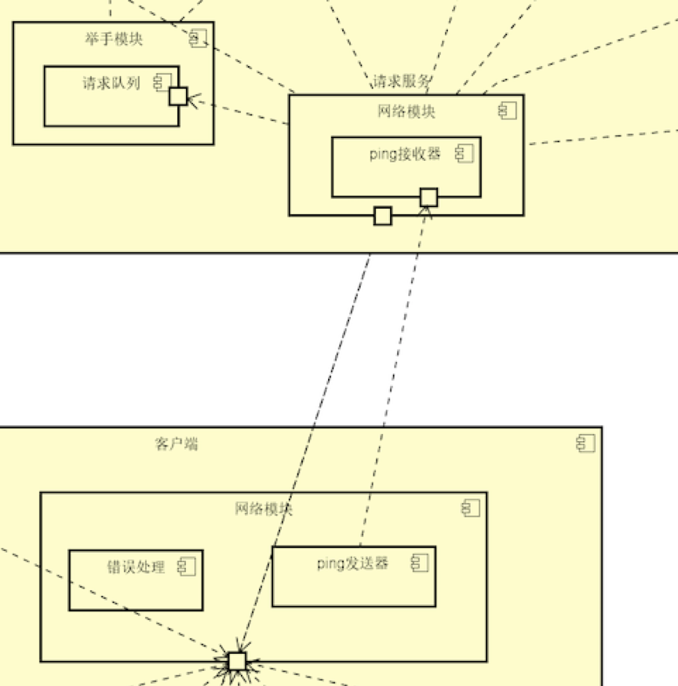

# Scenario

A4: 系统在5s内发现用户断线[高,高]

# Analysis
<table>
	<tr>
		<th>场景A4</th>
		<th colspan='4'>系统在5s内发现用户断线</th>
	</tr>
	<tr>
		<td>质量属性</td>
		<td colspan='4'>可用性</td>
	</tr>
	<tr>
		<td>环境</td>
		<td colspan='4'>整体系统正常运行</td>
	</tr>
	<tr>
		<td>刺激</td>
		<td colspan='4'>用户断线</td>
	</tr>
	<tr>
		<td>响应</td>
		<td colspan='4'>1. 系统发现用户断线时，记录断线信息 2. 当用户重连时恢复用户断线前的现场信息</td>
	</tr>
	<tr>
			<th>架构决策</th>
			<th>敏感点</th>
			<th>权衡点</th>
			<th>风险</th>
			<th>非风险</th>
	</tr>
	<tr>
		<td>ping/echo机制</td>
		<td>S1</td>
		<td></td>
		<td></td>
		<td>N1</td>
	</tr>
	<tr>
		<td>出错重试</td>
		<td></td>
		<td>T1</td>
		<td>R1</td>
		<td></td>
	</tr>
	<tr>
		<td>理由说明</td>
		<td colspan='4'>通过ping/echo的检测机制,系统能够尽早发现连接异常,并采取出错重试的恢复措施</td>
	</tr>
	<tr>
		<td>相关架构图</td>
		<td colspan='4'></img></td>
	</tr>
</table>

## 敏感点
|#|架构决策|理由|
|---|---|---|
|S1|ping/echo机制|可用性的敏感点 用来检测服务的状态|

## 权衡点
|#|架构决策|理由|
|---|---|---|
|T1|出错重试|可用性与效率的权衡点 出错后立刻尝试重连可以避免偶然错误,但增加系统负载|

## 风险
|#|架构决策|理由|
|---|---|---|
|R1|出错重试|出错重试会增加系统负载,降低效率|

## 非风险
|#|架构决策|理由|
|---|---|---|
|N1|ping/echo机制|ping/echo机制实现简单,且已有成熟的解决方案|