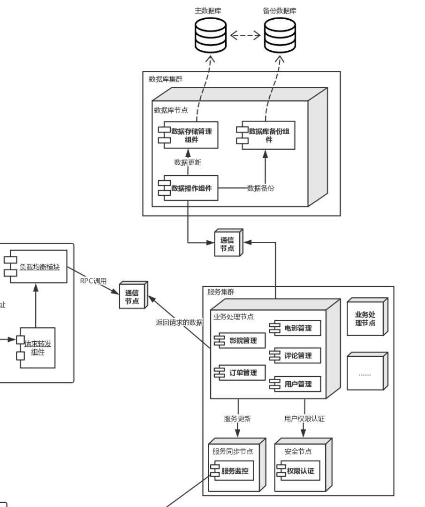

### 质量属性效用树

|质量属性|具体属性|场景|
|----|----|----|
|性能|并发性|A6:超过100个用户同时购买同一场的电影票|
|性能|响应速度|A6|

### ATAM分析

<table>
	<tr>
		<th>场景A6</th>
		<th colspan='4'>超过100个用户同时购买同一场的电影票</th>
	</tr>
	<tr>
		<td>质量属性</td>
		<td colspan='4'>性能</td>
	</tr>
	<tr>
		<td>环境</td>
		<td colspan='4'>整体系统正常运行</td>
	</tr>
	<tr>
		<td>刺激</td>
		<td colspan='4'>超过100个用户同时购买同一场的电影票</td>
	</tr>
	<tr>
		<td>响应</td>
		<td colspan='4'>1. 系统帮助用户正常完成购买操作 2. 服务器端的数据库中的数据正常修改 3. 客户端用户界面及时刷新</td>
	</tr>
	<tr>
			<th>架构决策</th>
			<th>敏感点</th>
			<th>权衡点</th>
			<th>风险</th>
			<th>非风险</th>
	</tr>
	<tr>
		<td>增加数据检索服务节点</td>
		<td>S1</td>
		<td></td>
		<td>R1</td>
		<td>N1</td>
	</tr>
	<tr>
		<td>增加数据计算服务节点</td>
		<td>S1</td>
		<td></td>
		<td>R1</td>
		<td>N1、N2</td>
	</tr>
	<tr>
		<td>使用Ngnix等软件处理请求分发+在客户端存储和维护服务端清单</td>
		<td></td>
		<td>T1</td>
		<td>R2</td>
		<td>N3</td>
	</tr>
	<tr>
		<td>使用优先队列处理请求</td>
		<td>S2</td>
		<td>T2</td>
		<td></td>
		<td></td>
	</tr>
	<tr>
		<td>最小连接数算法</td>
		<td></td>
		<td>T3</td>
		<td></td>
		<td></td>
	</tr>
	<tr>
		<td>文件系统存储</td>
		<td></td>
		<td></td>
		<td></td>
		<td>N4</td>
	</tr>
	<tr>
		<td>理由说明</td>
		<td colspan='4'>增加节点的成本低，灵活(N1、N2)，但是其实现难度受系统架构的可伸缩性影响(R1)。 软负载均衡+客户端维护信息可以取长补短。 文件系统处理大容量数据较为方便。</td>
	</tr>
	<tr>
		<td>相关架构图</td>
		<td colspan='4'></img></td>
	</tr>
</table>

### 敏感点

|#|架构决策|原因|
|-|-|-|
|S1|增加数据检索服务节点 增加数据计算服务节点|系统可伸缩性的敏感点，增加节点的难度取决于系统的可伸缩性。|
|S2|使用优先队列处理请求|响应时间的敏感点，用来衡量系统的性能。|

### 权衡点

|#|架构决策|原因|
|-|-|-|
|T1|使用Ngnix等软件处理请求分发+在客户端存储和维护服务端清单|效率和需求的权衡点。硬件负载均衡效率高，但是无法满足快速迭代的需求；使用软件负载均衡可以快速迭代，在大流量下效率可能会下降；在客户端维护数据有助于提升效率。|
|T2|使用优先队列处理请求|性能、实时性和数据完整性的权衡点。忽略低优先级请求会导致数据缺失，不使用优先队列会导致系统的实时性不高。|
|T3|最小连接数算法|效率和成本的权衡点。最小连接数算法的实现和计算成本中等，效率上等。|

### 风险

|#|架构决策|原因|
|-|-|-|
|R1|增加数据检索服务节点 增加数据计算服务节点|增加节点的难度取决于系统的可伸缩性。|
|R2|使用Ngnix等软件处理请求分发+在客户端存储和维护服务端清单|流量较大时负载均衡节点会成为性能瓶颈。|

### 非风险

|#|架构决策|原因|
|-|-|-|
|N1|增加数据检索服务节点 增加数据计算服务节点|增加节点成本较低，且灵活。|
|N2|增加数据计算服务节点|增加节点不需要重新部署和启动系统服务。|
|N3|使用Ngnix等软件处理请求分发+在客户端存储和维护服务端清单|客户端维护数据可以减轻负载均衡节点负担。|
|N4|文件系统存储|文件系统技术成熟，高可用，稳定。|