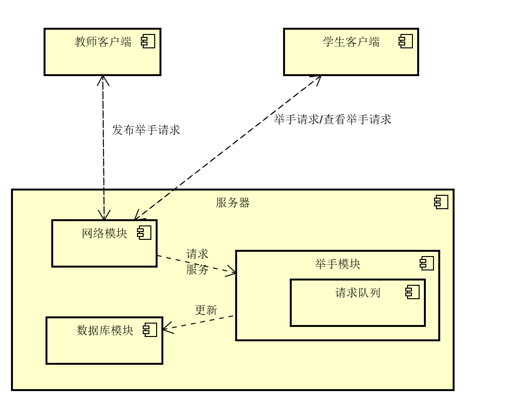
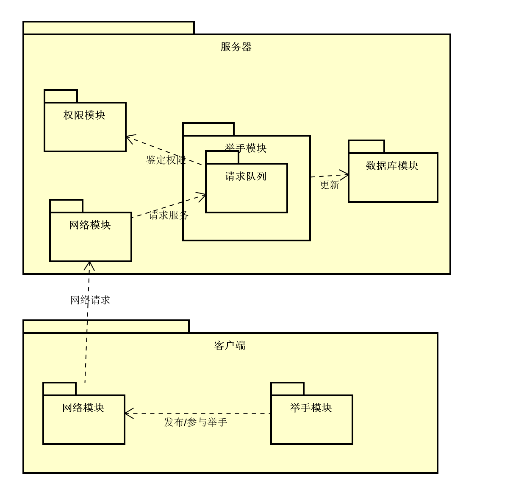
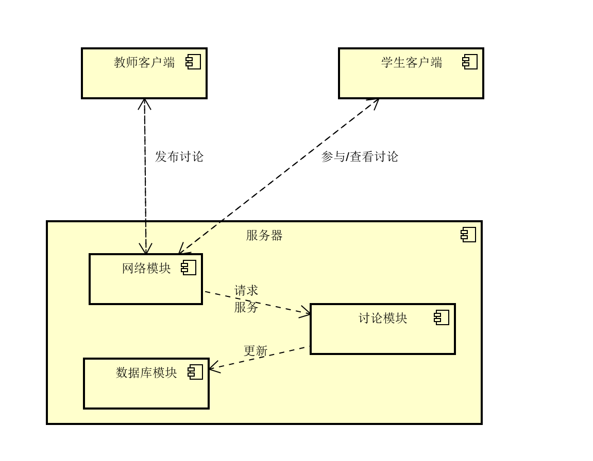
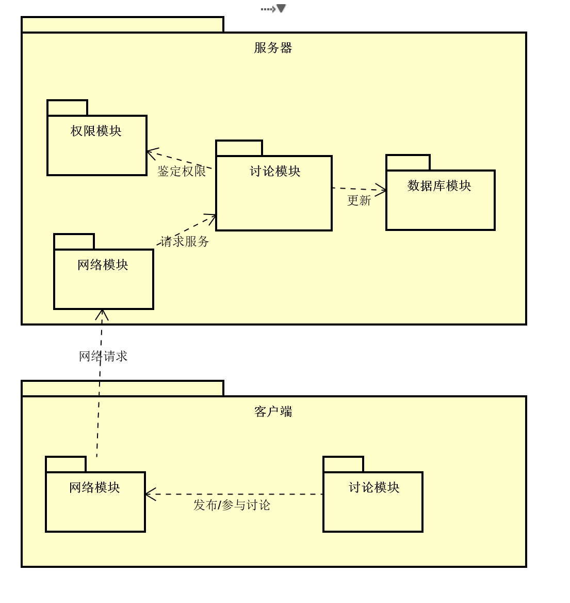
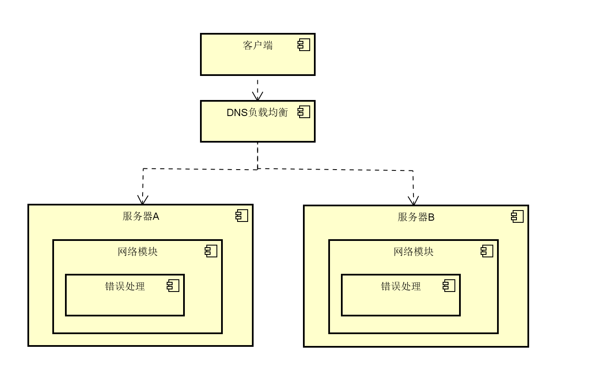
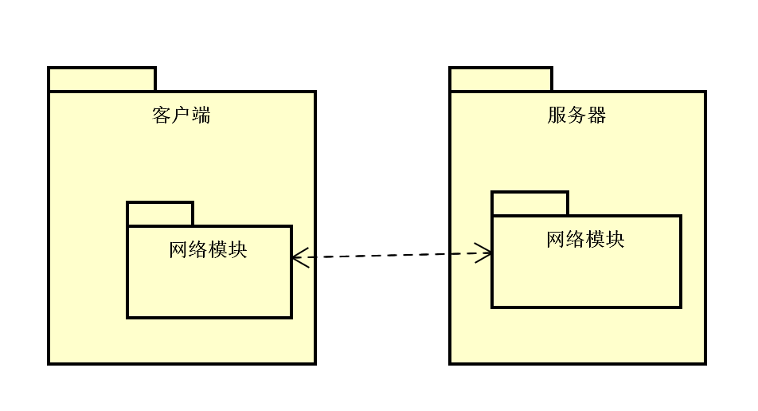

## 3.1 第1次迭代

### 3.1.1 分解系统组件

选择**举手模块**继续分解。

### 3.1.2 确定架构驱动因素（重要性、难易度从高到低）

| #    | 架构驱动因素       | 重要性 | 难易度 |
| ---- | ------------------ | ------ | ------ |
| 1    | 功能需求：发言举手 | 高     | 中     |
|2 |场景1：大量用户短时间内进行举手 |高 |高 |
|3 |场景2:老师正常发起举手或同学正常举手 |高 |中 |
|4|场景3：由于各种原因导致的系统出错|中|低|
|5|场景9：学生想撤销举手操作|中|中|
|6|设计约束2：系统应该能在市面上绝大多数设备上运行|中|低|

### 3.1.3 选择满足架构驱动因素的架构模式

#### 3.1.3.1 设计关注点

| 质量属性 | 设计关注点     | 子关注点               |
| -------- | -------------- | ---------------------- |
| 性能     | 良好的举手体验 | 快速响应               |
|          |                | 可短时间内支持多个用户 |
|  易用性|良好的举手体验 |用户可快速撤销举手|

#### 3.1.3.2 候选模式

**快速响应**

| #   | 模式名称 | 开发难度 |性能影响 | 成本|
| --- | -------- | ----- | ------ | ---|
| 1   | 提高服务器性能    | 低    | 高     | 高 |
|2|服务器使用缓存|中|中| 低 |

选择模式 ：服务器使用缓存
选择理由： 提升服务器性能虽然可以显著提升响应速度但成本也大幅提高，服务器使用缓存将减少与数据库的交互进而提升响应速度，提升程度足够且成本低

**短时间内支持多个用户**

| #   | 模式名称 | 开发难度 | 性能影响 | 成本|
| --- | -------- | ----- | ------ | --|
| 1   | DNS负载均衡    | 低  | 高     | 高 |
|2|提升服务器性能 |低|中| 高 |

选择模式：DNS负载均衡
选择理由：通过给服务器增加硬件来提升性能虽然在最开始可以显著提升性能，但随着用户数量提升，成本的增加与性能的增加就不成正比。而使用负载均衡的方式可同时容纳的用户要更多。

**用户可快速撤销举手**
|#| 模式名称| 开发难度 | 性能影响|
| -- | --| --| --|
| | 使用缓存|中 | 中|
| | 优先处理撤销请求|低|中|

选择模式：选择 **使用缓存、优先处理撤销请求**模式。服务器通过使用缓存进而每次用户举手操作都不会直接写入数据库中，在撤销举手时也就减少了与数据库的交互模块，增加了性能，而优先处理撤销请求也可以提高撤销请求被处理的速度。这两者都可以提高性能且不互相冲突，开发难度也都适中，所以都选择。

### 3.1.4 候选模式与对应ASR

| # | 模式类型 | 选择的模式 | 架构驱动 |
| -- | -- | -- | -- |
| 1 |  快速响应| 服务器使用缓存 | 场景2，场景7，设计约束2 |
| 2| 短时间内支持多个用户 | DNS负载均衡 | 场景1，场景2，设计约束2 |
|3|用户可快速撤销举手|使用缓存、优先处理撤销请求|场景9|

### 3.1.5 架构视图

**C&C视图**

 

**模块视图**

 

## 3.1 第2次迭代

### 3.1.1 分解系统组件

选择**讨论模块**继续分解。

### 3.1.2 确定架构驱动因素（重要性、难易度从高到低）

| #    | 架构驱动因素                                    | 重要性 | 难易度 |
| ---- | ----------------------------------------------- | ------ | ------ |
| 1    | 功能需求：参与讨论                              | 高     | 中     |
| 2    | 场景1：大量同学同时参与老师的讨论       | 高     | 中     |
|3 |场景2:老师正常发起讨论或同学正常参与讨论 |高 |中 |
|4 | 场景10：用户请求服务|高|中|
| 5    | 设计约束2：系统应该能在市面上绝大多数设备上运行 | 中     | 低     |

### 3.1.3 选择满足架构驱动因素的架构模式

#### 3.1.3.1 设计关注点

| 质量属性 | 设计关注点 | 子关注点  |
| -------- | ---------- | --------- |
|性能|良好的讨论体验|快速响应 |
| | | 支持高并发|

#### 3.1.3.2 候选模式

**快速响应**

| #   | 模式名称 | 开发难度 |性能影响 | 成本|
| --- | -------- | ----- | ------ | ---|
| 1   | 提高服务器性能    | 低    | 高     | 高 |
|2|服务器使用缓存|中|中| 低 |

选择模式 ：服务器使用缓存
选择理由： 提升服务器性能虽然可以显著提升响应速度但成本也大幅提高，服务器使用缓存将减少与数据库的交互进而提升响应速度，提升程度足够且成本低

**支持高并发**

| #    | 模式名称       | 开发难度 | 性能影响 | 成本 |
| ---- | -------------- | -------- | -------- | ---- |
| 1    | DNS负载均衡    | 低       | 高       | 高   |
| 2    | 提升服务器性能 | 低       | 中       | 高   |

选择模式：DNS负载均衡
选择理由：通过给服务器增加硬件来提升性能虽然在最开始可以显著提升性能，但随着用户数量提升，成本的增加与性能的增加就不成正比。而使用负载均衡的方式可同时容纳的用户要更多。

### 3.1.4 候选模式与对应ASR

| #    | 模式类型     | 选择的模式     | 架构驱动                |
| ---- | ------------ | -------------- | ----------------------- |
|1 |快速响应|使用缓存|场景2，场景10，设计约束2|
| 2    | 支持高并发   | DNS负载均衡    | 场景1，场景2，场景10，设计约束2 |

**C&C视图**

 

**模块视图**

 

## 3.4 第四次迭代
### 3.4.1 分解系统组件

本迭代分解客户端节点的网络模块。

### 3.4.2 确定架构驱动因素

|#|架构驱动因素|重要性|难易度|
|---|---|-|-|
|1| 场景2:用户正常操作|高|低|
|2|场景3：各种原因导致系统出错|高|中|
|3|场景6：断线重连|高|中||
|4| 场景9：学生撤销错误操作|高|中|
|5|场景10：用户请求服务|高|中|

### 3.4.3 选择架构模式

#### 3.4.3.1 设计关注点

|质量属性|设计关注点|子关注点|
|---|---|-|
|可用性|故障恢复 |重启 |
| | | 对客户端透明|

#### 3.4.3.2 候选模式
**重启**

| #   | 模式名称 | 停机时间 | 是否丢失服务 |
| --- | -------- | ----- | ------ |
| 1   | 冷重启    | >2分钟    | 是     |
| 2| 热备份| >0.3秒|可能|

选择模式：**热备份**

选择理由：根据场景3中的需求，重启时间应该小于5s，所以冷重启并不适合，而且热备份更易于实现

**对客户端透明**

|# |模式名称 | 通信方式 |超时位置|
| --- | -------- | ----- | ------ |
| 1| 客户端处理故障| 单播|客户端|
|2| 代理故障|单播 | 代理|
|3|基础设施处理故障|广播|基础设施内部|

选择模式：**代理处理故障**
选择理由：如果使用客户端处理故障的方式，则客户端的开发人员需要了解处理故障的原理，进而很容易被曲解而导致系统不够鲁棒。而基础设施并不自带广播的功能，添加广播能力需要增加很高的成本，所以选择代理处理故障。

### 3.1.4 候选模式与对应ASR

| #    | 模式类型     | 选择的模式     | 架构驱动                |
| ---- | ------------ | -------------- | ----------------------- |
| 1    | 重启   | 热备份    | 场景2，场景3，场景6，场景9，场景10，设计约束2 |
|2|对客户端透明|代理处理故障|场景2，场景3，场景6，场景9，场景10，设计约束2|

### 3.4.5 架构视图

**C&C视图**

 

**模块视图**

 

