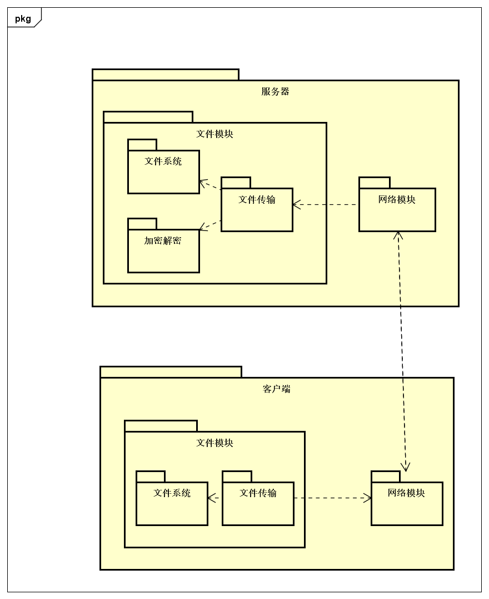
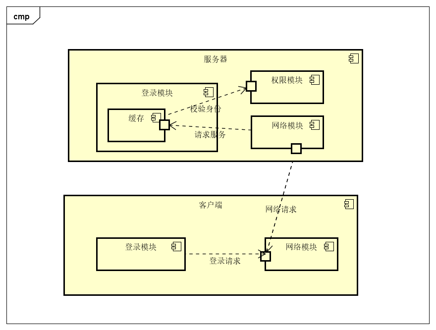
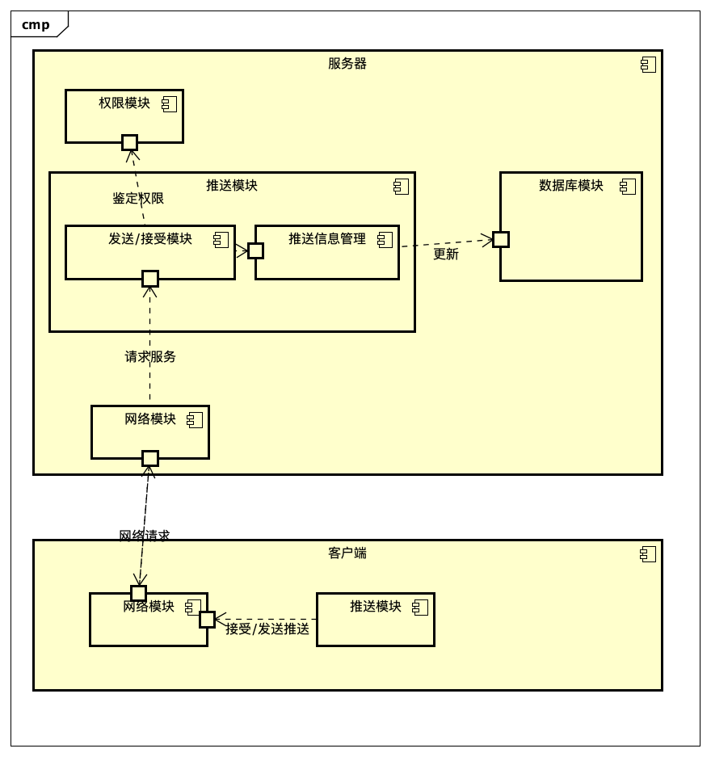
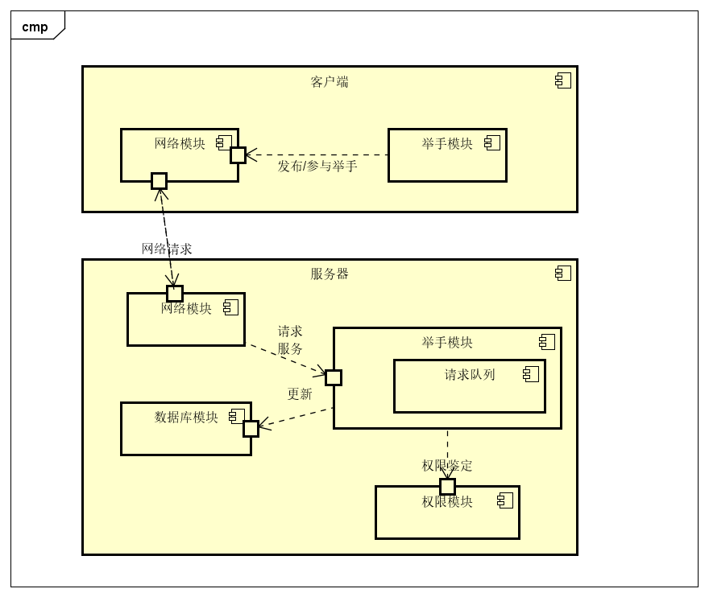
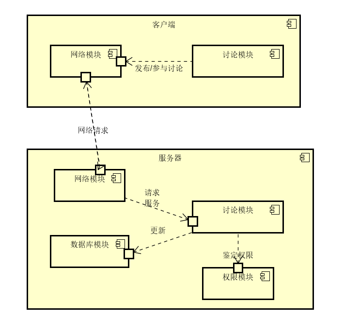
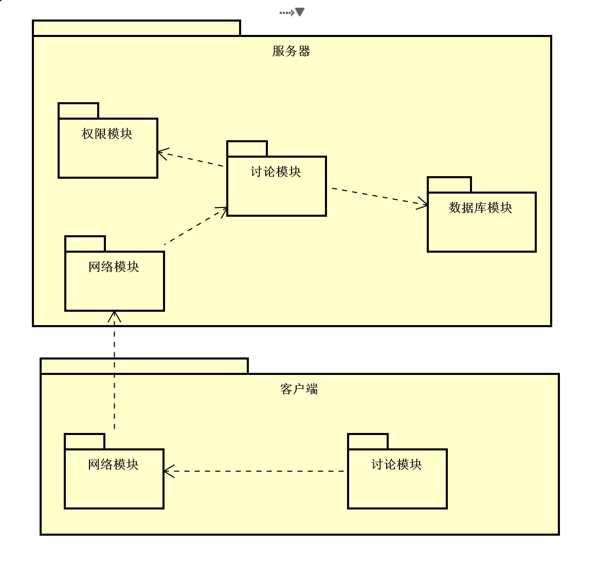
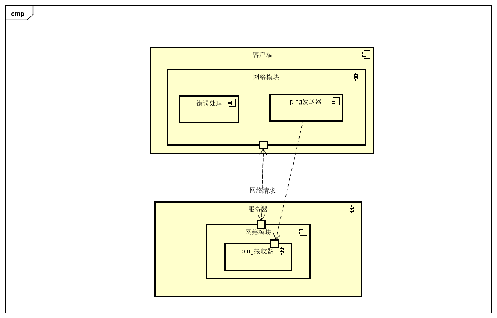
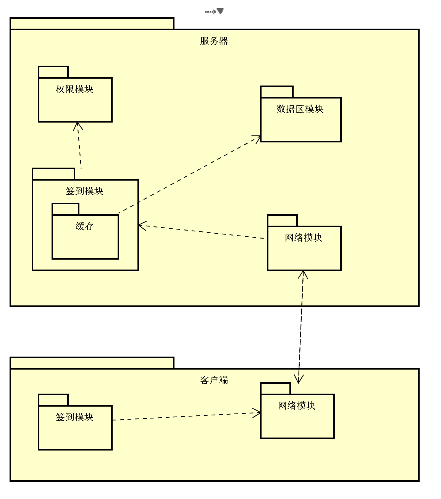
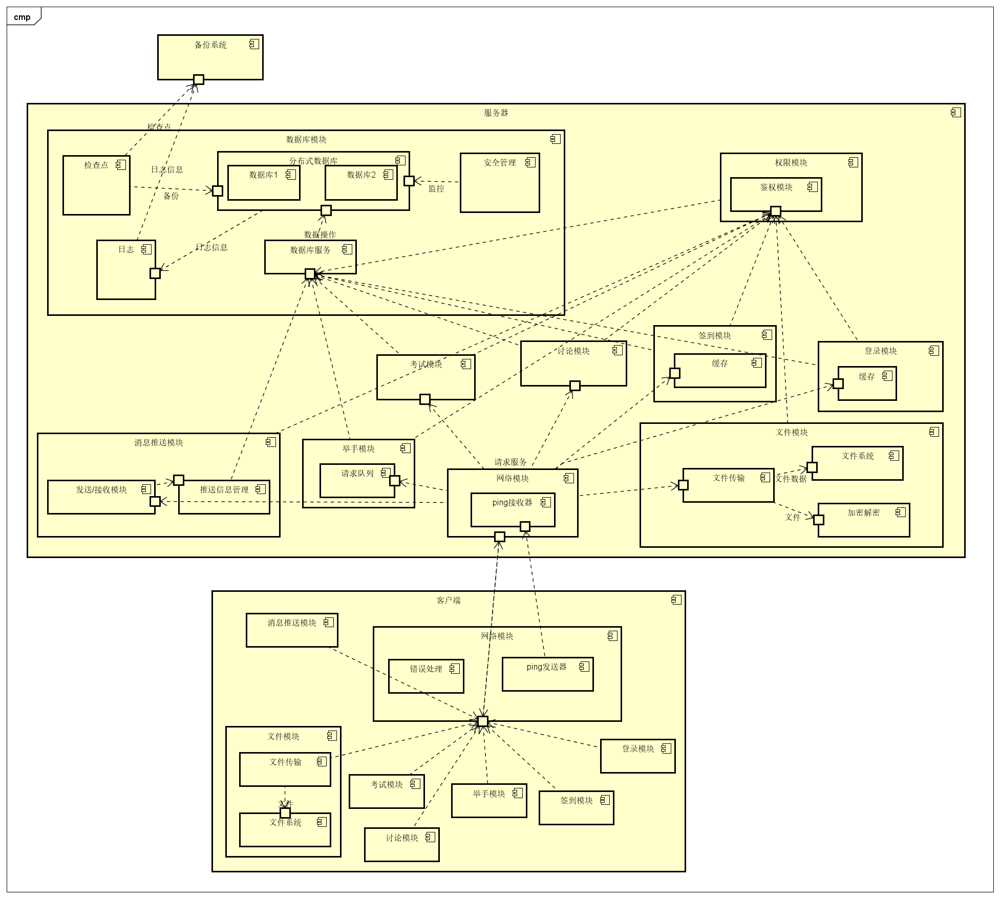

## 4.1 第一次迭代

###4.1.1 分解系统组件

将**服务器**分解为**考试模块、讨论模块、举手模块、签到模块、文件模块、消息推送模块、网络模块、权限模块、数据库模块、登录模块** 

将**客户端**分解为**考试模块、讨论模块、举手模块、签到模块、文件模块、消息推送模块、网络模块、登录模块**

在后续分解中将同时分解客户端以及服务器相同的模块

### 4.1.2 架构图

## 4.2 第二次迭代

### 4.2.1 分解系统组件

选择**考试模块**继续分解。

### 4.2.2 确定架构驱动因素（重要性、难易度从高到低）

| #    | 架构驱动因素 | 重要性 | 难易度 |
| ---- | :----------- | ------ | ------ |
|1|场景1：大量用户短时间内进行数据量交换较小的操作|中|中|
|2     |场景6：断线重连|高|高|
|3|场景7：学生数据防止被攻击和篡改|高|高|

### 4.2.3 选择满足架构驱动因素的架构模式

#### 4.2.3.1 设计关注点

| 质量属性 | 设计关注点 | 子关注点     |
| -------- | ---------- | ------------ |
| 可用性   | 故障检测   | 快速反应     |
| 可用性   | 故障恢复   | 数据完整性   |
| 安全性   | 高并发     | 密集网络请求 |

#### 4.2.3.2 候选模式

**快速反应**

| #    | 模式名称 | 反应时间 | 准确率 |
| ---- | -------- | -------- | ------ |
|1|异常处理|<0.1秒|可能会误判|
|2|出错重试|<2秒|误判可能性较低|

选择模式：**出错重试**

理由：在通过网络传输数据时，一出现异常就启动断线重连机制，这样做虽然反应快，但可能会把瞬时的网络波动误判成断线；出错重试机制虽然会花费更多时间，但并没有超出要求规定的5秒，且准确率更高，故选择之。

**数据完整性**

|#|模式|存储负载|实现难度|
|---|---|-|-|
|1|检查点|1秒每15秒|低|
|2|检查点+变化日志|1秒每半分钟+每秒2条消息|中|
|3|检查点+捆绑日志|1秒每半分钟+每x秒1条消息|中|
|4|检查点+同步备份|1秒每半分钟+每x秒1条消息|高|

选择模式：**检查点**

理由：虽然检查点不能完全恢复现场数据，但是场景7并没有要求要完全恢复现场信息，因此实现最简单的检查点完全够用。除此之外，进一步缩短检查点的周期，可以有效提高数据恢复程度。

**密集网络请求**

|#|模式|实现难度|并发性能|
|-|-|-|-|
|1|同步请求|低|<60（取决于硬件和容器）|
|2|集群+负载均衡|高|>10000（取决于硬件和容器）|
|3|消息队列|中|>150（取决于硬件和容器）|

选择模式：**模式3**

理由：使用同步的方式处理请求将不能满足场景1要求的5s内处理300人的请求；集群+负载均衡的并发性能最好，但是实现难度较大，不经济；使用消息队列缓存用户请求，实现难度中等，并发能力也足以满足要求。
### 4.2.4 候选模式与对应ASR

| #    | 模式类型 | 选择的模式 | 架构驱动 |
| ---- | -------- | ---------- | -------- |
|1|快速反应|出错重试|场景6：断线重连|
|2|数据完整性|检查点|场景6：断线重连|
|3|密集网络请求|消息队列|场景1：大量用户短时间内进行数据量交换较小的操作|

### 4.2.5 架构视图

**C&C视图**

**模块视图**

## 4.3 第三次迭代

### 4.3.1 分解系统组件

本迭代分解客户端节点的**文件模块**。

### 4.3.2 确定架构驱动因素（重要性、难易度从高到低）

| #    | 架构驱动因素                                     | 重要性 | 难易度 |
| ---- | ------------------------------------------------ | ------ | ------ |
| 1    | 场景5：用户企图下载未选课的课程文件             | 高       |  中      |
| 2    | 场景6：断线重连                                 | 高     | 低       |
| 3	| 场景10：用户请求服务 | 中 | 中 |
| 4 | 场景11：用户请求其他用户的信息 | 中 | 中 |
| 5    | 场景12：文件上传和下载                           | 高     | 高     |

### 4.3.3 选择满足架构驱动因素的架构模式

#### 4.3.3.1 设计关注点

| 质量属性 | 设计关注点       | 子关注点         |
| -------- | ---------------- | ---------------- |
| 安全性   | 资源采集         |  资源压缩编码                |
| | 数据不能泄露				|防止数据被非法访问|
| 性能     | 资源数据传输     | 资源数据传输协议 资源传输效率  |
| 可靠性   | 资源下载中断恢复 | 中断处理和恢复   |
|   	  | 上传数据处理 | 上传数据处理方式、上传数据处理效率 |
| 可用性   | 上传进度     | 上传断点记录、上传数据拆分方式     |

#### 4.3.3.2 候选模式

**资源压缩编码**

| #    | 模式名称 | 压缩率 | 容错能力 | CPU能力要求 | 压缩时间 |
| ---- | -------- | ------ | -------- | ----------- | -------- |
| 1    | RAR压缩  | 高     | 高       | 高          | 中       |
| 2    | ZIP压缩  | 中     | 低       | 高          | 高       |

选择模式：**RAR压缩** 

选择理由：ZIP占存过大，并且只有英文版，RAR具有官方简体中文且安装包较小，同时RAR压缩率高容错能力高，相比ZIP能支持更多的流行压缩格式。最为关键的是在传输超大型文件过程中RAR支持分卷压缩，降低了上传压力。

**防止数据非法访问**

| #    | 模式名称               | 成本 | 对性能的影响 | 数据泄露影响 | 用户体验影响 | 开发难度 |
| ---- | ---------------------- | ---- | ------------ | ------------ | ------------ | -------- |
| 1    | 加密文件               | 低   | 高           | 高           | 中           | 低       |
| 2    | 定时更改文件接口的地址 | 中   | 高           | 中           | 低           | 高       |

选择模式：**加密文件**

选择理由：定时更改接口地址很可能会带来地址的同步问题，增加开发难度。加密文件后，即使文件泄露，文件中的内容也不会泄露，安全性较高，所以选择加密文件

**资源数据传输协议**

| #    | 模式名称 | 性能 | 安全性 | 可伸缩性 | 可用性 |
| ---- | -------- | ---- | ------ | -------- | ------ |
| 1    | TCP协议  | 弱   | 强     | 弱       | 强     |
| 2    | UDP协议  | 强   | 弱     | 强       | 弱     |

选择模式：**TCP协议** 

选择理由：UDP协议是无连接的，它本身没有数据校验机制，不会进行数据的校准和分组确认。而TCP是面向连接的可靠协议，如果发现分组有丢失现象，会请求进行重传。对于资源下载，数据的安全性和可用性非常重要，传送的文件出现问题需要重新下载，反而增加下载时间。所以选择TCP协议进行下载。

**资源传输效率**

| #    | 模式名称       | 性能 | 可伸缩性 | 可用性 |
| ---- | -------------- | ---- | -------- | ------ |
| 1    | 使用镜像服务器 | 高   | 高       | 高     |
| 2    | 离线下载       | 中   | 高       | 高     |
| 3    | 提升服务器带宽 | 高   | 中       | 中     |
| 4    | 限制客户端码率 | 中   | 中       | 中     |

选择模式：**镜像服务器加速、离线下载**

选择理由： 数据传输效率主要考虑传输速率和传输可用性。传输效率主要由服务器总带宽决定，单一提升某一服务器的带宽的确可以提高传输效事，但使用镜像服务器不仅可以提升总带宽，而且有更高的可用性和容错性。单一服务器的连接并发数是固定的，可容纳用户也有数量上的限制，而使用镜像服务器可以容纳更多的用户，并且可以通过镜像服务器的缓存提高性能。如果某台服务器发生故障，单一服务器就再也不能提供服务，而分布式服务器仍可对用户提供资源而限制客户端的码率并不是长久的方案，首先不满足易用性。所以首选方案是使用镜像服务器,当然也可以根据需求提升镜像服务器的带宽。而离线下载则可以帮助冷门资源的下载，提高性能和可用性，且提高安全性，又不与镜像服务器冲突，所以也会同时使用。

**中断处理和恢复**

| #    | 模式名称                             | 性能 | 易用性 | 安全性 |
| ---- | ------------------------------------ | ---- | ------ | ------ |
| 1    | 保存本地备份，可在重新下载时导入恢复 | 高   | 中     | 中     |
| 2    | 删除本地备份，完全重新下载           | 低   | 中     | 高     |

选择模式：**保存本地备份、重新下载时导入恢复**

选择理由： 保存备份虽然会降低安全性但是有前面的加密保护，而重新导人并不困难但对用户下载大文件中断有着极大帮助，重新导人解析或许会消耗时间，但是实际上用户可以通过选择是否维续之前的下载来决定是否导人解析。导人解析本身也可以通过进度的配置文件解决。

**上传数据处理方式**

| #    | 模式名称                                 | 性能要求 | 成本 | 安全性 | 处理效率 |
| ---- | ---------------------------------------- | -------- | ---- | ------ | -------- |
| 1    | 直接存储                                 | 低       | 低   | 低     | 高       |
| 2    | 把文件解压扫描，检查是否有病毒后存储     | 高       | 高   | 高     | 低       |
| 3    | 只解压一小部分文件，检查是否有病毒后存储 | 中       | 中   | 中     | 中       |

选择模式：**只解压一小部分文件，检查是否有病毒后存储**

选择理由：直接存储安全性太低，全部解压扫描效率太低，所以选择解压部分扫描抽查。

**上传数据处理效率**

| #    | 模式名称               | 处理速率 | 可伸缩性 | 可用性 |
| ---- | ---------------------- | -------- | -------- | ------ |
| 1    | 使用RAD5存储上传的数据 | 中       | 中       | 高     |
| 2    | 边解压边分析数据       | 高       | 高       | 低     |
| 3    | 解压完成再分析数据     | 中       | 中       | 低     |

选择模式：**使用RAD5存储上传的数据、边解压边分析数据**
选择理由：系统突然崩溃时可使用另外一个校验信息，恢复之前上传的数据，提高了可用性，使用边解压边分析有效提高了数据的处理效率。

**上传断点记录**

| #    | 模式名称             | 上传速率 | 可用性 | 可同时上传数量 |
| ---- | -------------------- | -------- | ------ | -------------- |
| 1    | 自定义断点交互协议   | 中       | 高     | 高             |
| 2    | 使用http断点下载协议 | 高       | 高     | 中             |

选择模式：**自定义断点交互协议**
选择理由：自定义断点交互协议可以让游览器记住最近一次成功传输的位置，也可以把上传的断点放在服务器端。

**上传数据拆分方式**

| #    | 模式名称          | 处理速率 | 可伸缩性 | 可用性 |
| ---- | ----------------- | -------- | -------- | ------ |
| 1    | 定义拆分单元为1M  | 中       | 高       | 高     |
| 2    | 定义拆分单元为10M | 高       | 中       | 中     |

选择模式：**定义拆分单元为1M**

选择理由：传输单元为1M，没有占用太多的传输通道，可以增加更多的并发，使得统一用户在同一时间，上传更多的文件。

### 4.3.4 候选模式与对应ASR

| #    | 模式类型         | 选择的模式                       | 架构驱动                               |
| ---- | ---------------- | -------------------------------- | -------------------------------------- |
| 1    | 资源压缩编码     | RAR压缩                          | 文件上传和下载                         |
| 2    | 资源数据传输协议 | TCP协议                          | 文件上传和下载、用户请求服务           |
| 3    | 资源传输效率     | 镜像服务器加速和离线下载         | 文件上传和下载、用户请求服务           |
| 4    | 中断处理和恢复   | 保存本地备份，重新下载时导入恢复 | 文件上传和下载、断线重连、用户请求服务 |
| 5    | 上传数据处理方式 | 只解压一小部分文件，检查是否有病毒后存储     | 文件上传和下载、用户请求服务                                 |
| 6    | 上传数据处理效率 | 使用RAD5存储上传的数据、边解压边分析数据     | 文件上传和下载                                               |
| 7    | 上传断点记录     | 自定义断点交互协议                           | 文件上传和下载、断线重连                                     |
| 8    | 上传数据拆分方式 | 定义拆分单元为1M                             | 文件上传和下载 |

### 4.3.5 架构视图

**C&C视图**

**模块视图**

## 4.4 第四次迭代

### 4.4.1 分解系统组件

选择**登录模块**继续分解。

### 4.4.2 确定架构驱动因素

| #    | 架构驱动因素                        | 重要性 | 难易度 |
| ---- | ----------------------------------- | ------ | ------ |
|1|场景3：系统故障|中|中|
|2|场景6：断线重连|低|中|
|3     |场景10：用户请求服务|高|高|
|4|设计约束2：系统应该能在市面上绝大多数设备上运行|高|中|

### 4.4.3 选择满足架构驱动因素的架构模式

#### 4.4.3.1 设计关注点

| 质量属性 | 设计关注点       | 子关注点                             |
| -------- | ---------------- | ------------------------------------ |
| 性能     | 良好的登录体验 | 登录校验快速   |

#### 4.4.3.2 候选模式

**登录校验快速**

| #   | 模式名称 | 开发难度 |性能影响 | 成本|
| --- | -------- | ----- | ------ | ---|
|1|服务器使用缓存|中|中| 低 |

选择模式 ：**服务器使用缓存**
选择理由： 将用户校验信息保存在内存中可以减少与数据库的交互，进而加快校验速度

### 4.4.4 候选模式与对应ASR

| #    | 模式类型         | 选择的模式                       | 架构驱动                               |
| ---- | ---------------- | -------------------------------- | -------------------------------------- |
| 1    | 良好的登录体验     | 服务器使用缓存                          | 场景10，设计约束2|

### 4.4.5 架构图

**C&C 视图**

**模块视图**

## 4.5 第五次迭代

### 4.5.1 分解系统组件

选择**推送模块**继续分解。

### 4.5.2 确定架构驱动因素 

| #    | 架构驱动因素                        | 重要性 | 难易度 |
| ---- | ----------------------------------- | ------ | ------ |
| 1    | 场景4：推送信息需要快速有效到达用户 | 高     | 高     |
| 2    | 场景3：由于各种原因导致的系统出错   | 中     | 中     |

### 4.5.3 选择满足架构驱动因素的架构模式

#### 4.5.3.1 设计关注点

| 质量属性 | 设计关注点       | 子关注点                             |
| -------- | ---------------- | ------------------------------------ |
| 性能     | 推送信息到达用户 | 用户推送效率、离线用户获得推送方式   |
| 可靠性   | 确保信息有效到达 | 确保信息到达用户                     |
| 安全性   | 用户数据私密性   | 用户推送信息不错位，对其他用户不可见 |

#### 4.5.3.2 候选模式

**用户推送效率**

| #    | 模式名称               | 开发难度 | 加速效果 | 安全性 |
| ---- | ---------------------- | -------- | -------- | ------ |
| 1    | 优先处理推送信息请求   | 中       | 好       | 高     |
| 2    | 按顺序处理信息发送请求 | 中       | 中       | 中     |

选择模式：**优先处理推送信息请求**

选择原因：通过优先处理推送信息请求可以保证推送模块的优先级，因为推送优先级较高能保证推送消息快速到达用户，提高效率

**离线用户获得推送方式**

| #    | 模式名称                                               | 开发难度 | 加速效果 | 安全性 | 未送达概率 |
| ---- | ------------------------------------------------------ | -------- | -------- | ------ | ---------- |
| 1    | 离线用户上传后再由服务器发送推送                       | 中       | 中       | 高     | 高         |
| 2    | 服务器发送推送数据到本机，离线用户上线后从本地读取推送 | 中       | 中       | 中     | 中         |

选择模式：**离线用户上传后再由服务器发送推送**

选择原因：提前发送至本机，安全性无法保障且容易被盗取。

**确保信息到达用户**

| #    | 模式名称  | 开发难度 | 性能影响 | 能否保证到达 |
| ---- | --------- | -------- | -------- | ------------ |
| 1    | 回执+重发 | 中       | 中       | 能           |
| 2    | 多次发送  | 低       | 中       | 不能         |

选择模式：**回执+重发**

选择原因：设备收到信息发送回执，若原设备一段时间未收到回执就重发。这样可以在保证信息到达的情况下减少网络压力。

**用户推送信息不错位，对其他用户不可见**

| #    | 模式名称             | 开发难度 | 性能影响 | 安全性 |
| ---- | -------------------- | -------- | -------- | ------ |
| 1    | 广播式发送           | 低       | 低       | 低     |
| 2    | 定点指定用户发送信息 | 中       | 低       | 高     |

选择模式：**定点指定用户发送信息**

选择原因：广播式发送缺乏安全性，容易泄露推送内容

### 4.5.4 候选模式与对应ASR

| #    | 模式类型                             | 选择的模式                       | 架构驱动                                                 |
| ---- | ------------------------------------ | -------------------------------- | -------------------------------------------------------- |
| 1    | 用户推送效率                         | 优先处理推送信息请求             | 推送信息需要快速有效到达用户                             |
| 2    | 离线用户获得推送方式                 | 离线用户上传后再由服务器发送推送 | 推送信息需要快速有效到达用户                             |
| 3    | 确保信息到达用户                     | 回执+重发                        | 推送信息需要快速有效到达用户、由于各种原因导致的系统出错 |
| 4    | 用户推送信息不错位，对其他用户不可见 | 定点指定用户发送信息             | 推送信息需要快速有效到达用户                             |

### 4.5.5 架构视图

**C&C 视图**

**模块视图**

## 4.6 第六次迭代

### 4.6.1 分解系统组件

选择**权限管理模块**继续分解。

### 4.6.2 确定架构驱动因素

| #    | 架构驱动因素                              | 重要性 | 难易度 |
| ---- | ----------------------------------------- | ------ | ------ |
| 1    | 设计约束1：用户的数据不得被泄露和非法修改 | 高     | 高     |
| 2    | 场景13：用户执行未授权的操作              | 高     | 高     |
| 3    | 场景7：学生数据防止被攻击和篡改           | 高     | 高     |
| 4    | 场景10：用户请求服务                      | 中     | 高     |
| 5    | 场景2：用户正常操作                       | 中     | 中     |

### 4.6.3 选择满足架构驱动因素的架构模式

#### 4.6.3.1 设计关注点

| 质量属性 | 设计关注点   | 子关注点         |
| -------- | ------------ | ---------------- |
| 安全性   | 权限设置安全 | 防止非法访问     |
|          |              | 防止非法数据     |
| 性能     | 权限检查效率 | 提高权限检查效率 |

#### 4.6.3.2 候选模式

**防止非法访问**

| #    | 模式名称                     | 开发难度 | 性能影响 | 安全性 |
| ---- | ---------------------------- | -------- | -------- | ------ |
| 1    | 对每个请求单独鉴权           | 中       | 中       | 高     |
| 2    | 维持白名单地址列表             | 低       | 低       | 低     |
| 3    | 维持黑名单                   | 低       | 低       | 低     |

选择模式：**对每个请求单独鉴权**

选择理由：对每个请求都进行鉴权操作能够保证安全性。

**防止非法数据**

| #    | 模式名称     | 开发难度 | 性能影响 | 安全性 |
| ---- | ------------ | -------- | -------- | ------ |
| 1    | 输入数据检验 | 中       | 中       | 高     |
| 2    | 数据传递检验 | 高       | 中       | 高     |

选择模式：**输入数据检验和数据传递检验**

选择理由：在提交给后续服务之前检验数据以及传递过程中数据的检验能够确保数据的合法性。

**提高权限检查速度**

| #    | 模式名称     | 开发难度 | 性能         |
| ---- | ------------ | -------- | ------------ |
| 1    | 请求队列     | 中       | 中           |
| 2    | 多线程并行   | 中       | 高           |
| 3    | 提高硬件性能 | 低       | 依赖硬件性能 |

选择模式：**请求队列、多线程并行**

选择理由：系统性能的提高依赖于硬件性能的提高会造成成本过高。所以采用多线程和请求队列提高效率。

### 4.6.4 候选模式与对应ASR

| #    | 模式类型         | 选择的模式                 | 架构驱动                                                     |
| ---- | ---------------- | -------------------------- | ------------------------------------------------------------ |
| 1    | 防止非法访问     | 对每个请求单独鉴权         | 用户的数据不得被泄露和非法修改，学生数据防止被攻击和篡改，用户执行未授权的操作 |
| 2    | 防止非法数据     | 输入数据检验、数据传递检验 | 学生数据防止被攻击和篡改                                     |
| 3    | 提高权限检查速度 | 请求队列、多线程并行       | 用户正常操作、用户请求服务                                   |

### 4.6.5 架构视图

**C&C 视图**

**模块视图**

## 4.7 第七次迭代

### 4.7.1 分解系统组件

选择**举手模块**继续分解。

### 4.7.2 确定架构驱动因素（重要性、难易度从高到低）

| #    | 架构驱动因素       | 重要性 | 难易度 |
| ---- | ------------------ | ------ | ------ |
| 1    | 功能需求：发言举手 | 高     | 中     |
|2 |场景1：大量用户短时间内进行举手 |高 |高 |
|3 |场景2:老师正常发起举手或同学正常举手 |高 |中 |
|4|场景3：由于各种原因导致的系统出错|中|低|
|5|场景9：学生想撤销举手操作|中|中|
|6|设计约束2：系统应该能在市面上绝大多数设备上运行|中|低|

### 4.7.3 选择满足架构驱动因素的架构模式

#### 4.7.3.1 设计关注点

| 质量属性 | 设计关注点     | 子关注点               |
| -------- | -------------- | ---------------------- |
| 性能     | 良好的举手体验 | 快速响应               |
|          |                | 可短时间内支持多个用户 |
|  易用性|良好的举手体验 |用户可快速撤销举手|

#### 4.7.3.2 候选模式

**快速响应**

| #   | 模式名称 | 开发难度 |性能影响 | 成本|
| --- | -------- | ----- | ------ | ---|
| 1   | 提高服务器性能    | 低    | 高     | 高 |
|2|服务器使用缓存|中|中| 低 |

选择模式 ：**服务器使用缓存**
选择理由： 提升服务器性能虽然可以显著提升响应速度但成本也大幅提高，服务器使用缓存将减少与数据库的交互进而提升响应速度，提升程度足够且成本低

**短时间内支持多个用户**

| #   | 模式名称 | 开发难度 | 性能影响 | 成本|
| --- | -------- | ----- | ------ | --|
| 1   | DNS负载均衡    | 中  | 高     | 高 |
|2|提升服务器性能 |低|中| 中 |

选择模式：**提升服务器性能**
选择理由：提升服务器性能和DNS负载均衡都可以显著提升系统处理高并发的能力，但DNS负载均衡开发难度较大，适用于大型互联网产品，在本教学支持系统中不实用，故不选取。

**用户可快速撤销举手**
|#| 模式名称| 开发难度 | 性能影响|
| -- | --| --| --|
| | 使用缓存|中 | 中|
| | 优先处理撤销请求|低|中|

选择模式：选择 **使用缓存、优先处理撤销请求**模式。服务器通过使用缓存进而每次用户举手操作都不会直接写入数据库中，在撤销举手时也就减少了与数据库的交互模块，增加了性能，而优先处理撤销请求也可以提高撤销请求被处理的速度。这两者都可以提高性能且不互相冲突，开发难度也都适中，所以都选择。

### 4.7.4 候选模式与对应ASR

| # | 模式类型 | 选择的模式 | 架构驱动 |
| -- | -- | -- | -- |
| 1 |  快速响应| 服务器使用缓存 | 场景2，场景7，设计约束2 |
| 2| 短时间内支持多个用户 | DNS负载均衡 | 场景1，场景2，设计约束2 |
|3|用户可快速撤销举手|使用缓存、优先处理撤销请求|场景9|

### 4.7.5 架构视图

**C&C视图**

 

**模块视图**

 

## 4.8 第八次迭代

### 4.8.1 分解系统组件

选择**讨论模块**继续分解。

### 4.8.2 确定架构驱动因素（重要性、难易度从高到低）

| #    | 架构驱动因素                                    | 重要性 | 难易度 |
| ---- | ----------------------------------------------- | ------ | ------ |
| 1    | 功能需求：参与讨论                              | 高     | 中     |
| 2    | 场景1：大量同学同时参与老师的讨论       | 高     | 中     |
|3 |场景2:老师正常发起讨论或同学正常参与讨论 |高 |中 |
|4 | 场景10：用户请求服务|高|中|
| 5    | 设计约束2：系统应该能在市面上绝大多数设备上运行 | 中     | 低     |

### 4.8.3 选择满足架构驱动因素的架构模式

#### 4.8.3.1 设计关注点

| 质量属性 | 设计关注点 | 子关注点  |
| -------- | ---------- | --------- |
|性能|良好的讨论体验|快速响应 |
| | | 支持高并发|

#### 4.8.3.2 候选模式

**快速响应**

| #   | 模式名称 | 开发难度 |性能影响 | 成本|
| --- | -------- | ----- | ------ | ---|
| 1   | 提高服务器性能    | 低    | 高     | 高 |
|2|服务器使用缓存|中|中| 低 |

选择模式 ：**服务器使用缓存**
选择理由： 提升服务器性能虽然可以显著提升响应速度但成本也大幅提高，服务器使用缓存将减少与数据库的交互进而提升响应速度，提升程度足够且成本低

**支持高并发**

| #   | 模式名称 | 开发难度 | 性能影响 | 成本|
| --- | -------- | ----- | ------ | --|
| 1   | DNS负载均衡    | 中  | 高     | 高 |
|2|提升服务器性能 |低|中| 中 |

选择模式：**提升服务器性能**
选择理由：提升服务器性能和DNS负载均衡都可以显著提升系统处理高并发的能力，但DNS负载均衡开发难度较大，适用于大型互联网产品，在本教学支持系统中不实用，故不选取。

### 4.8.4 候选模式与对应ASR

| #    | 模式类型     | 选择的模式     | 架构驱动                |
| ---- | ------------ | -------------- | ----------------------- |
|1 |快速响应|使用缓存|场景2，场景10，设计约束2|
| 2    | 支持高并发   | DNS负载均衡    | 场景1，场景2，场景10，设计约束2 |

### 4.8.5架构视图

**C&C视图**

 

**模块视图**

 

## 4.9 第九次迭代
### 4.9.1 分解系统组件

本迭代分解客户端节点的**网络模块**。

### 4.9.2 确定架构驱动因素

|#|架构驱动因素|重要性|难易度|
|---|---|-|-|
|1| 场景2:用户正常操作|高|低|
|2|场景3：各种原因导致系统出错|高|中|
|3|场景6：断线重连|高|中||
|4| 场景9：学生撤销错误操作|高|中|
|5|场景10：用户请求服务|高|中|

### 4.9.3 选择架构模式

#### 4.9.3.1 设计关注点

|质量属性|设计关注点|子关注点|
|---|---|-|
|可用性|故障恢复 |重启 |
| | | 对客户端透明|
| | 故障检测|健康监测|

#### 4.9.3.2 候选模式
**重启**

| #   | 模式名称 | 停机时间 | 是否丢失服务 |
| --- | -------- | ----- | ------ |
| 1   | 冷重启    | >2分钟    | 是     |
| 2| 热备份| >0.3秒|可能|

选择模式：**热备份**

选择理由：根据场景3中的需求，重启时间应该小于5s，所以冷重启并不适合，而且热备份更易于实现

**对客户端透明**

|# |模式名称 | 通信方式 |超时位置|
| --- | -------- | ----- | ------ |
| 1| 客户端处理故障| 单播|客户端|
|2| 代理故障|单播 | 代理|
|3|基础设施处理故障|广播|基础设施内部|

选择模式：**代理处理故障**
选择理由：如果使用客户端处理故障的方式，则客户端的开发人员需要了解处理故障的原理，进而很容易被曲解而导致系统不够鲁棒。而基础设施并不自带广播的功能，添加广播能力需要增加很高的成本，所以选择代理处理故障。

**健康监测**

|# |模式名称 | 成本 |监测效果| 支持HTTP |
| --- | -------- | ----- | ------|--- |
| 1| Ping/Echo | 中|高|是|
|2| 心跳 |中 | 高|否|

选择模式：**Ping/Echo**
选择理由：ping/echo 与心跳有相似的成本与检测效果，但 ping echo不需要服务器主动往客户端发消息，可适用于更多网络连接类型，例如HTTP连接、RMI等

### 4.9.4 候选模式与对应ASR

| #    | 模式类型     | 选择的模式     | 架构驱动                |
| ---- | ------------ | -------------- | ----------------------- |
| 1    | 重启   | 热备份    | 场景2，场景3，场景6，场景9，场景10，设计约束2 |
|2|对客户端透明|代理处理故障|场景2，场景3，场景6，场景9，场景10，设计约束2|

### 4.9.5 架构视图

**C&C视图**

 

**模块视图**

 

## 4.10 第十次迭代

### 4.10.1 分解系统组件

本次迭代选择**签到模块**进行分解。

### 4.10.2 确定架构驱动因素

| #    | 架构驱动因素                                    | 重要性 | 难易度 |
| ---- | ----------------------------------------------- | ------ | ------ |
| 1    | 功能需求：课程签到                              | 高     | 高     |
| 2    | 场景1：大量用户短时间内进行数据量交换较小的操作 | 高     | 高     |
| 3    | 场景2：用户正常操作                             | 中     | 高     |
| 4    | 场景3：由于各种原因导致的系统出错               | 中     | 中     |
| 5    | 设计约束1：用户的数据不得被泄露和非法修改       | 中     | 中     |
| 6    | 场景10：用户请求服务                            | 中     | 中     |
| 7    | 场景7：学生数据防止被攻击和篡改                 | 中     | 高     |

### 4.10.3 选择满足架构驱动因素的架构模式

#### 4.10.3.1 设计关注点

| 质量属性 | 设计关注点 | 子关注点             |
| -------- | ---------- | -------------------- |
| 性能     | 资源管理   | 快速的处理时间       |
| 可用性   | 预防故障   | 恢复错误发生前的数据 |
| 安全性   | 攻击检测   | 检测非法签到         |

#### 4.10.3.2 候选模式

**快速的处理时间**

| #    | 模式名称                       | 速度提升效果 | 硬件需求 | 成本 |
| ---- | ------------------------------ | ------------ | -------- | ---- |
| 1    | 引入并发                       | 高           | 中       | 中   |
| 2    | 增加服务器数量                 | 高           | 高       | 高   |
| 3    | 对数据进行缓存                 | 高           | 中       | 中   |
| 4    | 提高硬件性能（如 CPU、内存等） | 高           | 高       | 高   |

选择模式：**引入并发、对数据进行缓存**

选择理由：引入并发访问实现成本始终，对硬件需求不大，同时签到这一服务的特点是写操作偏多而读操作较少，并发可能会引起的数据不一致等问题能够教容易的得到解决；对数据进行缓存能够提高对这部分数据的读写速度，提高单次处理的速度同时也令处理时间更快，当缓存到达一定的容量时，在将缓存中的数据同步到数据库中。

**恢复错误发生前的数据**

与数据库模块恢复数据策略相同

**防止非法签到**

| #    | 模式名称           | 实现难度 |
| ---- | ------------------ | -------- |
| 1    | 记录访问者身份信息 | 低       |
| 2    | 拒绝异常 ip 访问   | 低       |
| 3    | 身份信息验证       | 低       |
| 4    | 非法访问行为识别   | 高       |

选择模式：**身份信息验证、拒绝异常 ip 访问**

选择理由：身份信息验证能够满足本系统对安全性的要求，拒绝异常 ip 访问能够防止代替签到等违规操作，且该两种方式较容易实现，成本较低，故选择。

### 4.10.4 候选模式与对应 ASR

| #    | 模式类型           | 选择的模式               | 架构驱动                                       |
| ---- | ------------------ | ------------------------ | ---------------------------------------------- |
| 1    | 快速的处理时间     | 引入并发，对数据进行缓存 | 场景1、场景2、场景10                           |
| 2    | 数据完整性         | 检查点+捆绑日志          | 场景3、约束1           |
| 3    | 检测非法签到     | 身份信息验证、拒绝异常 ip 访问                 | 约束1、场景7       |

### 4.10.5 架构视图

**C&C 视图**

 

**模块视图**

 

## 4.11 第十一次迭代

### 4.11.1 分解系统组件

本次迭代选择**数据访问模块**进行分解

### 4.11.2 确定架构驱动因素

| #    | 架构驱动因素                                                 | 重要性 | 难易度 |
| ---- | ------------------------------------------------------------ | ------ | ------ |
| 1    | 约束1：用户的数据不得被泄露和非法修改                        | 高     | 高     |
| 2    | 场景1：大量用户在短时间内使用客户端进行进行数据量交换较小的操作 | 高     | 中     |
| 3    | 场景3：由于各种原因导致的系统出错                            | 高     | 中     |
| 4    | 场景6：断线重连                                              | 高     | 高     |
| 5    | 场景7：学生数据防止被攻击和篡改                              | 高     | 高     |
| 6    | 场景10：用户请求服务                                         | 中     | 中·    |
| 7    | 场景2：用户正常操作                                          | 高     | 高     |

### 4.11.3 选择满足架构驱动因素的架构模式

#### 4.11.3.1 设计关注点

| 质量属性 | 设计关注点 | 子关注点           |
| -------- | ---------- | ------------------ |
| 性能     | 资源管理   | 快速的响应时间     |
|          |            | 足够的吞吐量       |
| 可用性   | 故障预防   | 数据备份     |
|          |  故障恢复          | 恢复数据          |
| 安全性   | 抵抗攻击   | 防止数据泄露       |
|          |            | 防止数据被非法修改 |
|          | 检测攻击   | 检测数据泄露       |
|          |            | 检测数据非法修改   |

#### 4.11.3.2 候选模式

**快速响应**

| #    | 模式名称     | 速度提升效果 | 硬件需求 | 成本 |
| ---- | ------------ | ------------ | -------- | ---- |
| 1    | 缓存         | 高           | 中       | 中   |
| 2    | 增加硬件数量 | 高           | 高       | 高   |
| 3    | 提高硬件性能 | 高           | 高       | 高   |
| 4    | 建立高效索引 | 高           | 低       | 中   |

选择模式：**缓存、建立高效索引**

选择理由：结合用户对数据库访问的模式对索引进行优化可以能够显著提升查询速度；将经常被读取的数据放入缓存中能够缩短处理时间；分布式数据库能够提高

**足够的吞吐量**

| #    | 模式名称         | 吞吐量提升效果 | 成本 | 难度 |
| ---- | ---------------- | -------------- | ---- | ---- |
| 1    | 分布式数据库     | 高             | 中   | 中   |
| 2    | 读写分离         | 高             | 中   | 中   |
| 3    | 增加计算设备数量 | 中             | 高   | 低   |
| 4    | 提高计算设备性能 | 中             | 高   | 低   |

选择模式：**分布式数据库**

选择理由：在系统平时的使用场景中，业务请求不是每时每刻都是大量的，通过提升硬件的方式来提升吞吐量在业务请求较少时，对资源存在严重的浪费；在此系统的业务场景中，写操作较多，不低于读操作的需求，所以读写分离不适合用来解决此问题；分布式数据库本身成本较为适中，拥有较好的伸缩性，通过实现数据访问节点的动态平滑扩缩容，应对峰值流量。可以更好的支撑未来业务量的快速发展以及各种异常变化，提升业务满意度。

**数据备份**

| #    | 模式名称   | 成本 | 实现难度 |
| ---- | ---------- | ---- | -------- |
| 1    | 定期磁带   | 高   | 低       |
| 2    | 数据库备份 | 中   | 低       |
| 3    | 网络数据   | 中   | 中       |
| 4    | 远程镜像   | 高   | 中       |

选择模式：**网络数据**

选择理由：对生产系统的数据库数据和所需跟踪的重要目标文件的更新进行监控与跟踪，并将更新日志实时通过网络传送到备份系统，备份系统则根据日志对磁盘进行更新。通过该方式可以借助云端对数据库进行备份，降低成本。

**恢复数据**

| #    | 模式            | 存储负载                 | 处理器负载                    |
| ---- | --------------- | ------------------------ | ----------------------------- |
| 1    | 检查点          | 1秒每半分钟              | 无                            |
| 2    | 检查点+变化日志 | 1秒每半分钟+每秒2条消息  | 无                            |
| 3    | 检查点+捆绑日志 | 1秒每半分钟+每x秒1条消息 | 无                            |
| 4    | 检查点+同步备份 | 1秒每半分钟+每x秒1条消息 | 每x秒同步一次主机和备份的状态 |

选择模式：**检查点+变化日志**

理由：单单使用检查点不能完全恢复出错前的现场信息，捆绑日志实现起来较为复杂，同步备份则由于客户端节点并未采取备份而不可行。考虑到实际使用中，用户的操作频率有一定的上限，使用变化日志带来的存储负担还可接受，故选择检查点+变化日志。

**检测数据泄露**

| #    | 模式名称           | 实现难度 |
| ---- | ------------------ | -------- |
| 1    | 监控访问者身份信息 | 低    |
| 2    | 创建访问模式库以检测异常的访问 | 高 |

选择模式：**监控访问者身份信息**

选择理由：通过创建访问模式库来发现异常的访问行为是一项十分复杂的工程，需要投入较高的人力物力；监控访问方信息实现相对简单，其对攻击的保障已经足够满足本系统的需求。

**检测数据被非法修改**

| #    | 模式名称                           | 安全系数 | 实现难度 |
| ---- | ---------------------------------- | -------- | -------- |
| 1    | 监控修改请求者信息                 | 中       | 低       |
| 2    | 建立访问模式库以检测异常的修改请求 | 高       | 高       |
| 3    | 对数据添加校验码                   | 中       | 低       |

选择模式：**监控修改请求者信息**

选择理由：通过创建访问模式库来发现异常的访问行为是一项十分复杂的工程，需要投入较高的人力物力；对数据添加校验码除了需要额外的存储空间之外，还需要消耗大量的计算资源对校验码进行检查，成本较高；监控修改请求者信息实现相对简单，其对攻击的保障已经足够满足本系统的需求。

**防止数据泄露**

| #    | 模式名称               | 安全等级 | 实现难度 |
| ---- | ---------------------- | -------- | -------- |
| 1    | 数据加密               | 高       | 低       |
| 2    | 异常访问行为识别       | 高       | 高       |
| 3    | 限制对数据库远程的访问 | 中       | 低       |
| 4    | 对所有访问进行身份验证 | 中       | 低       |

选择模式：**数据加密、限制远程访问、对所有访问进行身份验证**

选择理由：异常访问行为识别需要的技术要求较高，成本较高；限制远程访问并对访问进行验证能够有效抵御非法的远程及本地访问，数据加密作为最后一道防线是的数据难以被攻击者破解

**防止数据被非法修改**

同 **防止数据泄露**

### 4.11.4 候选模式与对应 ASR

| #    | 模式类型           | 选择的模式                                     | 架构驱动             |
| ---- | ------------------ | ---------------------------------------------- | -------------------- |
| 1    | 快速响应           | 缓存、建立高效索引                             | 场景2                |
| 2    | 足够的吞吐量       | 分布式数据库                                   | 场景1、场景10        |
| 3    | 数据备份           | 网络数据                                       | 场景6、场景3、场景10 |
| 4    | 恢复数据           | 检查点+捆绑日志                                | 场景6、场景3         |
| 5    | 检测数据泄露       | 监控访问者身份信息                             | 约束1、场景7         |
| 6    | 检测数据被非法修改 | 监控修改请求者信息                             | 约束1、场景7         |
| 7    | 防止数据泄露       | 数据加密、限制远程访问、对所有访问进行身份验证 | 约束1、场景7         |
| 8    | 防止数据被非法修改 | 数据加密、限制远程访问、对所有访问进行身份验证 | 约束1、场景7         |

### 4.11.5 架构视图

**C&C 视图**

 

**模块视图**

 

## 4.12 架构图

### 4.12.1 模块视图

###4.12.2 C&C视图

