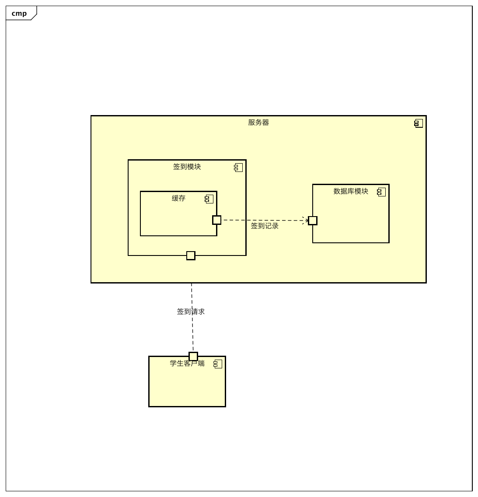
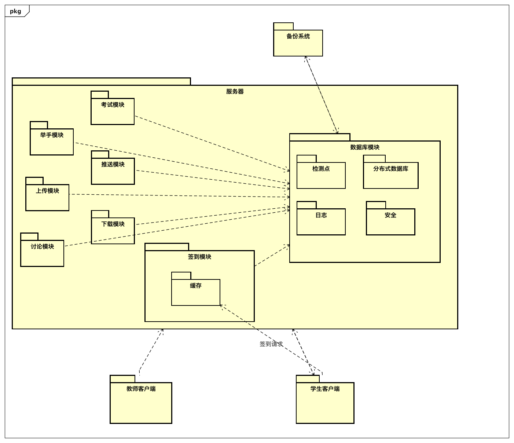
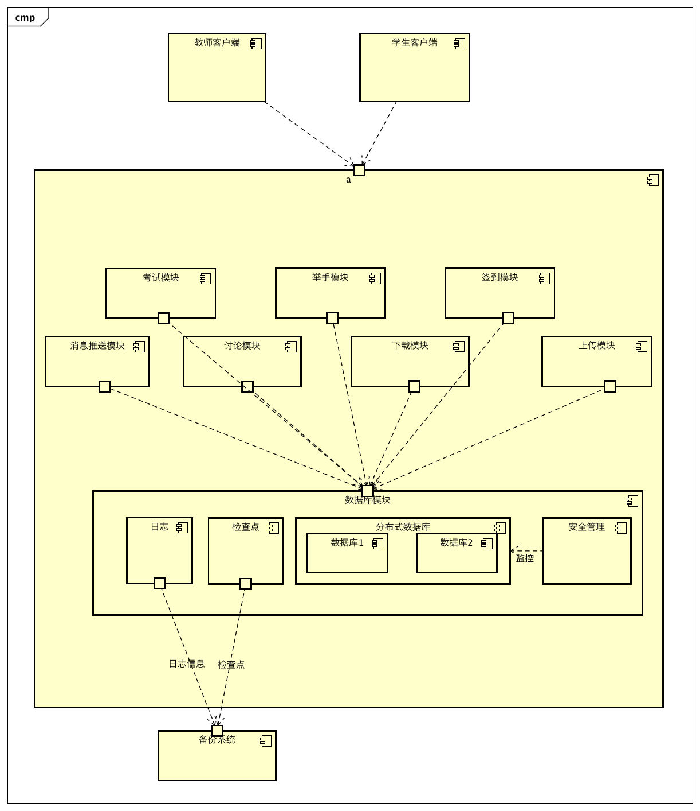
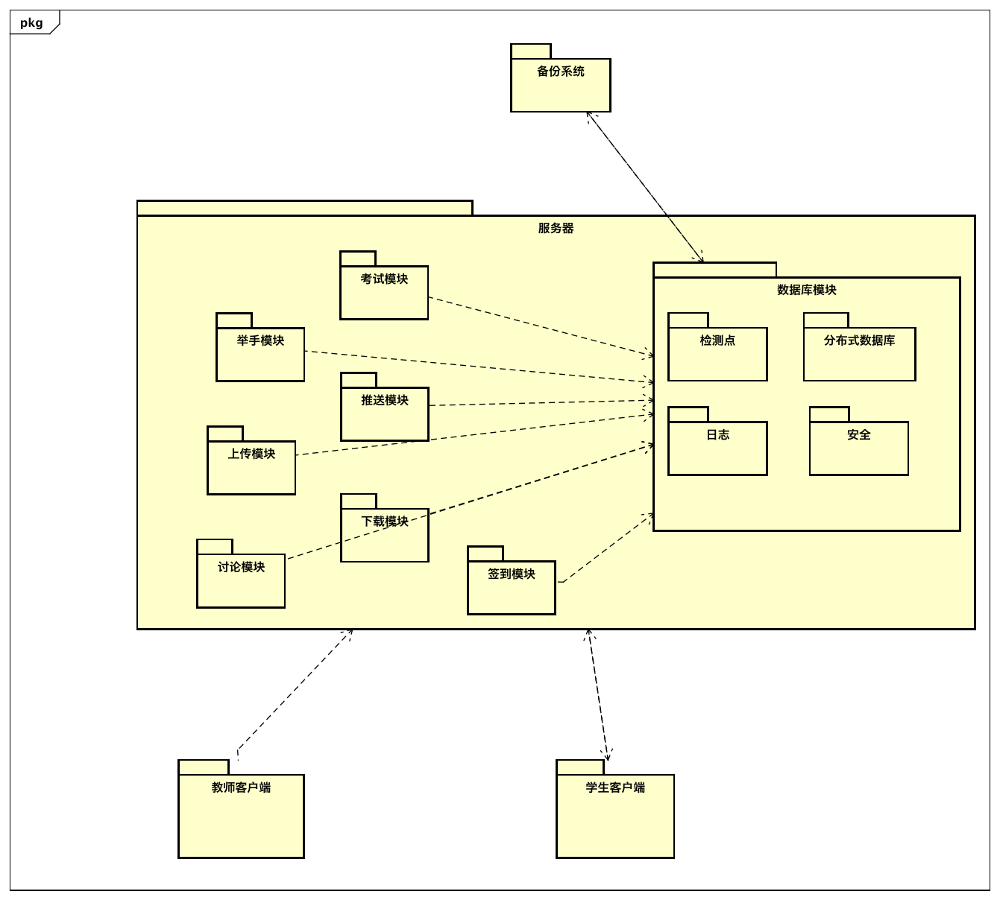

## 第二次迭代

### 4.2.1 分解系统组件

本次迭代选择签到模块进行分解

### 4.2.2 确定架构驱动因素

| #    | 架构驱动因素                                    | 重要性 | 难易度 |
| ---- | ----------------------------------------------- | ------ | ------ |
| 1    | 功能需求：课程签到                              | 高     | 高     |
| 2    | 场景1：大量用户短时间内进行数据量交换较小的操作 | 高     | 高     |
| 3    | 场景2：用户正常操作                             | 中     | 高     |
| 4    | 场景3：由于各种原因导致的系统出错               | 中     | 中     |
| 5    | 设计约束1：用户的数据不得被泄露和非法修改       | 中     | 中     |
| 6    | 场景10：用户请求服务                            | 中     | 中     |
| 7    | 场景7：学生数据防止被攻击和篡改                 | 中     | 高     |

### 4.2.3 选择满足架构驱动因素的架构模式

#### 4.2.3.1 设计关注点

| 质量属性 | 设计关注点 | 子关注点             |
| -------- | ---------- | -------------------- |
| 性能     | 资源管理   | 快速的处理时间       |
| 可用性   | 预防故障   | 恢复错误发生前的数据 |
| 安全性   | 攻击检测   | 检测非法签到         |

#### 4.2.3.2 候选模式

##### 快速的处理时间

| #    | 模式名称                       | 速度提升效果 | 硬件需求 | 成本 |
| ---- | ------------------------------ | ------------ | -------- | ---- |
| 1    | 引入并发                       | 高           | 中       | 中   |
| 2    | 增加服务器数量                 | 高           | 高       | 高   |
| 3    | 对数据进行缓存                 | 高           | 中       | 中   |
| 4    | 提高硬件性能（如 CPU、内存等） | 高           | 高       | 高   |

选择模式：**引入并发**、对数据进行缓存

选择理由：引入并发访问实现成本始终，对硬件需求不大，同时签到这一服务的特点是写操作偏多而读操作较少，并发可能会引起的数据不一致等问题能够教容易的得到解决；对数据进行缓存能够提高对这部分数据的读写速度，提高单次处理的速度同时也令处理时间更快，当缓存到达一定的容量时，在将缓存中的数据同步到数据库中。

#### 恢复错误发生前的数据

与数据库模块恢复数据策略相同

#### 防止非法签到

| #    | 模式名称           | 实现难度 |
| ---- | ------------------ | -------- |
| 1    | 记录访问者身份信息 | 低       |
| 2    | 拒绝异常 ip 访问   | 低       |
| 3    | 身份信息验证       | 低       |
| 4    | 非法访问行为识别   | 高       |

选择模式：身份信息验证、拒绝异常 ip 访问

选择理由：身份信息验证能够满足本系统对安全性的要求，拒绝异常 ip 访问能够防止代替签到等违规操作，且该两种方式较容易实现，成本较低，故选择。

### 4.2.4 候选模式与对应 ASR

| #    | 模式类型           | 选择的模式               | 架构驱动                                       |
| ---- | ------------------ | ------------------------ | ---------------------------------------------- |
| 1    | 快速的处理时间     | 引入并发，对数据进行缓存 | 场景1、场景2、场景10                           |
| 2    | 数据完整性         | 检查点+捆绑日志          | 场景3、约束1           |
| 3    | 检测非法签到     | 身份信息验证、拒绝异常 ip 访问                 | 约束1、场景7       |

### 4.2.5 架构视图

#### C&C 视图

#### 模块视图

## 4.3 第三次迭代

### 4.3.1 分解系统组件

本次迭代选择数据访问模块进行分解

### 4.3.2 确定架构驱动因素

| #    | 架构驱动因素                                                 | 重要性 | 难易度 |
| ---- | ------------------------------------------------------------ | ------ | ------ |
| 1    | 约束1：用户的数据不得被泄露和非法修改                        | 高     | 高     |
| 2    | 场景1：大量用户在短时间内使用客户端进行进行数据量交换较小的操作 | 高     | 中     |
| 3    | 场景3：由于各种原因导致的系统出错                            | 高     | 中     |
| 4    | 场景6：断线重连                                              | 高     | 高     |
| 5    | 场景7：学生数据防止被攻击和篡改                              | 高     | 高     |
| 6    | 场景10：用户请求服务                                         | 中     | 中·    |
| 7    | 场景2：用户正常操作                                          | 高     | 高     |

### 4.3.3 选择满足架构驱动因素的架构模式

#### 4.3.3.1 设计关注点

| 质量属性 | 设计关注点 | 子关注点           |
| -------- | ---------- | ------------------ |
| 性能     | 资源管理   | 快速的响应时间     |
|          |            | 足够的吞吐量       |
| 可用性   | 故障预防   | 数据备份     |
|          |  故障恢复          | 恢复数据          |
| 安全性   | 抵抗攻击   | 防止数据泄露       |
|          |            | 防止数据被非法修改 |
|          | 检测攻击   | 检测数据泄露       |
|          |            | 检测数据非法修改   |
|          |            |                    |

#### 4.3.3.2 候选模式

##### 快速响应

| #    | 模式名称     | 速度提升效果 | 硬件需求 | 成本 |
| ---- | ------------ | ------------ | -------- | ---- |
| 1    | 缓存         | 高           | 中       | 中   |
| 2    | 增加硬件数量 | 高           | 高       | 高   |
| 3    | 提高硬件性能 | 高           | 高       | 高   |
| 4    | 建立高效索引 | 高           | 低       | 中   |

选择模式：缓存、建立高效索引

选择理由：结合用户对数据库访问的模式对索引进行优化可以能够显著提升查询速度；将经常被读取的数据放入缓存中能够缩短处理时间；分布式数据库能够提高

##### 足够的吞吐量

| #    | 模式名称         | 吞吐量提升效果 | 成本 | 难度 |
| ---- | ---------------- | -------------- | ---- | ---- |
| 1    | 分布式数据库     | 高             | 中   | 中   |
| 2    | 读写分离         | 高             | 中   | 中   |
| 3    | 增加计算设备数量 | 中             | 高   | 低   |
| 4    | 提高计算设备性能 | 中             | 高   | 低   |

选择模式：分布式数据库

选择理由：在系统平时的使用场景中，业务请求不是每时每刻都是大量的，通过提升硬件的方式来提升吞吐量在业务请求较少时，对资源存在严重的浪费；在此系统的业务场景中，写操作较多，不低于读操作的需求，所以读写分离不适合用来解决此问题；分布式数据库本身成本较为适中，拥有较好的伸缩性，通过实现数据访问节点的动态平滑扩缩容，应对峰值流量。可以更好的支撑未来业务量的快速发展以及各种异常变化，提升业务满意度。

##### 数据备份

| #    | 模式名称   | 成本 | 实现难度 |
| ---- | ---------- | ---- | -------- |
| 1    | 定期磁带   | 高   | 低       |
| 2    | 数据库备份 | 中   | 低       |
| 3    | 网络数据   | 中   | 中       |
| 4    | 远程镜像   | 高   | 中       |

选择模式：网络数据

选择理由：对生产系统的数据库数据和所需跟踪的重要目标文件的更新进行监控与跟踪，并将更新日志实时通过网络传送到备份系统，备份系统则根据日志对磁盘进行更新。通过该方式可以借助云端对数据库进行备份，降低成本。

##### 恢复数据

| #    | 模式            | 存储负载                 | 处理器负载                    |
| ---- | --------------- | ------------------------ | ----------------------------- |
| 1    | 检查点          | 1秒每半分钟              | 无                            |
| 2    | 检查点+变化日志 | 1秒每半分钟+每秒2条消息  | 无                            |
| 3    | 检查点+捆绑日志 | 1秒每半分钟+每x秒1条消息 | 无                            |
| 4    | 检查点+同步备份 | 1秒每半分钟+每x秒1条消息 | 每x秒同步一次主机和备份的状态 |

选择模式：检查点+变化日志

理由：单单使用检查点不能完全恢复出错前的现场信息，捆绑日志实现起来较为复杂，同步备份则由于客户端节点并未采取备份而不可行。考虑到实际使用中，用户的操作频率有一定的上限，使用变化日志带来的存储负担还可接受，故选择检查点+变化日志。

##### 检测数据泄露

| #    | 模式名称           | 实现难度 |
| ---- | ------------------ | -------- |
| 1    | 监控访问者身份信息 | 低    |
| 2    | 创建访问模式库以检测异常的访问 | 高 |

选择模式：监控访问者身份信息

选择理由：通过创建访问模式库来发现异常的访问行为是一项十分复杂的工程，需要投入较高的人力物力；监控访问方信息实现相对简单，其对攻击的保障已经足够满足本系统的需求。

##### 检测数据被非法修改

| #    | 模式名称                           | 安全系数 | 实现难度 |
| ---- | ---------------------------------- | -------- | -------- |
| 1    | 监控修改请求者信息                 | 中       | 低       |
| 2    | 建立访问模式库以检测异常的修改请求 | 高       | 高       |
| 3    | 对数据添加校验码                   | 中       | 低       |

选择模式：监控修改请求者信息

选择理由：通过创建访问模式库来发现异常的访问行为是一项十分复杂的工程，需要投入较高的人力物力；对数据添加校验码除了需要额外的存储空间之外，还需要消耗大量的计算资源对校验码进行检查，成本较高；监控修改请求者信息实现相对简单，其对攻击的保障已经足够满足本系统的需求。

##### 防止数据泄露

| #    | 模式名称               | 安全等级 | 实现难度 |
| ---- | ---------------------- | -------- | -------- |
| 1    | 数据加密               | 高       | 低       |
| 2    | 异常访问行为识别       | 高       | 高       |
| 3    | 限制对数据库远程的访问 | 中       | 低       |
| 4    | 对所有访问进行身份验证 | 中       | 低       |

选择模式：数据加密、限制远程访问、对所有访问进行身份验证

选择理由：异常访问行为识别需要的技术要求较高，成本较高；限制远程访问并对访问进行验证能够有效抵御非法的远程及本地访问，数据加密作为最后一道防线是的数据难以被攻击者破解

##### 防止数据被非法修改

同 **防止数据泄露**

### 4.3.4 候选模式与对应 ASR

质量属性  设计关注点  子关注点  性能  资源管理      足够的吞吐量  可用性  故障预防  数据备份    故障恢复  恢复数据  安全性  抵抗攻击  防止数据泄露      防止数据被非法修改    检测攻击  检测数据泄露      检测数据非法修改

| #    | 模式类型           | 选择的模式                                     | 架构驱动             |
| ---- | ------------------ | ---------------------------------------------- | -------------------- |
| 1    | 快速响应           | 缓存、建立高效索引                             | 场景2                |
| 2    | 足够的吞吐量       | 分布式数据库                                   | 场景1、场景10        |
| 3    | 数据备份           | 网络数据                                       | 场景6、场景3、场景10 |
| 4    | 恢复数据           | 检查点+捆绑日志                                | 场景6、场景3         |
| 5    | 检测数据泄露       | 监控访问者身份信息                             | 约束1、场景7         |
| 6    | 检测数据被非法修改 | 监控修改请求者信息                             | 约束1、场景7         |
| 7    | 防止数据泄露       | 数据加密、限制远程访问、对所有访问进行身份验证 | 约束1、场景7         |
| 8    | 防止数据被非法修改 | 数据加密、限制远程访问、对所有访问进行身份验证 | 约束1、场景7         |

### 4.3.5 架构视图

#### C&C 视图

#### 模块视图

