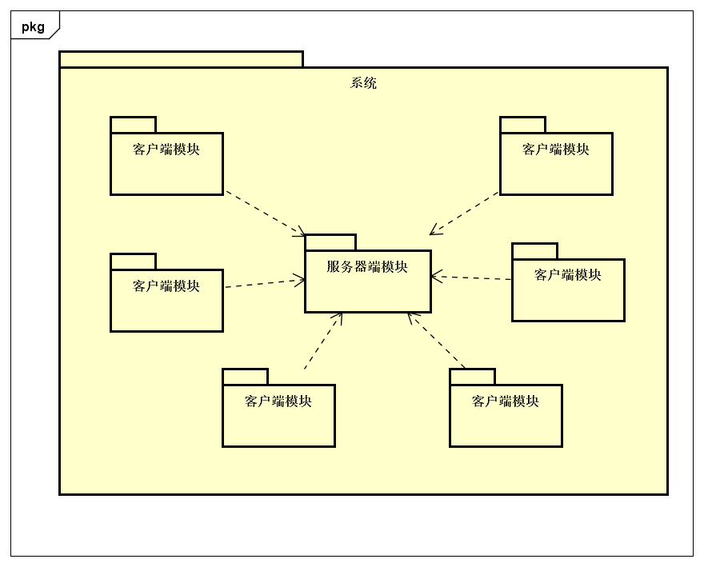
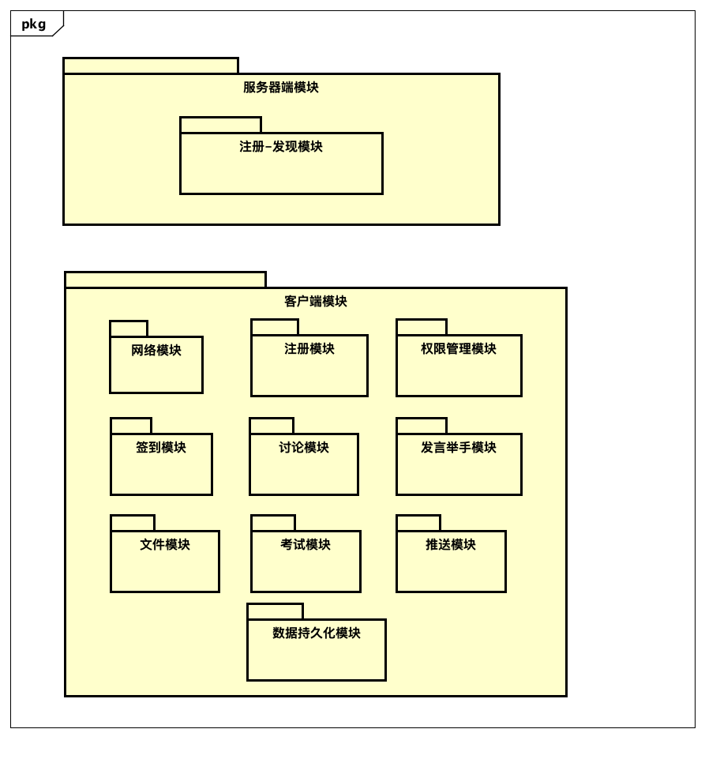

## 3.1 第一次迭代

### 3.1.1 分解系统组件
 
将系统分解为**服务器**和**客户端**两类节点。

## 3.2 第二次迭代

### 3.2.1 分解系统组件

将**服务器节点**和**客户端**节点分别进行分解。**服务器节点**分解为**注册-发现模块**，**客户端节点**分解为**注册模块**、**签到模块**、**讨论模块**、**举手发言模块**、**文件模块**、**考试模块**、**推送模块**和**数据持久化模块**。

