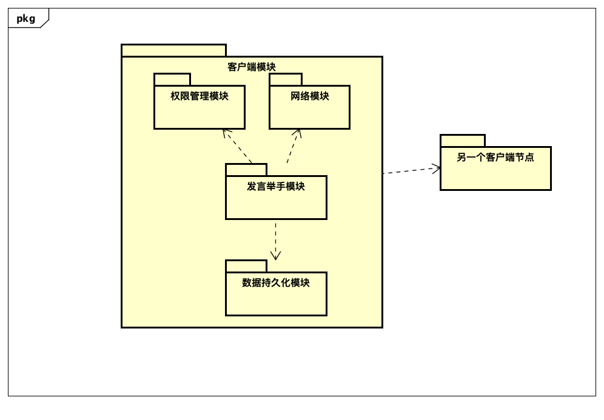
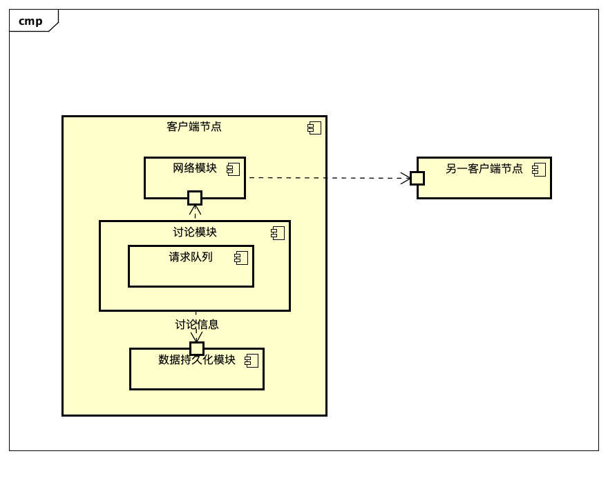
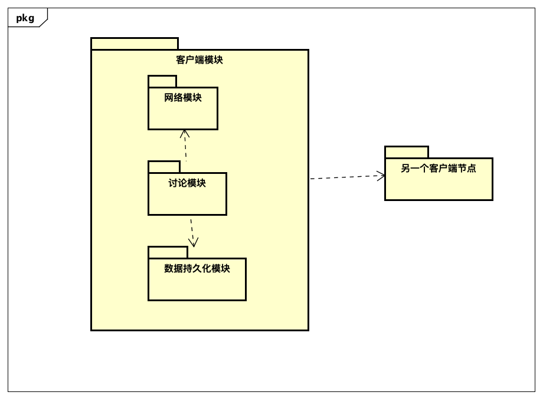
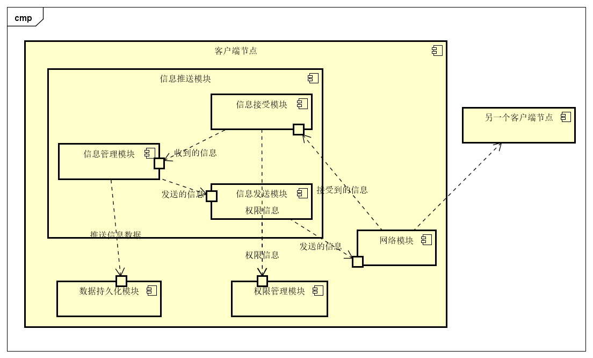

## 3.1 第一次迭代

### 3.1.1 分解系统组件
 
将系统分解为**服务器**和**客户端**两类节点。

## 3.2 第二次迭代
### 3.2.1 分解系统组件

将**服务器节点**和**客户端**节点分别进行分解。**服务器节点**分解为**注册-发现模块**，**客户端节点**分解为**注册模块**、**权限管理模块**、**签到模块**、**讨论模块**、**举手发言模块**、**文件模块**、**考试模块**、**推送模块**和**数据持久化模块**。

## 3.3 第三次迭代
### 3.3.1 分解系统组件

本迭代分解服务端节点的**注册-发现模块**。

### 3.3.2 确定架构驱动因素

| # |架构驱动因素|重要性|难易度|
|---|---|-|-|
|1|场景10：用户请求服务|高|高|
|2|场景11：用户请求其他用户的信息|高|中|
|3|场景3：系统故障|中|中|
|4|场景6：断线重连|低|中|

### 3.3.3 选择架构模式

#### 3.3.3.1 设计关注点

|质量属性|设计关注点|子关注点|
|---|---|-|
|可用性|预防故障|重启|
|||数据完整性|
||故障检测|监控服务端节点|
||故障恢复|对客户端节点透明|
|可靠性|客户端节点信息正确可用|检测失效客户端节点|

#### 3.3.3.2 候选模式

**重启**

|#|模式|时间|服务不可用|
|---|---|-|-|
|1|冷启动|>1分钟|是|
|2|热备份|>0.3秒|可能|
|3|多主机备份|无|否|

选择模式：**热备份**

理由：冷启动需要超过1分钟的时间，这个期间系统处于服务不可用的状态，这是无法接受的。多主机备份复杂度太高，实现困难，故选择热备份。

**数据完整性**

|#|模式|存储负载|处理器负载|
|---|---|-|-|
|1|检查点|1秒每分钟|无|
|2|检查点+变化日志|1秒每分钟+每秒30条消息|无|
|3|检查点+捆绑日志|1秒每分钟+每x秒1条消息|无|
|4|检查点+同步备份|1秒每分钟+每x秒1条消息|每x秒同步一次主机和备份的状态|

选择模式：**检查点+捆绑日志**

理由：光靠检查点不能完全恢复系统状态；对服务端节点的访问是时间不均匀的，每产生一次变化就记录一条日志可能会导致很大的存储负载；同步主机的状态到备份则会消耗一定的处理器，因此选择检查点+捆绑日志。

**监控服务端节点**

|#|模式|信息负载|
|---|---|-|
|1|心跳机制|1|
|2|Ping&Echo|2|
|3|客户端节点检测故障|0|

选择模式：**心跳机制**

理由：心跳机制实现简单，通信量也没有Ping&Echo那么多。客户端节点检测到故障并不能告知服务端节点，因而选择心跳机制。

**对客户端节点透明**

|#|模式|通信方式|超时位置|
|---|---|-|-|
|1|客户端节点处理故障|单播|客户端节点|
|2|代理处理故障|单播|代理|
|3|基础设施处理故障|广播|基础设施内部|

选择模式：**代理处理故障**

理由：在客户端处理故障要求客户端节点了解故障的细节，可能会导致系统不够鲁棒；在基础设施内处理故障，广播会占用较大的带宽，因此选择用代理。

**检测失效客户端节点**

|#|模式|反应速度|通信负载|
|---|---|-|-|
|1|心跳机制|快|每秒1次|
|2|客户端检测+广播|慢|1+N次|

选择模式：**心跳机制**

理由：客户端检测失效节点并向其他人广播会占用大量的通信带宽，并且网络的更新有延时，其他客户端节点不一定能及时得知失效节点，因此选择心跳机制。

### 3.3.4 候选模式与对应ASR

| # | 模式类型 | 选择的模式 | 架构驱动 |
| -- | -- | -- | -- |
|1|重启|热备份|场景10：用户请求服务 场景3：系统故障|
|2|数据完整性|检查点+捆绑日志|场景10：用户请求服务 场景3：系统故障|
|3|监控服务端节点|心跳机制|场景10：用户请求服务 场景3：系统故障|
|4|对客户端节点透明|代理处理故障|场景10：用户请求服务 场景3：系统故障|
|5|检测失效客户端节点|心跳机制|场景11：用户请求其他用户的信息 场景6：断线重连|

### 3.3.5 架构视图

**C&C视图**

**模块视图**

## 3.4 第四次迭代
### 3.4.1 分解系统组件

本迭代分解客户端节点的**网络模块**。

### 3.4.2 确定架构驱动因素

|#|架构驱动因素|重要性|难易度|
|---|---|-|-|
|1|场景10：用户请求服务|高|中|
|2|场景6：断线重连|高|中|
|3|场景11：用户请求其他用户的信息|高|中|
|4|功能需求：参加考试|中|中|

### 3.4.3 选择架构模式

#### 3.4.3.1 设计关注点

|质量属性|设计关注点|子关注点|
|---|---|-|
|可用性|预防故障|监测相邻节点|
|可用性|从故障中恢复|重启|
|||数据完整性|
|可靠性|减少无效数据|数据交换|

#### 3.4.3.2 候选模式

**监测相邻节点**

|#|模式|通信开销|连接信息的时效性|
|-|-|-|-|
|1|心跳机制|随着网络增大而增大|高|
|2|超时重试机制|小|低|

选择模式：**超时重试机制**

理由：采用心跳机制检测相邻节点的连接是否有效，虽然可以保证客户端节点的连接信息的时效性，但是随着P2P网络增大，心跳机制带来的通信开销也会增大，最终增大到不可接受的地步。相比之下，超时重试机制实现简单，开销较低，因此选择超时重试机制。

**重启**

|#|模式|时间|服务不可用|
|---|---|-|-|
|1|冷启动|>5秒|是|
|2|热备份|>0.3秒|可能|
|3|多主机备份|无|否|

选择模式：**冷启动**

理由：对于客户端节点而言，多主机备份运行程序是不现实的；热备份虽然启动时间快，但是实现起来较为复杂。相比之下，遇到问题就重启更符合一般用户的操作习惯，5秒以上的等待时间也并非不能接受，故选择冷启动。

**数据完整性**

这一部分放在客户端节点的数据持久化模块实现。

**数据交换**

|#|模式|频率|通信负载|
|-|-|-|-|
|1|快泛洪|每分钟一次|高|
|2|慢泛洪|每五分钟一次|低|

选择模式：**慢泛洪**

理由：若客户端频繁向相邻节点交换数据，会占用较大带宽，影响网络的正常通信，因此选择频率较低的慢泛洪。

### 3.4.4 候选模式与对应ASR

| # | 模式类型 | 选择的模式 | 架构驱动 |
| -- | -- | -- | -- |
|1|监测相邻节点|超时重试机制|场景10：用户请求服务 场景6：断线重连|
|2|重启|冷启动|场景10：用户请求服务|
|3|数据完整性|无|场景6：断线重连 功能需求5：参加考试|
|4|数据交换|慢泛洪|场景11：用户请求其他用户的信息|

### 3.4.5 架构视图
**C&C视图**

**模块视图**

## 3.5 第五次迭代
### 3.5.1 分解系统组件

本迭代分解客户端节点的数据持久化模块。

### 3.5.2 确定架构驱动因素

|#|架构驱动因素|重要性|难易度|
|---|---|-|-|
|1|约束1：用户的数据不得被泄露和非法修改|高|高|
|2|场景7：学生数据防止被攻击和篡改|高|高|
|3|场景3：系统故障|高|中|
|4|场景6：断线重连|高|中|
|5|功能需求：参加考试|高|高|
|6|功能需求：课程签到|中|低|
|7|功能需求：发言举手|中|低|
|8|功能需求：参与讨论|中|低|
|9|功能需求：信息推送|中|低|

### 3.5.3 选择架构模式
#### 3.2.3.1 设计关注点

| 质量属性 | 设计关注点 | 子关注点  |
| -------- | ---------- | --------- |
|安全性|用户数据安全|防止泄露|
|||防止非法修改|
|可用性|故障预防|数据完整性|

#### 3.5.3.2 候选模式

**防止泄露**

|#|模式|实现难度|
|-|-|-|
|1|数据加密|低|
|2|限制数据库远程访问|低|
|3|限制数据库远程访问+数据加密|中|

选择模式：**限制数据库远程访问+数据加密**

理由：单单给数据加密并不能防止数据被泄露，只是增加了解读数据的难度；限制远程访问数据库可以有效防御外部的恶意访问，但却不能很好的应对本地攻击，因此综合采取两种方式来防止数据泄露。

**防止非法修改**

|#|模式|实现难度|安全性|性能开销|
|-|-|-|-|-|
|1|校验位|高|高|高|
|2|限制数据库访问权限|低|中|无|

选择模式：**限制数据库访问权限**

理由：虽然使用数据校验位安全性很高，但其实现难度也高，并且会带来额外的性能开销；限制数据库访问权限提供的安全性已经可以满足要求了，因此选择它。

**数据完整性**

|#|模式|存储负载|处理器负载|
|---|---|-|-|
|1|检查点|1秒每半分钟|无|
|2|检查点+变化日志|1秒每半分钟+每秒2条消息|无|
|3|检查点+捆绑日志|1秒每半分钟+每x秒1条消息|无|
|4|检查点+同步备份|1秒每半分钟+每x秒1条消息|每x秒同步一次主机和备份的状态|

选择模式：**检查点+变化日志**

理由：单单使用检查点不能完全恢复出错前的现场信息，捆绑日志实现起来较为复杂，同步备份则由于客户端节点并未采取备份而不可行。考虑到实际使用中，用户的操作频率有一定的上限，使用变化日志带来的存储负担还可接受，故选择检查点+变化日志。

### 3.5.4 候选模式与对应ASR

| # | 模式类型 | 选择的模式 | 架构驱动 |
| -- | -- | -- | -- |
|1|防止泄露|限制数据库远程访问+数据加密|约束1：用户的数据不得被泄露和非法修改|
|2|防止非法修改|限制数据库访问权限|约束1：用户的数据不得被泄露和非法修改 场景7：学生数据防止被攻击和篡改|
|3|数据完整性|检查点+变化日志|场景3：系统故障 场景6：断线重连 功能需求1：课程签到 功能需求2：发言举手 功能需求3：参与讨论 功能需求5：参加考试 功能需求6：信息推送|

### 3.5.5 架构视图
**C&C视图**

**模块视图**

## 3.6 第六次迭代
### 3.6.1 分解系统组件

本迭代分解客户端节点的**签到模块**。

### 3.6.2 确定架构驱动因素

|#|架构驱动因素|重要性|难易度|
|---|---|-|-|
|1|场景1：大量用户短时间内进行数据量交换较小的操作|高|高|
|2|约束1：用户的数据不得被泄露和非法修改|高|中|
|3|功能需求：课程签到|高|低|

### 3.6.3 选择架构模式

#### 3.6.3.1 设计关注点

| 质量属性 | 设计关注点 | 子关注点  |
| -------- | ---------- | --------- |
|性能|高并发|密集网络请求|
|安全性|数据安全|禁止非法修改|
|||数据完整性|

#### 3.6.3.2 候选模式

**密集网络请求**

|#|模式|实现难度|并发性能|
|-|-|-|-|
|1|同步请求|低|<60（取决于硬件和容器）|
|2|集群+负载均衡|高|>10000（取决于硬件和容器）|
|3|消息队列|中|>150（取决于硬件和容器）|

选择模式：**消息队列**

理由：使用同步的方式处理请求将不能满足场景1要求的5s内处理300人的请求；集群+负载均衡的并发性能最好，但是实现难度较大，不经济；使用消息队列缓存用户请求，实现难度中等，并发能力也足以满足要求。

**禁止非法修改**

|#|模式|实现难度|安全性|性能开销|
|-|-|-|-|-|
|1|校验位|高|高|高|
|2|限制数据库访问权限|低|中|无|

选择模式：**限制数据库访问权限**

理由：虽然使用数据校验位安全性很高，但其实现难度也高，并且会带来额外的性能开销；限制数据库访问权限提供的安全性已经可以满足要求了，因此选择它。

**数据完整性**

|#|模式|存储负载|处理器负载|
|---|---|-|-|
|1|检查点|1秒每半分钟|无|
|2|检查点+变化日志|1秒每半分钟+每秒2条消息|无|
|3|检查点+捆绑日志|1秒每半分钟+每x秒1条消息|无|
|4|检查点+同步备份|1秒每半分钟+每x秒1条消息|每x秒同步一次主机和备份的状态|

选择模式：**检查点+捆绑日志**

理由：检查点不能完全保证数据完整性，使用变化日志在高并发的场景下会产生大量的日志，对磁盘的IO能力是一个较大的挑战；同步备份在客户端节点稍显小题大做，故而选择检查点+捆绑日志。

### 3.6.4 候选模式与对应ASR

| #   | 模式类型 | 选择的模式 | 架构驱动 |
| --- | -------- | ---------- | -------- |
|1|密集网络请求|消息队列|场景1：大量用户短时间内进行数据量交换较小的操作 功能需求1：课程签到|
|2|禁止非法修改|限制数据库访问权限|功能需求1：课程签到 约束1：用户的数据不得被泄露和非法修改|
|3|数据完整性|检查点+捆绑日志|功能需求1：课程签到 约束1：用户的数据不得被泄露和非法修改|

### 3.6.5 架构视图
**C&C视图**

**模块视图**

## 3.7 第七次迭代
### 3.7.1 分解系统组件

本迭代分解客户端节点的**考试模块**。

### 3.7.2 确定架构驱动因素

|#|架构驱动因素|重要性|难易度|
|---|---|-|-|
|1|场景6：断线重连|高|高|
|2|场景7：学生数据防止被攻击和篡改|高|高|
|3|约束1：用户的数据不得被泄露和非法修改|高|高|
|4|场景1：大量用户短时间内进行数据量交换较小的操作|中|中|
|5|功能需求: 参与考试|高|高|

### 3.7.3 选择架构模式
#### 3.7.3.1 设计关注点

| 质量属性 | 设计关注点 | 子关注点  |
| -------- | ---------- | --------- |
|可用性|故障检测|快速反应|
||故障恢复|数据完整性|
|安全性|数据安全|防止泄露数据|
|||禁止非法修改|
|性能|高并发|密集网络请求|

#### 3.7.3.2 候选模式

**快速反应**

|#|模式|反应时间|准确率|
|-|-|-|-|
|1|异常处理|<0.1秒|可能会误判|
|2|出错重试|<2秒|误判可能性较低|

选择模式：**出错重试**

理由：在通过网络传输数据时，一出现异常就启动断线重连机制，这样做虽然反应快，但可能会把瞬时的网络波动误判成断线；出错重试机制虽然会花费更多时间，但并没有超出要求规定的5秒，且准确率更高，故选择之。

**数据完整性**

|#|模式|存储负载|实现难度|
|---|---|-|-|
|1|检查点|1秒每15秒|低|
|2|检查点+变化日志|1秒每半分钟+每秒2条消息|中|
|3|检查点+捆绑日志|1秒每半分钟+每x秒1条消息|中|
|4|检查点+同步备份|1秒每半分钟+每x秒1条消息|高|

选择模式：**检查点**

理由：虽然检查点不能完全恢复现场数据，但是场景7并没有要求要完全恢复现场信息，因此实现最简单的检查点完全够用。除此之外，进一步缩短检查点的周期，可以有效提高数据恢复程度。

**防止泄露数据**

这部分在数据持久化模块实现。

**禁止非法修改**

这部分在数据持久化模块实现。

**密集网络请求**

|#|模式|实现难度|并发性能|
|-|-|-|-|
|1|同步请求|低|<60（取决于硬件和容器）|
|2|集群+负载均衡|高|>10000（取决于硬件和容器）|
|3|消息队列|中|>150（取决于硬件和容器）|

选择模式：**消息队列**

理由：使用同步的方式处理请求将不能满足场景1要求的5s内处理300人的请求；集群+负载均衡的并发性能最好，但是实现难度较大，不经济；使用消息队列缓存用户请求，实现难度中等，并发能力也足以满足要求。

### 3.7.4 候选模式与对应ASR

| #   | 模式类型 | 选择的模式 | 架构驱动 |
| --- | -------- | ---------- | -------- |
|1|快速反应|出错重试|场景6：断线重连|
|2|数据完整性|检查点|场景6：断线重连|
|3|防止泄露数据|无|场景7：学生数据防止被攻击和篡改 约束1：用户的数据不得被泄露和非法修改|
|4|禁止非法修改|无|场景7：学生数据防止被攻击和篡改 约束1：用户的数据不得被泄露和非法修改|
|5|密集网络请求|消息队列|场景1：大量用户短时间内进行数据量交换较小的操作|

### 3.7.5 架构视图
**C&C视图**

**模块视图**

## 3.8 第八次迭代
### 3.8.1 分解系统组件
本迭代分解客户端节点的**发言举手模块**。

### 3.8.2 确定架构驱动因素
| # |架构驱动因素|重要性|难易度|
|----|----|----|----|
|1|功能需求：发言举手|中|低|
|2|场景1：大量用户短时间内进行数据量交换较小的操作|高|高|
|3|场景3：系统故障|中|中|
|4|场景6：断线重连|低|中|
|5|场景9：学生使用过程中撤销错误操作|高|中|
|6|场景10：用户请求服务|高|高|
|7|场景11：用户请求其他用户的信息|高|中|

### 3.8.3 选择架构模式
#### 3.8.3.1 设计关注点
|质量属性|设计关注点|子关注点|
|---|---|---|
|性能|资源管理|数据交换速度度量|
|可用性|客户端节点可用性监测|对客户端节点透明|
||客户端节点故障恢复|对客户端节点透明|
|||保持数据一致性|
|易用性|支持用户动机|撤销操作|
|可靠性|客户端节点信息正确可用|检测失效客户端节点|

#### 3.8.3.2 候选模式
**数据交换速度度量**

|#|模式|精确度|性能|
|---|---|---|---|
|1|度量每次请求的时间|高|中|
|2|度量样本请求的时间|中|高|
|3|度量模拟请求的时间|中|高|

选择模式：**度量样本请求的时间**

理由：每次请求都度量时间会导致系统延迟增大,所以不可取;模拟请求的开支虽然较小,但仅仅为了度量数据交换速度而发送请求也会消耗一定网络资源;因此选择抽取一定量样本进行度量

**保持数据一致性**

数据一致性由客户端节点的持久化模块实现.

**对客户端节点透明**

|#|模式|通信方式|超时位置|
|---|---|---|---|
|1|客户端节点处理故障|单播|客户端节点|
|2|代理处理故障|单播|代理|
|3|基础设施处理故障|广播|基础设施内部|

选择模式：**代理处理故障**

理由：在客户端处理故障要求客户端节点了解故障的细节，可能会导致系统不够鲁棒；在基础设施内处理故障，广播会占用较大的带宽，因此选择用代理。

**撤销操作**

|#|模式|易用性|性能代价|
|---|---|---|---|
|1|命令模式|高|中|
|2|客户端节点提供撤销接口|高|中|

选择模式: **客户端节点提供撤销接口**

理由: 使用命令模式保存举手信息会造成较大的内存消耗,因此选择专门提供举手信息的撤销接口.

**检测失效客户端节点**

|#|模式|反应速度|通信负载|
|---|---|---|---|
|1|心跳机制|快|每秒1次|
|2|ping/echo机制|快|每秒1次|
|3|客户端检测+广播|慢|1+N次|

选择模式：**ping/echo机制**

理由：心跳机制要求教师所持节点保存所有的学生持有节点,且需要定期发送心跳信息,容易造成通信瓶颈;客户端检测失效节点并向其他人广播会占用大量的通信带宽，并且网络的更新有延时，其他客户端节点不一定能及时得知失效节点;因此选择ping/echo机制。

### 3.8.4 候选模式与对应ASR

| # | 模式类型 | 选择的模式 | 架构驱动 |
|---|---|---|---|
|1|数据交换速度度量|度量样本请求的时间|场景1：大量用户短时间内进行数据量交换较小的操作|
|2|数据完整性|无|场景3：系统故障|
|3|对客户端节点透明|代理处理故障|场景3：系统故障 场景10：用户请求服务|
|4|撤销操作|客户端节点提供撤销接口|场景9:学生使用过程中撤销错误操作|
|5|检测失效客户端节点|ping/echo机制|场景6：断线重连 场景11：用户请求其他用户的信息|

### 3.8.5 架构视图

**c&c视图**

**模块视图**

## 3.9 第九次迭代
### 3.9.1 分解系统组件
本迭代分解客户端节点的**讨论模块**。

### 3.9.2 确定架构驱动因素
|#|架构驱动因素|重要性|难易度|
|---|---|---|---|
|1|功能需求：参与讨论|中|低|
|2|场景2：用户正常操作|中|高|
|3|场景3：系统故障|中|中|
|4|场景6：断线重连|高|中|
|5|场景10：用户请求服务|高|中|
|6|场景11：用户请求其他用户的信息|高|中|

### 3.9.3 选择架构模式
#### 3.9.3.1 设计关注点
|质量属性|设计关注点|子关注点|
|---|---|---|
|性能|控制资源需求|限制执行时间|
|||限制资源响应|
||管理资源|维护数据备份|
|可用性|客户端节点可用性监测|对客户端节点透明|
||客户端节点故障恢复|对客户端节点透明|
|可靠性|客户端节点信息正确可用|检测失效客户端节点|

#### 3.9.3.2 候选模式

**限制执行时间**

|#|模式|性能|实现难度|
|----|----|----|----|
|1|异步定时终止|高|中|

选择模式：**异步定时终止**

理由：在接受请求后即异步定时终止执行,实现简单且性能较好

**限制资源响应**

|#|模式|性能|实现难度|
|----|----|----|----|
|1|定长请求队列|高|中|
|2|不限长请求队列|中|中|

选择模式：**定长请求队列**

理由：不限长请求队列可能会导致请求处理缓慢,无法满足质量需求;虽然定长请求队列会导致部分用户无法发表言论,但可以及时作出反馈,因此选择模式1

**维护数据备份**

|#|模式|通信性能|存储性能|
|----|----|----|----|
|1|实时备份|中|中|
|2|定期备份|中|高|

选择模式: **定期备份**

理由: 采用实时备份显然会造成IO资源的大量消耗,同时频繁备份本身也会消耗网络资源,因此选择定期备份。

**对客户端节点透明**

|#|模式|通信方式|超时位置|
|---|---|---|---|
|1|客户端节点处理故障|单播|客户端节点|
|2|代理处理故障|单播|代理|
|3|基础设施处理故障|广播|基础设施内部|

选择模式：**代理处理故障**

理由：在客户端处理故障要求客户端节点了解故障的细节，可能会导致系统不够鲁棒；在基础设施内处理故障，广播会占用较大的带宽，因此选择用代理。

**检测失效客户端节点**

|#|模式|反应速度|通信负载|
|---|---|---|---|
|1|心跳机制|快|每秒1次|
|2|ping/echo机制|快|每秒1次|
|3|客户端检测+广播|慢|1+N次|

选择模式：**心跳机制**

理由：ping/echo机制要求各客户端节点向参与讨论的节点发送信息,会造成较大的资源消耗;客户端检测失效节点并向其他人广播会占用大量的通信带宽，并且网络的更新有延时，其他客户端节点不一定能及时得知失效节点;因此选择心跳机制。

### 3.9.4 候选模式与对应ASR

| # | 模式类型 | 选择的模式 | 架构驱动 |
| --- | --- | --- | --- |
|1|限制执行时间|异步定时终止|场景2：用户正常操作|
|2|限制资源响应|定长请求队列|场景2：用户正常操作|
|3|维护数据备份|维护数据备份|场景2：用户正常操作|
|4|对客户端节点透明|对客户端节点透明|场景3：系统故障 场景6：断线重连 场景10：用户请求服务|
|5|检测失效客户端节点|检测失效客户端节点|场景11：用户请求其他用户的信息|

### 3.9.5 架构视图
**c&c视图**

**模块视图**

## 3.10 第十次迭代
### 3.10.1 分解系统组件
选择**文件管理模块**继续分解。

### 3.10.2 确定架构驱动因素

| #   | 架构驱动因素                                    | 重要性 | 难易度 |
| --- | ----------------------------------------------- | ------ | ------ |
| 1   | 功能需求：共享文件                              | 高     | 高     |
| 2   | 场景12：文件上传和下载                          | 高     | 高     |
| 3   | 场景6：断线重连                                 | 高     | 中     |
| 4   | 设计约束1：用户的数据不得被泄露和非法修改       | 高     | 中     |
| 5   | 场景5：用户企图下载未选课的课程文件             | 高     | 低     |
| 6   | 场景13：用户执行未授权的操作                    | 中     | 低     |
| 7   | 场景2：用户正常操作                             | 中     | 低     |
| 8   | 场景3：由于各种原因导致的系统出错               | 中     | 低     |
| 9   | 场景10：用户请求服务                            | 低     | 中     |
| 10  | 设计约束2：系统应该能在市面上绝大多数设备上运行 | 中     | 低     |

### 3.10.3 选择满足架构驱动因素的架构模式
#### 3.10.3.1 设计关注点

| 质量属性 | 设计关注点             | 子关注点                     |
| -------- | ---------------------- | ---------------------------- |
| 性能     | 良好的上传下载体验     | 良好的上传下载速度           |
|          |                        | 快速的响应速度               |
|          |                        | 可支持多个资源同时上传和下载 |
| 可用性   | 断线重连               | 检测网络中断                 |
|          |                        | 上传下载中断可以恢复进度     |
|          | 高可用时间             | 系统应达到99.9%可用时间      |
| 安全性   | 数据不得泄露和非法修改 | 防止数据非法访问和修改       |
|          | 用户权限设定           | 不得下载没有权限的文件       |
|          |                        | 学生用户不得上传文件         |

#### 3.10.3.2 候选模式

**良好的上传下载速度**

| #   | 模式名称                                                 | 开发难度 | 速度提升效果 | 数据安全性 | 硬件需求 | 成本 |
| --- | -------------------------------------------------------- | -------- | ------------ | ---------- | -------- | ---- |
| 1   | 多线程上传和下载                                         | 中       | 中           | 高         | 低       | 低   |
| 2   | 使用UDP协议传输数据                                      | 中       | 中           | 中         | 低       | 低   |
| 3   | 后台同步                                                 | 高       | 高           | 中         | 中       | 低   |
| 4   | 使用高带宽连接方式（例如Wi-Fi Direct协议而不是蓝牙协议） | 低       | 高           | 高         | 高       | 高   |
| 5   | 引入外部内容分发网络（CDN）                              | 低       | 高           | 中         | 中       | 高   |
| 6   | 提高硬件性能                                             | 低       | 中           | 高         | 高       | 高   |

选择模式：**后台同步**、**多线程上传和下载**、**使用UDP协议**

选择理由：系统对数据安全性要求很高，所以不能冒险将数据保存到网络上。使用类似OneDrive的同步云，将文件实时同步到本地设备，能够实现即用即取，不需要手动上传和下载。同时，存储到CDN需要付出巨大的网络成本。由于系统需要在尽可能多的设备上运行，且一些设备可能并不支持Wi-Fi Direct协议，所以不能将系统的性能依赖于连接方式和硬件的速度。UDP和多线程是目前常用的网络加速方法，开发资料丰富，效果良好，且无数据泄露风险，故选择。

**快速的响应速度**

| #   | 模式名称             | 开发难度 | 速度提升效果 | 数据及时性 |
| --- | -------------------- | -------- | ------------ | ---------- |
| 1   | 单独处理资源列表请求 | 中       | 高           | 高         |
| 2   | 本地缓存资源列表     | 中       | 高           | 中         |

选择模式：**单独处理资源列表请求**、**本地缓存资源列表**

选择理由：两种方法均能有效提高获得响应速度，故均选用。本地缓存的资源过期问题可以通过用户手动刷新解决。

**可支持多个资源同时上传和下载**

| #   | 模式名称                    | 成本 | 效果 | 开发难度 |
| --- | --------------------------- | ---- | ---- | -------- |
| 1   | 引入外部内容分发网络（CDN） | 高   | 高   | 低       |
| 2   | 多线程                      | 低   | 中   | 高       |

选择模式：**多线程**

选择理由：和之前一样，引入CDN会增加巨大的网络成本。多线程能充分利用系统资源，在不付出额外成本的情况下提高能同时上传和下载的资源数。

**检测网络中断**

| #   | 模式名称                     | 性能影响 | 响应速度       |
| --- | ---------------------------- | -------- | -------------- |
| 1   | 心跳                         | 低       | 中             |
| 2   | Ping-echo                    | 中       | 中             |
| 3   | 一段时间内没有速度即认为中断 | 低       | 依赖于时间间隔 |

选择模式：**心跳**

选择理由：一段时间内没有速度认为中断容易在网络负载大的时候造成假阳性的问题。心跳比ping-echo不需要额外硬件资源和设置，并能达到可以接受的响应速度。注意，虽然网络模块有心跳机制，但是为了保存文件传输的效率，文件传输需要建立单独的信道进行传输，所以不能复用网络模块的心跳机制。

**上传下载中断可以恢复进度**

| #   | 模式名称                   | 成本 | 效果 | 开发难度 | 系统硬件和网络资源消耗 |
| --- | -------------------------- | ---- | ---- | -------- | ---------------------- |
| 1   | 首先将文件保存到外部服务器 | 高   | 高   | 低       | 低                     |
| 2   | 使用临时文件保存进度       | 低   | 高   | 中       | 中                     |
| 3   | 减少每个包的大小           | 低   | 高   | 高       | 中                     |

选择模式：**使用临时文件保存进度**、**减少每个包的大小**

选择理由：将文件都首先保存到外部服务器会增加成本，故不选用。减少包的大小和使用临时文件能够让网络中断时损失的进度降低。

**系统应达到99.9%可用时间**

| #   | 模式名称                             | 成本 | 可用时间 | 文件大小限制 |
| --- | ------------------------------------ | ---- | -------- | ------------ |
| 1   | 将部分常用文件存储于外部服务器       | 高   | 高       | 低           |
| 2   | 在网络可用时在后台将文件保存到设备上 | 低   | 中       | 高           |

选择模式：**在网络可用时在后台将文件保存到设备上**

选择理由：将文件保存到外部服务器可能会造成数据安全性和网络流量问题。可以让用户自己选择是否在网络可用时将所有文件都缓存到本地。

**防止数据非法访问和修改**

| #   | 模式名称               | 成本 | 对性能的影响 | 数据泄露影响 | 用户体验影响 | 开发难度 |
| --- | ---------------------- | ---- | ------------ | ------------ | ------------ | -------- |
| 1   | 加密文件               | 低   | 高           | 低           | 中           | 低       |
| 2   | 定时更改文件接口的地址 | 中   | 高           | 高           | 低           | 高       |
| 3   | 禁止可疑网络请求       | 低   | 低           | 高           | 中           | 低       |
| 4   | 使用中心化数据服务器   | 高   | 低           | 高           | 中           | 低       |
| 5   | 保存多份文件副本       | 高   | 高           | 高           | 中           | 中       |

选择模式：**加密文件**、**禁止可疑网络请求**

选择理由：对每个文件都进行加密会造成性能灾难，但是可以采取加密部分非常重要的文件的策略。禁止可疑网络请求能够过滤一些非法请求，提高系统安全性。使用中心化数据服务器会提高成本。定时更改接口地址很可能会带来地址的同步问题。保存多份文件副本会增加资源消耗。

**不得下载没有权限的文件**

| #   | 模式名称           | 成本 | 性能开销 | 开发难度 | 安全性 |
| --- | ------------------ | ---- | -------- | -------- | ------ |
| 1   | 对每个请求进行鉴权 | 低   | 中       | 低       | 高     |
| 2   | 维护可访问文件列表 | 中   | 低       | 高       | 中     |

选择模式：**对每个请求进行鉴权**

选择理由：维护可访问文件列表需要保证文件列表实时更新，开发难度极大，且一旦同步出现问题会极大降低用户体验和数据安全问题，故不选用。

**学生用户不得上传文件**

| #   | 模式名称           | 成本 | 性能开销 | 开发难度 | 安全性 |
| --- | ------------------ | ---- | -------- | -------- | ------ |
| 1   | 对每个请求进行鉴权 | 低   | 中       | 低       | 高     |
| 2   | 维护教师用户列表   | 中   | 低       | 中       | 中     |

选择模式：**对每个请求进行鉴权**

选择理由：通过对每个请求可以保证安全性和降低开发难度。

### 3.10.4 候选模式与对应ASR

| #   | 模式类型                     | 选择的模式                              | 架构驱动                                     |
| --- | ---------------------------- | --------------------------------------- | -------------------------------------------- |
| 1   | 良好的上传下载速度           | 后台同步、多线程上传和下载、使用UDP协议 | 场景12、设计约束1、设计约束2                 |
| 2   | 快速的响应速度               | 单独处理资源列表请求、本地缓存资源列表  | 场景2、设计约束1、设计约束2                  |
| 3   | 可支持多个资源同时上传和下载 | 使用软件实现负载均衡                    | 场景12、场景2、设计约束1、设计约束2          |
| 4   | 检测网络中断                 | 心跳                                    | 场景6、场景2、设计约束2                      |
| 5   | 上传下载中断可以恢复进度     | 使用临时文件保存进度、减少每个包的大小  | 场景12、场景6、场景3、设计约束1              |
| 6   | 系统应达到99.9%可用时间      | 在网络可用时在后台将文件保存到设备上    | 设计约束1、场景2、场景10                     |
| 7   | 防止数据非法访问和修改       | 加密文件、禁止可疑网络请求              | 设计约束1、场景13                            |
| 8   | 不得下载没有权限的文件       | 对每个请求进行鉴权                      | 场景5、设计约束1、功能需求：共享文件、场景13 |
| 9   | 学生用户不得上传文件         | 对每个请求进行鉴权                      | 功能需求：共享文件、场景13                   |

### 3.10.5 架构视图

**模块视图**

**C&C视图**

## 3.11 第十一次迭代

### 3.11.1 分解系统组件

选择**权限管理模块**继续分解。

### 3.11.2 确定架构驱动因素

| #   | 架构驱动因素                                    | 重要性 | 难易度 |
| --- | ----------------------------------------------- | ------ | ------ |
| 1   | 设计约束1：用户的数据不得被泄露和非法修改       | 高     | 高     |
| 2   | 场景13：用户执行未授权的操作                    | 高     | 高     |
| 3   | 场景7：学生数据防止被攻击和篡改                 | 高     | 高     |
| 4   | 场景10：用户请求服务                            | 中     | 高     |
| 5   | 场景2：用户正常操作                             | 中     | 中     |
| 6   | 设计约束2：系统应该能在市面上绝大多数设备上运行 | 中     | 中     |

### 3.11.3 选择满足架构驱动因素的架构模式

#### 3.11.3.10 设计关注点

| 质量属性 | 设计关注点   | 子关注点         |
| -------- | ------------ | ---------------- |
| 安全性   | 数据安全     | 防止非法访问     |
|          |              | 防止非法数据     |
| 可用性   | 高可用时间   | 从攻击中恢复     |
| 性能     | 权限检查速度 | 提高权限检查速度 |

### 3.11.3.2 候选模式

**防止非法访问**

| #   | 模式名称                     | 开发难度 | 性能影响 | 安全性 |
| --- | ---------------------------- | -------- | -------- | ------ |
| 1   | 对每个请求单独鉴权           | 中       | 中       | 高     |
| 2   | 对每个请求维护可访问资源列表 | 高       | 低       | 高     |
| 3   | 维持可信地址列表             | 低       | 低       | 低     |
| 4   | 维持黑名单                   | 低       | 低       | 低     |

选择模式：**对每个请求单独鉴权**

选择理由：对每个请求都进行鉴权操作能够保证安全性。

**防止非法数据**

| #   | 模式名称     | 开发难度 | 性能影响 | 安全性 |
| --- | ------------ | -------- | -------- | ------ |
| 1   | 输入数据检验 | 中       | 中       | 高     |

选择模式：**输入数据检验**

选择理由：在提交给后续服务之前检验数据能够确保数据的合法性。

**从攻击中恢复**

| #   | 模式名称     | 开发难度 | 恢复速度 | 用户体验     |
| --- | ------------ | -------- | -------- | ------------ |
| 1   | 黑名单       | 低       | 高       | 对用户透明   |
| 2   | 重新建立网络 | 低       | 中       | 需要用户操作 |
| 3   | 冗余         | 高       | 高       | 对用户透明   |

选择模式：**黑名单**、**重新建立网络**

选择理由：由于节点硬件规模限制，无法采用冗余配置鉴权模块的方式加快恢复速度。采用黑名单可以快速屏蔽小闺蜜的攻击源，恢复系统运行；若攻击规模大，可采用重新建立网络（自动或者手动）的方式恢复系统功能。

**提高权限检查速度**

| #   | 模式名称     | 开发难度 | 性能         |
| --- | ------------ | -------- | ------------ |
| 1   | 请求队列     | 中       | 中           |
| 2   | 多线程并行   | 中       | 高           |
| 3   | 提高硬件性能 | 低       | 依赖硬件性能 |

选择模式：**请求队列**、**多线程并行**

选择理由：由于需要在尽可能多的硬件上运行，所以不能把系统性能的提高依赖于硬件性能的提高。多线程能够提高权限检查的速度；使用请求队列能够平滑系统性能，提高效率。

### 3.11.4 候选模式与对应ASR

| #   | 模式类型         | 选择的模式           | 架构驱动                 |
| --- | ---------------- | -------------------- | ------------------------ |
| 1   | 防止非法访问     | 对每个请求单独鉴权   | 设计约束1，场景7，场景13 |
| 2   | 防止非法数据     | 输入数据检验         | 设计约束1，场景7，场景13 |
| 3   | 从攻击中恢复     | 黑名单、重新建立网络 | 场景2，场景10，设计约束2 |
| 4   | 提高权限检查速度 | 请求队列、多线程并行 | 场景2，场景10，设计约束2 |

### 3.11.5 架构视图

**模块视图**

**C&C视图**

## 3.12 第十二次迭代

### 3.12.1 分解系统组件

选择**推送模块**继续分解。

### 3.12.2 确定架构驱动因素

| #   | 架构驱动因素                              | 重要性 | 难易度 |
| --- | ----------------------------------------- | ------ | ------ |
| 1   | 场景4：推送信息需要快速有效到达用户       | 高     | 高     |
| 2   | 功能需求：信息推送                        | 高     | 高     |
| 3   | 设计约束1：用户的数据不得被泄露和非法修改 | 中     | 中     |
| 4   | 场景3：由于各种原因导致的系统出错         | 中     | 中     |

### 3.12.3 选择满足架构驱动因素的架构模式

#### 3.12.3.1 设计关注点

| 质量属性 | 设计关注点           | 子关注点                   |
| -------- | -------------------- | -------------------------- |
| 性能     | 推送信息快速到达用户 | 快速到达在线用户           |
|          |                      | 离线用户上线时快速获得推送 |
| 可靠性   | 确保信息到达         | 确保信息到达用户           |
| 安全性   | 用户数据私密性       | 不能获得其他用户的推送     |

#### 3.12.3.2 候选模式

**快速到达在线用户**

| #   | 模式名称             | 开发难度 | 加速效果 | 安全性 |
| --- | -------------------- | -------- | -------- | ------ |
| 1   | 优先处理推送信息请求 | 中       | 好       | 高     |
| 2   | 将信息发往所有设备   | 中       | 中       | 中     |

选择模式：**优先处理推送信息请求**

选择原因：通过优先处理推送信息请求可以保证推送信息能够快速到达机器，而不被处理其他请求而延迟。

**离线用户上线时快速获得推送**

| #   | 模式名称                                                   | 开发难度 | 加速效果 | 安全性 | 未送达概率 |
| --- | ---------------------------------------------------------- | -------- | -------- | ------ | ---------- |
| 1   | 本机等待离线用户上线后再发送                               | 中       | 中       | 高     | 高         |
| 2   | 先发送给所有设备，当离线用户上线后，所有设备发送给离线用户 | 中       | 中       | 中     | 中         |
| 3   | 将信息存储到外部网络上                                     | 低       | 高       | 低     | 低         |

选择模式：**本机等待离线用户上线后再发送**

选择原因：发给其他设备是不必要的，徒增开发难度和安全隐患。引入外部网络增大了信息泄露概率，也增加了网络流量成本。

**确保信息到达用户**

| #   | 模式名称       | 开发难度 | 性能影响 | 能否保证到达 |
| --- | -------------- | -------- | -------- | ------------ |
| 1   | 回执+重发      | 中       | 中       | 能           |
| 2   | 多次发送       | 低       | 中       | 不能         |
| 3   | 首先检测可达性 | 低       | 低       | 不能         |

选择模式：**回执+重发**

选择原因：设备收到信息发送回执，若原设备一段时间未收到回执就重发。这样可以在保证信息到达的情况下减少网络压力。

**不能获得其他用户的推送**

| #   | 模式名称                               | 开发难度 | 性能影响 | 安全性 |
| --- | -------------------------------------- | -------- | -------- | ------ |
| 1   | 发送所有推送给所有用户，由用户设备筛选 | 低       | 低       | 低     |
| 2   | 定点发送信息                           | 中       | 低       | 高     |

选择模式：**定点发送信息**

选择原因：把所有信息发送给所在用户，由用户设备筛选浪费网络流量，并增加了信息泄露的风险。

### 3.12.4 候选模式与对应ASR

| #   | 模式类型                   | 选择的模式                   | 架构驱动                             |
| --- | -------------------------- | ---------------------------- | ------------------------------------ |
| 1   | 快速到达在线用户           | 优先处理推送信息请求         | 场景4，功能需求：信息推送            |
| 2   | 离线用户上线时快速获得推送 | 本机等待离线用户上线后再发送 | 场景4，功能需求：信息推送，设计约束1 |
| 3   | 确保信息到达用户           | 回执+重发                    | 场景4，功能需求：信息推送，场景3     |
| 4   | 不能获得其他用户的推送     | 定点发送信息                 | 设计约束1                            |
### 3.12.5 架构视图

**模块视图**

**C&C视图**

