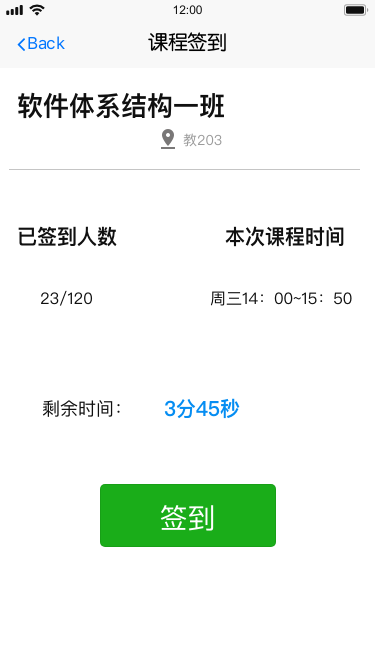
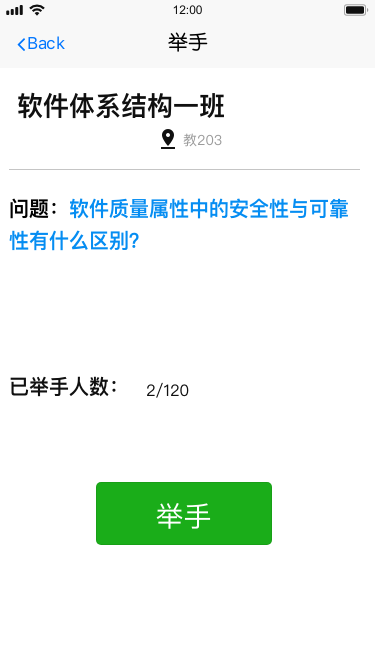
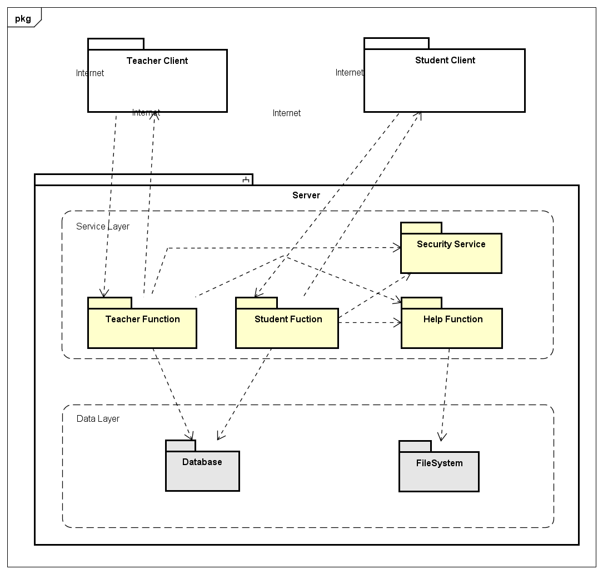
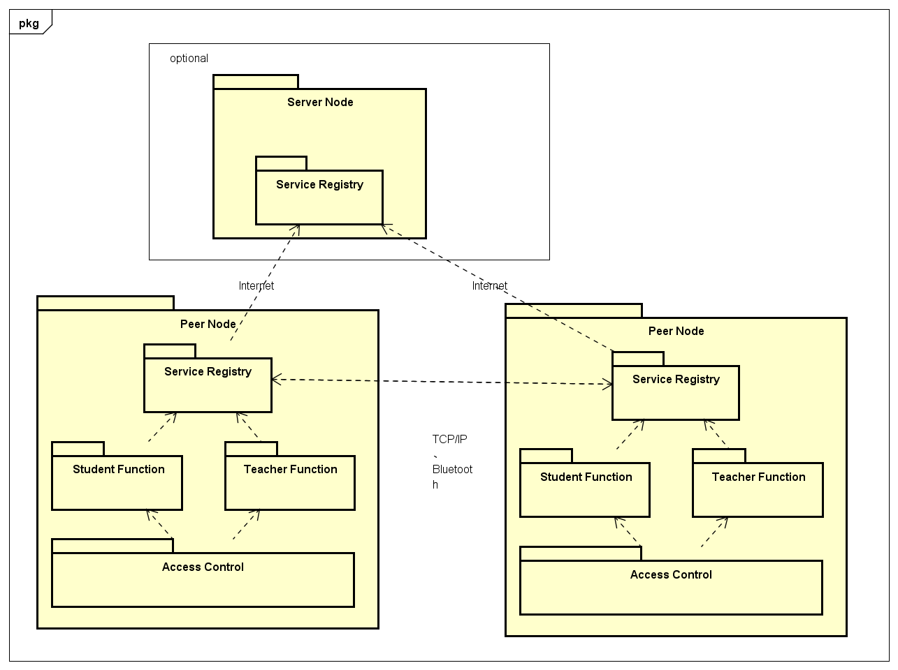

# 课程教学辅助系统

# 1. 团队成员以及扮演涉众

团队名称：五律协同观乙方

| 成员学号 | 成员姓名 | 涉众 |
| -- | -- | -- |
| 161250010 | 陈俊达 |  |
| 161250011 | 陈俊宇 |  |
| 161250091 | 苗沐之 |  |
| 161250050 | 靳炳淑 |  |
| 161250103 | 钱宇辰 |  |
| 161250068 | 廖均达 |  |
| 161250056 | 李冰   |  |
| 161250067 | 梁楠   |  |

# 2. 项目简介

## 2.1 功能介绍

课程签到、发言举手、参与讨论、共享文件、参加考试、信息推送

## 2.2 系统输出

签到列表，举手记录，发言记录和历史，共享的文件，考试成绩和记录，推送信息记录

## 2.3 原型

 

# 3. 技术实现

## 3.1 Client-Server

### 3.1.1 架构图

### 3.1.2 优势

1. 充分利用两端硬件，将任务分配到客户端和服务器两端，降低了客户端的负担
2. 安全性能容易得到保障，可以对权限进行多层次校验，提供了更安全的存取模式 
3. 数据的储存管理功能完全由服务器实现，对客户端较为透明 
4. 不同层的责任分配清晰明了，可以将复杂性控制在每一层内部，避免层与层之间的复杂交互 

### 3.1.3 技术平台

## 3.2 Peer-to-Peer Network

### 3.2.1 架构

#### 3.2.1.1 架构图

#### 3.2.1.2 架构说明

可采用**有基础设施的P2P网络**和**无基础设施的P2P网络**两种方式实现需求。

- 在一个P2P网络中，每个节点均为互相平等的客户端节点，可通过蓝牙、无线局域网等方式互相直接通信

- 当采用有基础设施的P2P网络时，需要在固定的、已知的服务器上运行服务端模块，此节点成为服务端节点。若采用无基础设施的P2P网络，则在网络建立时通过选举机制确定其中一台设备为服务器，并在其上运行服务器端模块。

- 在网络开始建立时，客户端节点向服务端注册。服务器对每次连接保存节点列表，在客户端注册时将客户端的信息保存进列表，并提供给客户端目前已知的节点信息。对于无基础设施的P2P网络，客户端在不知道服务器端服务的情况下，向周边节点发送注册请求；每个客户端中继注册请求，直到到达服务器。

- 每个客户端都会维持一个连接列表。在注册时会首先从服务器处获得目前已知的节点信息。在通信时，先查询自己的列表中是否包含目标节点，若包含，则直接通信；若不包含，则会向自己的邻居节点查询得到目标节点的地址，更新连接列表，然后进行通信。

### 3.2.2 优势

有基础设施：

- 相对于基于蓝牙的P2P实现，本架构更加鲁棒，因为服务端节点挂掉的可能性较小。
- 对于数据传输，在小范围内使用局域网，保证传输效率，降低网络成本；在跨局域网的情况下，可以借助互联网满足更大范围、更多设备量的需求。

无基础设施：

- 完全不需要基础设施，建立、运行和维护成本为0，系统有更多的适用场景
- 所有信息局限在网络中，不会造成任何隐私和信息泄露问题

### 3.2.3 所适用的技术

1. NAT穿透

2. TCP Hole Punching